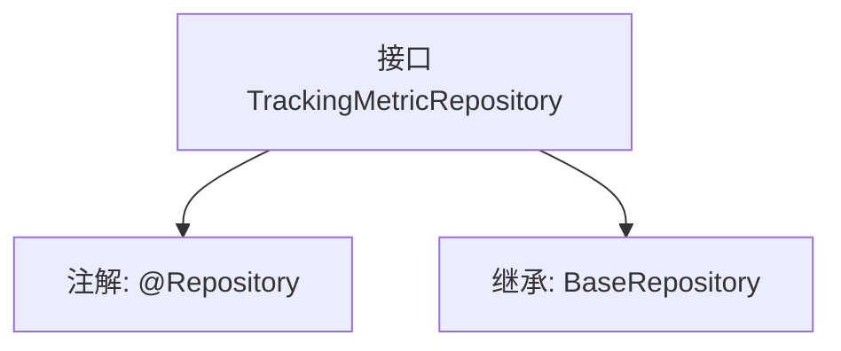

# 基础信息

|      |      |
|------|------|
| 名称 | TrackingMetricRepository |
| 编码语言 | .java |
| 代码路径 | WeFe/board/board-service/src/main/java/com/welab/wefe/board/service/database/repository/TrackingMetricRepository.java |
| 包名 | com.welab.wefe.board.service.database.repository |
| 依赖项 | ['com.welab.wefe.board.service.database.entity.TrackingMetricMysqlModel', 'com.welab.wefe.board.service.database.repository.base.BaseRepository', 'org.springframework.stereotype.Repository'] |
| 概述说明 | 这是一个Spring框架的仓库接口，继承基础仓库类，用于操作TrackingMetricMysqlModel数据模型，主键类型为String。 |

# 说明

这是一个名为TrackingMetricRepository的Spring数据仓库接口，使用@Repository注解标记。它继承了BaseRepository泛型接口，指定了实体类型为TrackingMetricMysqlModel，主键类型为String。该接口主要用于对TrackingMetricMysqlModel实体进行数据库操作，继承了BaseRepository提供的通用CRUD方法。

# 类列表 Class Summary

| 名称   | 类型  | 说明 |
|-------|------|-------------|
| TrackingMetricRepository | interface | 这是一个Spring的仓库接口，继承基础仓库类，用于操作TrackingMetricMysqlModel类型数据，主键为String类型。 |


## 类 TrackingMetricRepository

|      |      |
|------|------|
| 访问范围 | @Repository;public |
| 类型 | interface |
| 名称 | TrackingMetricRepository |
| 说明 | 这是一个Spring的仓库接口，继承基础仓库类，用于操作TrackingMetricMysqlModel类型数据，主键为String类型。 |


### UML类图

```mermaid
classDiagram
    class TrackingMetricMysqlModel {
        // 基础模型类，用于数据库映射
    }

    <<Interface>> BaseRepository~T, ID~ {
        // 泛型基础仓储接口
        +save(T entity) T
        +findById(ID id) Optional~T~
        +delete(T entity) void
    }

    <<Interface>> TrackingMetricRepository {
        // 跟踪指标数据仓储接口
    }

    BaseRepository <|-- TrackingMetricRepository
    TrackingMetricRepository --> TrackingMetricMysqlModel : 操作
```

类图描述：该结构展示了`TrackingMetricRepository`接口继承自泛型基础仓储接口`BaseRepository`，并指定泛型参数为`TrackingMetricMysqlModel`和`String`。其中`BaseRepository`定义了基本的CRUD操作，而`TrackingMetricRepository`作为其子接口专用于操作`TrackingMetricMysqlModel`类型的数据实体，体现了Spring Data JPA的仓储模式设计。


### 内部方法调用关系图



这段流程图展示了TrackingMetricRepository接口的结构。该接口被标记为@Repository注解，表明它是一个Spring数据访问层的组件。同时它继承了BaseRepository泛型接口，指定了实体类型为TrackingMetricMysqlModel，主键类型为String。这个设计遵循了Spring Data JPA的规范，通过继承基础仓库接口自动获得基本的CRUD操作能力，无需手动实现这些方法。

### 字段列表 Field List

| 名称  | 类型  | 说明 |
|-------|-------|------|

### 方法列表

| 名称  | 类型  | 说明 |
|-------|-------|------|


