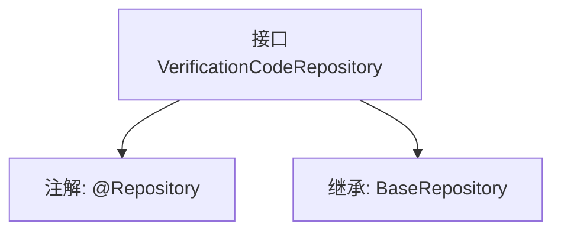

# 基础信息

|      |      |
|------|------|
| 名称 | VerificationCodeRepository |
| 编码语言 | .java |
| 代码路径 | WeFe/board/board-service/src/main/java/com/welab/wefe/board/service/database/repository/VerificationCodeRepository.java |
| 包名 | com.welab.wefe.board.service.database.repository |
| 依赖项 | ['com.welab.wefe.board.service.database.entity.VerificationCodeMysqlModel', 'com.welab.wefe.board.service.database.repository.base.BaseRepository', 'org.springframework.stereotype.Repository'] |
| 概述说明 | 这是一个Spring的Repository接口，继承自BaseRepository，用于操作VerificationCodeMysqlModel类型的数据，主键类型为String。 |

# 说明

该内容定义了一个名为VerificationCodeRepository的Spring数据仓库接口，使用@Repository注解标识其为数据访问组件。该接口继承自BaseRepository泛型基类，指定了实体类型为VerificationCodeMysqlModel，主键类型为String。这表明该仓库用于处理验证码数据的持久化操作，基于MySQL数据库实现，但未声明额外自定义方法，仅依赖基类提供的通用CRUD功能。

# 类列表 Class Summary

| 名称   | 类型  | 说明 |
|-------|------|-------------|
| VerificationCodeRepository | interface | 接口VerificationCodeRepository继承BaseRepository，用于操作VerificationCodeMysqlModel数据，主键类型为String。 |


## 类 VerificationCodeRepository

|      |      |
|------|------|
| 访问范围 | @Repository;public |
| 类型 | interface |
| 名称 | VerificationCodeRepository |
| 说明 | 接口VerificationCodeRepository继承BaseRepository，用于操作VerificationCodeMysqlModel数据，主键类型为String。 |


### UML类图

```mermaid
classDiagram
    class VerificationCodeRepository {
        <<Interface>>
    }
    class BaseRepository~T, ID~ {
        <<Interface>>
    }
    VerificationCodeRepository --|> BaseRepository : 继承
    // VerificationCodeRepository 继承自泛型接口 BaseRepository，指定泛型参数为 VerificationCodeMysqlModel 和 String
```

该类图展示了VerificationCodeRepository接口继承自BaseRepository泛型接口的关系。BaseRepository定义了两个泛型参数T和ID，在继承时被具体化为VerificationCodeMysqlModel和String类型。VerificationCodeRepository作为数据访问层接口，通过继承基础仓库接口获得通用CRUD操作能力，同时通过@Repository注解标识其Spring组件身份。这种设计实现了数据访问层的标准化和类型安全。


### 内部方法调用关系图



这段代码定义了一个Spring Data JPA的仓库接口VerificationCodeRepository，通过@Repository注解将其标记为持久层组件。该接口继承了BaseRepository接口，指定了实体类型为VerificationCodeMysqlModel，主键类型为String。继承BaseRepository意味着该接口自动获得了基础的CRUD操作方法，无需手动实现。这种设计遵循了Spring Data的规范，通过接口继承快速构建数据访问层。

### 字段列表 Field List

| 名称  | 类型  | 说明 |
|-------|-------|------|

### 方法列表

| 名称  | 类型  | 说明 |
|-------|-------|------|


