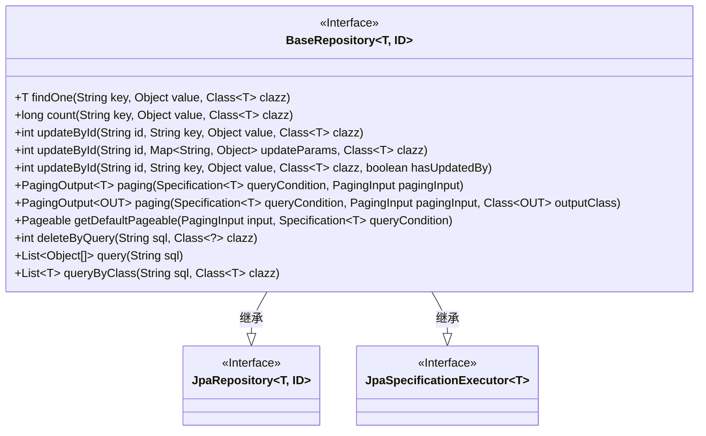

# 基础信息

|      |      |
|------|------|
| 名称 | BaseRepository |
| 编码语言 | .java |
| 代码路径 | WeFe/board/board-service/src/main/java/com/welab/wefe/board/service/database/repository/base/BaseRepository.java |
| 包名 | com.welab.wefe.board.service.database.repository.base |
| 依赖项 | ['com.welab.wefe.board.service.dto.base.PagingInput', 'com.welab.wefe.board.service.dto.base.PagingOutput', 'com.welab.wefe.common.data.mysql.MySpecification', 'org.springframework.data.domain.PageRequest', 'org.springframework.data.domain.Pageable', 'org.springframework.data.domain.Sort', 'org.springframework.data.jpa.domain.Specification', 'org.springframework.data.jpa.repository.JpaRepository', 'org.springframework.data.jpa.repository.JpaSpecificationExecutor', 'org.springframework.data.repository.NoRepositoryBean', 'org.springframework.lang.Nullable', 'org.springframework.transaction.annotation.Transactional', 'java.io.Serializable', 'java.util.List', 'java.util.Map'] |
| 概述说明 | BaseRepository接口扩展了JpaRepository和JpaSpecificationExecutor，提供自定义查询、更新、分页和原生SQL操作功能，支持按字段查询、统计、更新及分页转换DTO。 |

# 说明

该接口定义了一个通用基础仓库，扩展了JpaRepository和JpaSpecificationExecutor。主要功能包括：通过指定字段查询单条数据或统计数量；根据ID更新单个或多个字段；支持分页查询及结果转换；提供默认分页逻辑；支持原生SQL查询及删除操作。所有更新操作均标记为事务性，包含异常回滚机制。分页默认按创建时间降序排序，同时允许自定义排序规则。

# 类列表 Class Summary

| 名称   | 类型  | 说明 |
|-------|------|-------------|
| BaseRepository | interface | BaseRepository接口扩展JPA功能，提供按字段查询、更新、分页及原生SQL操作，支持事务处理和默认排序。 |

## 类 BaseRepository

|      |      |
|------|------|
| 访问范围 | @NoRepositoryBean;public |
| 类型 | interface |
| 名称 | BaseRepository |
| 说明 | BaseRepository接口扩展JPA功能，提供按字段查询、更新、分页及原生SQL操作，支持事务处理和默认排序。 |

### UML类图

这段代码定义了一个泛型接口BaseRepository<T, ID>，它继承了JpaRepository和JpaSpecificationExecutor接口。该接口提供了丰富的数据库操作方法，包括单条数据查询、计数、更新（单字段和多字段）、分页查询（支持POJO到DTO的转换）、原生SQL查询等。特别值得注意的是它包含了事务性操作（@Transactional注解）和默认分页实现逻辑，展现了强大的数据访问层抽象能力，适用于各种JPA实体类型的通用操作。

### 内部方法调用关系图

```mermaid
graph TD
    A["接口BaseRepository<T,ID>"]
    B["继承: JpaRepository<T,ID>"]
    C["继承: JpaSpecificationExecutor<T>"]
    D["方法: T findOne(key,value,clazz)"]
    E["方法: long count(key,value,clazz)"]
    F["方法: int updateById(id,key,value,clazz)"]
    G["方法: int updateById(id,updateParams,clazz)"]
    H["方法: int updateById(id,key,value,clazz,hasUpdatedBy)"]
    I["方法: PagingOutput<T> paging(queryCondition,pagingInput)"]
    J["方法: PagingOutput<OUT> paging(queryCondition,pagingInput,outputClass)"]
    K["方法: Pageable getDefaultPageable(input,queryCondition)"]
    L["方法: int deleteByQuery(sql,clazz)"]
    M["方法: List<Object[]> query(sql)"]
    N["方法: List<T> queryByClass(sql,clazz)"]

    A --> B
    A --> C
    A --> D
    A --> E
    A --> F
    A --> G
    A --> H
    A --> I
    A --> J
    A --> K
    A --> L
    A --> M
    A --> N
```

该流程图展示了BaseRepository接口的完整结构，它是一个泛型接口，继承了JpaRepository和JpaSpecificationExecutor两个核心JPA接口。接口定义了12个主要方法，包括基础CRUD操作（如findOne、count）、批量更新方法（3种updateById变体）、分页查询（2种paging方法）、原生SQL操作（query和queryByClass）以及事务性删除（deleteByQuery）。特别值得注意的是getDefaultPageable默认方法实现了分页排序逻辑，当未指定排序字段时会默认按createdTime降序排列。所有方法都支持泛型类型T和ID，体现了高度可复用的设计理念。

### 字段列表 Field List

| 名称  | 类型  | 说明 |
|-------|-------|------|

### 方法列表

| 名称  | 类型  | 说明 |
|-------|-------|------|
| updateById | int | 基于ID更新数据，指定字段和值，支持事务处理。 |
| updateById | int | 使用事务注解的更新方法，根据ID和参数更新指定类实例。 |
| getDefaultPageable | Pageable | 该方法根据输入参数生成分页请求对象。若无排序条件，默认按createdTime降序排序。支持自定义排序规则。 |
| deleteByQuery | int | 使用@Transactional注解确保异常时回滚，定义删除方法：按SQL查询和类类型删除数据。 |
| paging | PagingOutput<OUT> | 分页查询方法，支持条件查询和分页参数，返回指定类型的输出结果。 |
| findOne | T | 根据键和值查找指定类型的单个对象。 |
| count | long | 方法用于统计指定键和值类型的匹配项数量。 |
| paging | PagingOutput<T> | 分页查询方法，输入查询条件和分页参数，返回分页结果。 |
| updateById | int | 这是一个带事务注解的方法，用于根据ID更新指定字段值，参数包括ID、字段名、新值、实体类及是否更新操作者标记。 |
| query | List<Object[]> | 执行SQL查询并返回对象数组列表。 |
| queryByClass | List<T> | 该方法根据SQL查询和类类型返回对应类型的对象列表。 |

