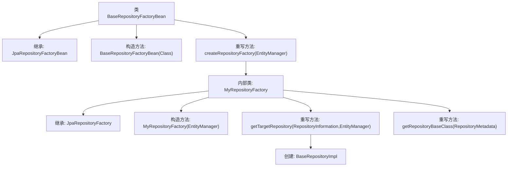

# 基础信息

|      |      |
|------|------|
| 名称 | BaseRepositoryFactoryBean |
| 编码语言 | .java |
| 代码路径 | WeFe/board/board-service/src/main/java/com/welab/wefe/board/service/database/repository/base/BaseRepositoryFactoryBean.java |
| 包名 | com.welab.wefe.board.service.database.repository.base |
| 依赖项 | ['org.springframework.data.jpa.repository.JpaRepository', 'org.springframework.data.jpa.repository.support.JpaRepositoryFactory', 'org.springframework.data.jpa.repository.support.JpaRepositoryFactoryBean', 'org.springframework.data.jpa.repository.support.JpaRepositoryImplementation', 'org.springframework.data.repository.core.RepositoryInformation', 'org.springframework.data.repository.core.RepositoryMetadata', 'org.springframework.data.repository.core.support.RepositoryFactorySupport', 'javax.persistence.EntityManager', 'java.io.Serializable'] |
| 概述说明 | BaseRepositoryFactoryBean扩展JpaRepositoryFactoryBean，自定义工厂创建BaseRepositoryImpl实例，用于特定JPA仓库实现。 |

# 说明

该代码定义了一个泛型工厂Bean类BaseRepositoryFactoryBean，用于创建自定义JPA仓库实例。它继承自JpaRepositoryFactoryBean，通过重写createRepositoryFactory方法返回自定义的MyRepositoryFactory。内部类MyRepositoryFactory扩展了JpaRepositoryFactory，重写了getTargetRepository方法返回BaseRepositoryImpl实例，并指定BaseRepositoryImpl作为仓库基类。整个结构实现了对Spring Data JPA仓库实例创建过程的自定义扩展。

# 类列表 Class Summary

| 名称   | 类型  | 说明 |
|-------|------|-------------|
| BaseRepositoryFactoryBean | class | BaseRepositoryFactoryBean扩展JpaRepositoryFactoryBean，自定义工厂创建BaseRepositoryImpl实例，支持泛型实体和ID类型。 |


## 类 BaseRepositoryFactoryBean

|      |      |
|------|------|
| 访问范围 | public |
| 类型 | class |
| 名称 | BaseRepositoryFactoryBean |
| 说明 | BaseRepositoryFactoryBean扩展JpaRepositoryFactoryBean，自定义工厂创建BaseRepositoryImpl实例，支持泛型实体和ID类型。 |


### UML类图

```mermaid
classDiagram
    class BaseRepositoryFactoryBean~R~T~ID~ {
        +BaseRepositoryFactoryBean(Class~? extends R~ repositoryInterface)
        +createRepositoryFactory(EntityManager em) RepositoryFactorySupport
    }

    class MyRepositoryFactory~T~I~ {
        -EntityManager em
        +MyRepositoryFactory(EntityManager em)
        +getTargetRepository(RepositoryInformation information, EntityManager entityManager) JpaRepositoryImplementation~?~?~
        +getRepositoryBaseClass(RepositoryMetadata metadata) Class~?~
    }

    class JpaRepositoryFactory {
        <<Interface>>
    }

    class RepositoryFactorySupport {
        <<Interface>>
    }

    class JpaRepositoryImplementation~?~?~ {
        <<Interface>>
    }

    class BaseRepositoryImpl~T~I~ {
        <<Interface>>
    }

    BaseRepositoryFactoryBean --> JpaRepositoryFactory : 继承
    BaseRepositoryFactoryBean --> RepositoryFactorySupport : 依赖
    MyRepositoryFactory --> JpaRepositoryFactory : 继承
    MyRepositoryFactory --> BaseRepositoryImpl : 创建实例
    MyRepositoryFactory --> JpaRepositoryImplementation : 返回实例
```

这段代码展示了一个基于Spring Data JPA的仓库工厂Bean实现。BaseRepositoryFactoryBean是一个泛型类，用于创建自定义的JPA仓库实例。它通过内部类MyRepositoryFactory重写了仓库创建逻辑，使用BaseRepositoryImpl作为基础实现类。类图清晰地展示了工厂模式的应用，以及各组件之间的继承和依赖关系，体现了Spring Data JPA扩展点的典型实现方式。


### 内部方法调用关系图



这段代码展示了一个Spring Data JPA的工厂Bean实现，用于创建自定义的JPA仓库实例。流程图描述了BaseRepositoryFactoryBean类的结构，它继承自JpaRepositoryFactoryBean并重写了创建仓库工厂的方法。内部类MyRepositoryFactory负责实际创建BaseRepositoryImpl实例，并指定了基础仓库类。整个过程体现了Spring Data JPA扩展点的典型实现方式，通过工厂模式来定制化仓库行为。

### 字段列表 Field List

| 名称  | 类型  | 说明 |
|-------|-------|------|

### 方法列表

| 名称  | 类型  | 说明 |
|-------|-------|------|
| createRepositoryFactory | RepositoryFactorySupport | 覆盖方法创建仓库工厂，返回自定义工厂实例并传入实体管理器。 |


