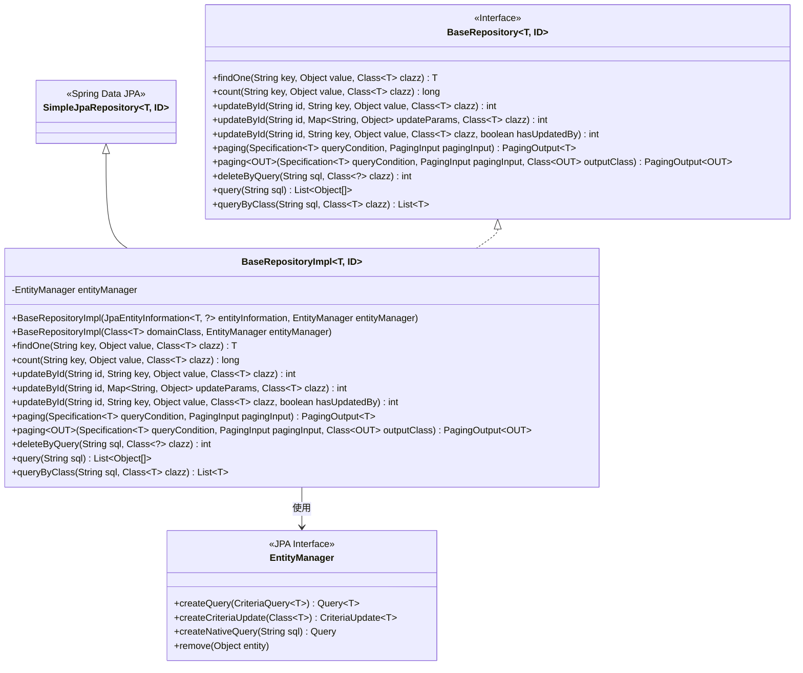

# 基础信息

|      |      |
|------|------|
| 名称 | BaseRepositoryImpl |
| 编码语言 | .java |
| 代码路径 | WeFe/board/board-service/src/main/java/com/welab/wefe/board/service/database/repository/base/BaseRepositoryImpl.java |
| 包名 | com.welab.wefe.board.service.database.repository.base |
| 依赖项 | ['com.welab.wefe.board.service.dto.base.PagingInput', 'com.welab.wefe.board.service.dto.base.PagingOutput', 'com.welab.wefe.common.web.util.CurrentAccountUtil', 'org.apache.commons.collections4.CollectionUtils', 'org.springframework.data.domain.Page', 'org.springframework.data.jpa.domain.Specification', 'org.springframework.data.jpa.repository.support.JpaEntityInformation', 'org.springframework.data.jpa.repository.support.SimpleJpaRepository', 'org.springframework.lang.Nullable', 'javax.persistence.EntityManager', 'javax.persistence.Query', 'javax.persistence.criteria.CriteriaBuilder', 'javax.persistence.criteria.CriteriaQuery', 'javax.persistence.criteria.CriteriaUpdate', 'javax.persistence.criteria.Root', 'java.io.Serializable', 'java.util.Date', 'java.util.List', 'java.util.Map'] |
| 概述说明 | BaseRepositoryImpl是JPA仓库实现类，提供通用CRUD操作，包括查询、更新、分页和原生SQL支持。 |

# 说明

BaseRepositoryImpl是一个泛型JPA仓库实现类，继承SimpleJpaRepository并实现BaseRepository接口。它通过EntityManager提供多种数据操作功能：根据键值查询单个实体、统计符合条件的记录数、按ID更新单个或多个字段、支持分页查询、执行原生SQL查询和删除操作。更新操作会自动设置更新时间，并可选择是否记录更新人。分页查询支持直接返回实体或DTO转换，原生SQL查询支持返回原始结果或映射到指定类。

# 类列表 Class Summary

| 名称   | 类型  | 说明 |
|-------|------|-------------|
| BaseRepositoryImpl | class | BaseRepositoryImpl是JPA基础仓库实现类，提供通用CRUD操作，包括按条件查询、分页、更新和删除功能，支持原生SQL查询。 |

## 类 BaseRepositoryImpl

|      |      |
|------|------|
| 访问范围 | public |
| 类型 | class |
| 名称 | BaseRepositoryImpl |
| 说明 | BaseRepositoryImpl是JPA基础仓库实现类，提供通用CRUD操作，包括按条件查询、分页、更新和删除功能，支持原生SQL查询。 |

### UML类图

这段代码展示了一个基于Spring Data JPA的自定义仓库实现类BaseRepositoryImpl，它继承了SimpleJpaRepository并实现了BaseRepository接口。该类提供了丰富的CRUD操作功能，包括条件查询、分页查询、批量更新和原生SQL查询等。通过EntityManager实现JPA规范操作，支持泛型类型参数T（实体类型）和ID（主键类型）。类图清晰地展示了继承关系、接口实现和关键依赖，体现了该实现类在JPA持久层中的核心作用。

### 内部方法调用关系图

```mermaid
graph TD
    A["类BaseRepositoryImpl<T, ID>"]
    B["属性: EntityManager entityManager"]
    C["构造方法1: BaseRepositoryImpl(JpaEntityInformation<T,?>, EntityManager)"]
    D["构造方法2: BaseRepositoryImpl(Class<T>, EntityManager)"]
    E["方法: T findOne(String key, Object value, Class<T> clazz)"]
    F["方法: long count(String key, Object value, Class<T> clazz)"]
    G["方法: int updateById(String id, String key, Object value, Class<T> clazz)"]
    H["方法: int updateById(String id, Map<String,Object> updateParams, Class<T> clazz)"]
    I["方法: int updateById(String id, String key, Object value, Class<T> clazz, boolean hasUpdatedBy)"]
    J["方法: PagingOutput<T> paging(Specification<T>, PagingInput)"]
    K["方法: PagingOutput<OUT> paging(Specification<T>, PagingInput, Class<OUT>)"]
    L["方法: int deleteByQuery(String sql, Class<?> clazz)"]
    M["方法: List<Object[]> query(String sql)"]
    N["方法: List<T> queryByClass(String sql, Class<T> clazz)"]

    A --> B
    A --> C
    A --> D
    A --> E
    A --> F
    A --> G
    A --> H
    A --> I
    A --> J
    A --> K
    A --> L
    A --> M
    A --> N
```

这段代码定义了一个通用的JPA仓库实现类BaseRepositoryImpl，继承自SimpleJpaRepository并实现了BaseRepository接口。该类提供了多种数据库操作方法，包括按条件查询(findOne)、计数(count)、按ID更新(updateById)、分页查询(paging)、原生SQL查询(query/queryByClass)和删除操作(deleteByQuery)。所有方法都通过EntityManager构建Criteria API或原生SQL来操作数据库，支持泛型类型T和ID，具有高度的灵活性和可复用性。

### 字段列表 Field List

| 名称  | 类型  | 说明 |
|-------|-------|------|
| entityManager | EntityManager | 私有不可变的EntityManager实例变量。 |

### 方法列表

| 名称  | 类型  | 说明 |
|-------|-------|------|
| count | long | 该方法通过JPA Criteria API统计数据库中指定字段值等于给定值的记录数，返回统计结果。 |
| updateById | int | 该方法通过JPA Criteria API根据ID更新实体指定字段值，同时自动设置更新时间和操作人ID，返回影响行数。 |
| paging | PagingOutput<T> | 该方法实现分页查询功能，接收查询条件和分页参数，返回分页结果。通过查询获取分页数据后，提取内容列表和总记录数，封装为分页输出对象返回。 |
| findOne | T | 该方法通过JPA Criteria API查询数据库，根据指定键值对查找匹配的第一个实体对象，若无结果则返回null。 |
| updateById | int | 该方法根据ID更新实体，设置更新参数、时间和操作人，最后执行更新操作。 |
| paging | PagingOutput<OUT> | 分页查询方法：根据条件查询分页数据，返回总条数、当前页数据和指定输出类型。 |
| deleteByQuery | int | 该方法通过原生SQL查询删除指定类的数据，先查询结果集再逐个删除，最后返回删除的记录数。 |
| updateById | int | 该方法通过ID更新实体字段，支持设置更新人和时间，返回影响行数。 |
| query | List<Object[]> | 该方法执行原生SQL查询并返回结果列表。参数为SQL语句字符串，返回值为Object数组列表。 |
| queryByClass | List<T> | 该方法通过原生SQL查询数据库，返回指定类别的结果列表。参数为SQL语句和目标类，使用实体管理器执行查询并获取结果。 |

