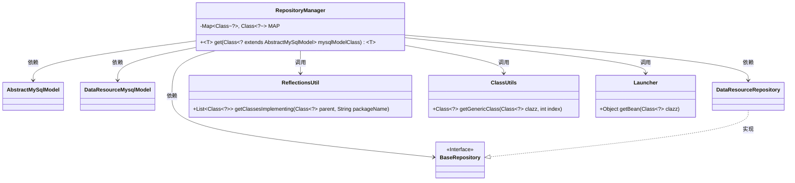
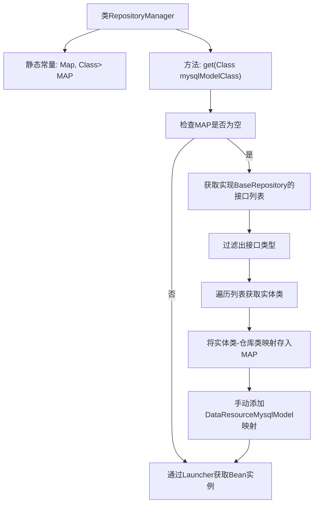

# 基础信息

|      |      |
|------|------|
| 名称 | RepositoryManager |
| 编码语言 | .java |
| 代码路径 | WeFe/board/board-service/src/main/java/com/welab/wefe/board/service/database/repository/base/RepositoryManager.java |
| 包名 | com.welab.wefe.board.service.database.repository.base |
| 依赖项 | ['com.welab.wefe.board.service.database.entity.base.AbstractMySqlModel', 'com.welab.wefe.board.service.database.entity.data_resource.DataResourceMysqlModel', 'com.welab.wefe.board.service.database.repository.data_resource.DataResourceRepository', 'com.welab.wefe.common.util.ClassUtils', 'com.welab.wefe.common.util.ReflectionsUtil', 'com.welab.wefe.common.web.Launcher', 'java.util.HashMap', 'java.util.List', 'java.util.Map', 'java.util.stream.Collectors'] |
| 概述说明 | RepositoryManager类通过静态Map缓存模型与仓库类的映射关系，提供get方法根据模型类获取对应的仓库实例。初始化时扫描实现BaseRepository的接口并建立映射，DataResourceRepository需手动映射。最终通过Launcher获取Bean实例。 |

# 说明

RepositoryManager类通过静态MAP缓存模型类与仓库接口的映射关系。get方法首次调用时会扫描com.welab.wefe包下所有继承BaseRepository的接口，通过反射获取接口泛型参数对应的模型类建立映射。由于DataResourceRepository无法自动获取泛型类型，需手动添加DataResourceMysqlModel的映射。最终通过Spring容器获取对应仓库实例。

# 类列表 Class Summary

| 名称   | 类型  | 说明 |
|-------|------|-------------|
| RepositoryManager | class | RepositoryManager类通过静态Map关联模型与仓库类，提供get方法动态获取对应仓库实例。初始化时扫描实现BaseRepository的接口并建立映射，DataResourceRepository需手动映射。最终通过Launcher获取Bean实例。 |

## 类 RepositoryManager

|      |      |
|------|------|
| 访问范围 | public |
| 类型 | class |
| 名称 | RepositoryManager |
| 说明 | RepositoryManager类通过静态Map关联模型与仓库类，提供get方法动态获取对应仓库实例。初始化时扫描实现BaseRepository的接口并建立映射，DataResourceRepository需手动映射。最终通过Launcher获取Bean实例。 |

### UML类图

类图描述：
RepositoryManager 是一个管理仓库类的工具类，通过静态方法 get 根据 AbstractMySqlModel 的子类获取对应的 BaseRepository 实现类。它依赖于 BaseRepository 接口及其实现类 DataResourceRepository，以及 AbstractMySqlModel 及其子类 DataResourceMysqlModel。RepositoryManager 通过 ReflectionsUtil 和 ClassUtils 工具类动态获取泛型类型信息，最终通过 Launcher 获取 Bean 实例。该设计实现了模型类与仓库接口的自动映射，并支持手动注册特殊映射关系。

### 内部方法调用关系图

该流程图描述了RepositoryManager类的核心逻辑。首先检查静态映射MAP是否为空，若为空则通过反射获取所有实现BaseRepository的接口，过滤后建立实体类与仓库类的映射关系，并补充特殊映射。最后通过Launcher获取对应的Bean实例。整个过程实现了按模型类动态获取对应仓库实例的功能。

### 字段列表 Field List

| 名称  | 类型  | 说明 |
|-------|-------|------|
| MAP = new HashMap() | Map<Class<?>, Class<?>> | 定义一个静态不可变的哈希映射，键值均为类对象类型，初始化为空。 |

### 方法列表

| 名称  | 类型  | 说明 |
|-------|-------|------|
| get | T | 静态方法`get`根据传入的MySQL模型类获取对应的仓库实例。首次调用时扫描实现`BaseRepository`的接口，建立模型类与仓库类的映射（含手动映射`DataResourceRepository`）。最后通过Spring容器返回对应仓库实例。 |

