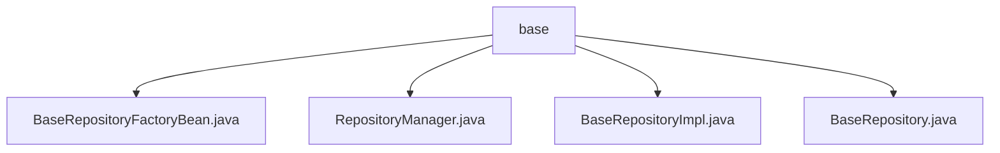

# 基础信息

|      |      |
|------|------|
| 名称 | base |
| 编码语言 | .java |
| 代码路径 | WeFe/board/board-service/src/main/java/com/welab/wefe/board/service/database/repository/base |
| 包名 | docs.board.board-service.src.main.java.com.welab.wefe.board.service.database.repository.base |
| 概述说明 | BaseRepositoryFactoryBean定义泛型工厂Bean，扩展JPA仓库创建流程。RepositoryManager缓存模型与仓库映射，支持扫描与手动注册。BaseRepositoryImpl实现通用JPA操作，含查询、更新、分页及SQL功能。BaseRepository接口扩展标准JPA功能，支持字段查询、更新及事务处理。 |

# 说明

## 概述  
该模块实现了一个自定义JPA仓库框架，核心职责是通过泛型工厂模式扩展Spring Data JPA，提供增强型数据访问能力。接口规范统一采用BaseRepository作为标准契约，支持动态字段查询、批量更新和分页转换等功能。关键数据结构包括泛型模型类映射缓存（如RepositoryManager中的MAP）和BaseRepositoryImpl中的EntityManager操作封装。外部依赖项包括Spring Data JPA、JPA Specification和EntityManager。例如BaseRepositoryFactoryBean通过MyRepositoryFactory重写实例创建逻辑。

## 主要业务场景  
模块适用于需要灵活操作数据库的JPA场景，类似构建通用数据访问层。完整业务流程涵盖：仓库接口扫描注册（如RepositoryManager初始化映射）、自定义查询（如BaseRepositoryImpl的分页转换）和事务性更新（如自动设置更新时间）。典型交互模式通过BaseRepository统一暴露API，例如分页查询支持DTO转换，原生SQL支持结果映射。集成案例包括DataResourceRepository等特殊处理场景，需手动维护模型映射关系。

### 包内部结构视图

该流程图展示了WeFe项目中board-service模块的基础仓库目录结构。base目录下包含4个核心Java文件：BaseRepositoryFactoryBean用于工厂模式实现，RepositoryManager管理仓库实例，BaseRepository定义基础接口，BaseRepositoryImpl提供接口实现。这些文件共同构成了项目的数据访问层基础架构。

# 文件列表

| 名称   | 类型  | 说明 |
|-------|------|-------------|
| [BaseRepositoryFactoryBean.java](BaseRepositoryFactoryBean.md) | file | BaseRepositoryFactoryBean扩展JpaRepositoryFactoryBean，自定义工厂创建BaseRepositoryImpl实例，用于特定JPA仓库实现。 |
| [RepositoryManager.java](RepositoryManager.md) | file | RepositoryManager类通过静态Map缓存模型与仓库类的映射关系，提供get方法根据模型类获取对应的仓库实例。初始化时扫描实现BaseRepository的接口并建立映射，DataResourceRepository需手动映射。最终通过Launcher获取Bean实例。 |
| [BaseRepositoryImpl.java](BaseRepositoryImpl.md) | file | BaseRepositoryImpl是JPA仓库实现类，提供通用CRUD操作，包括查询、更新、分页和原生SQL支持。 |
| [BaseRepository.java](BaseRepository.md) | file | BaseRepository接口扩展了JpaRepository和JpaSpecificationExecutor，提供自定义查询、更新、分页和原生SQL操作功能，支持按字段查询、统计、更新及分页转换DTO。 |

