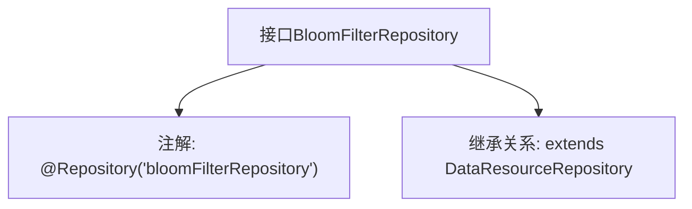

# 基础信息

|      |      |
|------|------|
| 名称 | BloomFilterRepository |
| 编码语言 | .java |
| 代码路径 | WeFe/board/board-service/src/main/java/com/welab/wefe/board/service/database/repository/data_resource/BloomFilterRepository.java |
| 包名 | com.welab.wefe.board.service.database.repository.data_resource |
| 依赖项 | ['com.welab.wefe.board.service.database.entity.data_resource.BloomFilterMysqlModel', 'org.springframework.stereotype.Repository'] |
| 概述说明 | 接口BloomFilterRepository继承DataResourceRepository，用于操作BloomFilterMysqlModel数据模型。 |

# 说明

该内容定义了一个名为BloomFilterRepository的Spring仓库接口，使用@Repository注解标记并指定名称为"bloomFilterRepository"。该接口继承自DataResourceRepository泛型接口，其泛型类型为BloomFilterMysqlModel，表明该仓库用于操作与布隆过滤器相关的MySQL数据模型。

# 类列表 Class Summary

| 名称   | 类型  | 说明 |
|-------|------|-------------|
| BloomFilterRepository | interface | 接口BloomFilterRepository继承DataResourceRepository，使用@Repository注解标记为数据资源仓库，操作BloomFilterMysqlModel类型数据。 |


## 类 BloomFilterRepository

|      |      |
|------|------|
| 访问范围 | @Repository("bloomFilterRepository");public |
| 类型 | interface |
| 名称 | BloomFilterRepository |
| 说明 | 接口BloomFilterRepository继承DataResourceRepository，使用@Repository注解标记为数据资源仓库，操作BloomFilterMysqlModel类型数据。 |


### UML类图

```mermaid
classDiagram
    class BloomFilterRepository {
        <<Interface>>
    }
    class DataResourceRepository~T~ {
        <<Interface>>
    }
    BloomFilterRepository --|> DataResourceRepository : 继承
    // BloomFilterRepository接口继承自泛型接口DataResourceRepository，泛型参数为BloomFilterMysqlModel
```

这段类图展示了BloomFilterRepository接口继承自泛型接口DataResourceRepository的关系，其中泛型参数指定为BloomFilterMysqlModel。BloomFilterRepository被标记为Spring的Repository组件，表明其用于数据访问层。该设计遵循了泛型接口的扩展模式，使子接口能处理特定类型的数据模型，同时保持基础接口的通用性。


### 内部方法调用关系图



该流程图展示了BloomFilterRepository接口的结构，它是一个带有特定名称的Spring仓库注解(@Repository)的接口，并继承了泛型化的DataResourceRepository基类，泛型参数为BloomFilterMysqlModel。这种设计表明该接口专门用于处理BloomFilterMysqlModel类型数据的持久化操作，属于Spring Data JPA的典型仓库模式实现。

### 字段列表 Field List

| 名称  | 类型  | 说明 |
|-------|-------|------|

### 方法列表

| 名称  | 类型  | 说明 |
|-------|-------|------|


