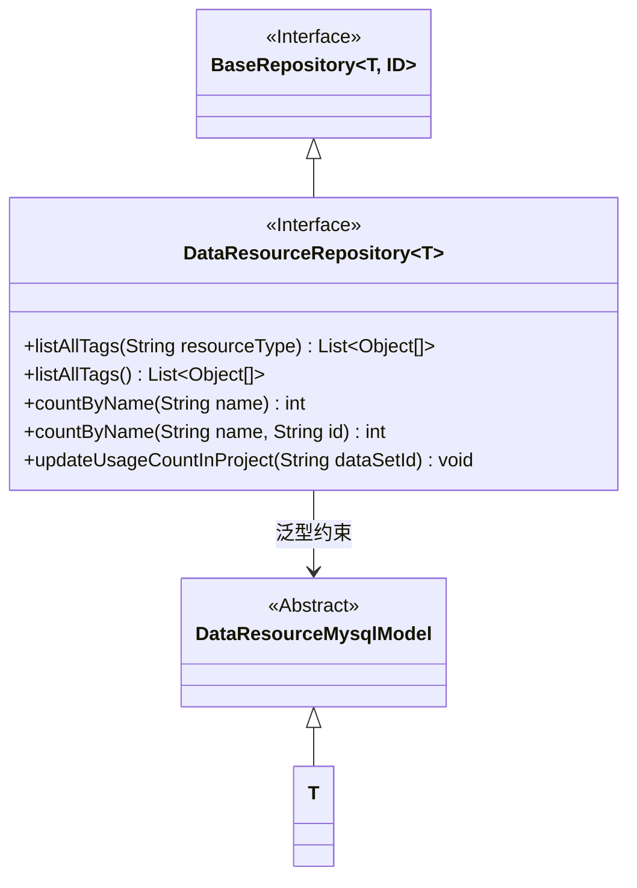
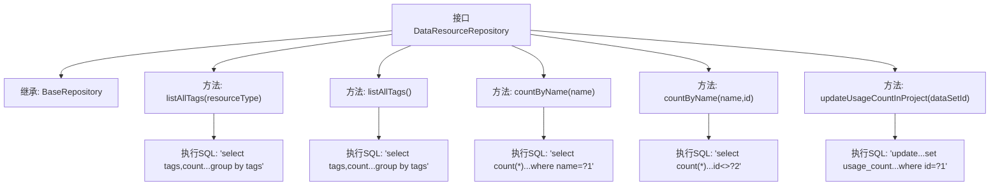

# 基础信息

|      |      |
|------|------|
| 名称 | DataResourceRepository |
| 编码语言 | .java |
| 代码路径 | WeFe/board/board-service/src/main/java/com/welab/wefe/board/service/database/repository/data_resource/DataResourceRepository.java |
| 包名 | com.welab.wefe.board.service.database.repository.data_resource |
| 依赖项 | ['com.welab.wefe.board.service.database.entity.data_resource.DataResourceMysqlModel', 'com.welab.wefe.board.service.database.repository.base.BaseRepository', 'org.springframework.data.jpa.repository.Modifying', 'org.springframework.data.jpa.repository.Query', 'org.springframework.stereotype.Repository', 'org.springframework.transaction.annotation.Transactional', 'java.util.List'] |
| 概述说明 | DataResourceRepository接口扩展BaseRepository，提供按资源类型或全局查询标签统计、名称计数及更新项目使用次数的原生SQL方法。 |

# 说明

该代码定义了一个名为DataResourceRepository的Spring Data JPA仓库接口，继承自BaseRepository。接口包含五个方法：两个用于查询标签及其出现次数的listAllTags方法（一个带资源类型参数，一个不带）；两个countByName方法用于统计同名记录数量（一个带ID参数用于排除自身）；一个updateUsageCountInProject方法用于更新数据集在项目中的使用次数。所有方法均使用原生SQL查询，其中更新操作添加了事务和自动清除缓存注解。

# 类列表 Class Summary

| 名称   | 类型  | 说明 |
|-------|------|-------------|
| DataResourceRepository | interface | DataResourceRepository接口扩展BaseRepository，包含查询标签统计、名称计数及更新项目使用次数的方法，使用原生SQL实现。 |

## 类 DataResourceRepository

|      |      |
|------|------|
| 访问范围 | @Repository("dataResourceRepository");public |
| 类型 | interface |
| 名称 | DataResourceRepository |
| 说明 | DataResourceRepository接口扩展BaseRepository，包含查询标签统计、名称计数及更新项目使用次数的方法，使用原生SQL实现。 |

### UML类图

该类图展示了一个Spring Data JPA仓库接口`DataResourceRepository`的继承关系和功能。接口继承自泛型`BaseRepository`，并约束泛型参数T必须继承`DataResourceMysqlModel`。接口包含五个查询方法：两个用于统计标签，两个用于按名称计数，一个用于更新项目使用计数。所有方法都使用原生SQL查询，并通过注解配置查询行为。

### 内部方法调用关系图

该流程图展示了Spring Data JPA接口`DataResourceRepository`的结构与功能。接口继承`BaseRepository`并定义了5个查询方法，包含3种查询类型：两个分组统计标签的`listAllTags`方法、两个校验名称重复的`countByName`方法，以及一个带事务修改的`updateUsageCountInProject`方法。每个方法节点精确映射到对应的原生SQL查询语句，通过箭头清晰呈现方法调用关系。

### 字段列表 Field List

| 名称  | 类型  | 说明 |
|-------|-------|------|

### 方法列表

| 名称  | 类型  | 说明 |
|-------|-------|------|
| listAllTags | List<Object[]> | 查询指定资源类型的非空标签及其出现次数，按标签分组返回结果列表。 |
| listAllTags | List<Object[]> | 查询非空标签及其出现次数，按标签分组返回结果列表。 |
| countByName | int | 查询同名不同ID的记录数 |
| updateUsageCountInProject | void | 更新数据集在项目中的使用次数：根据项目数据集表中的同意审核状态计数，自动更新指定ID的数据集使用次数。 |
| countByName | int | 查询数据库中指定名称的记录总数，返回整数结果。 |

