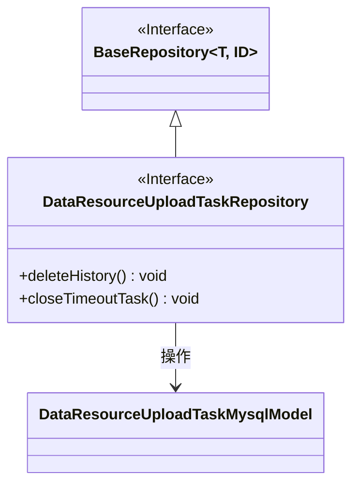
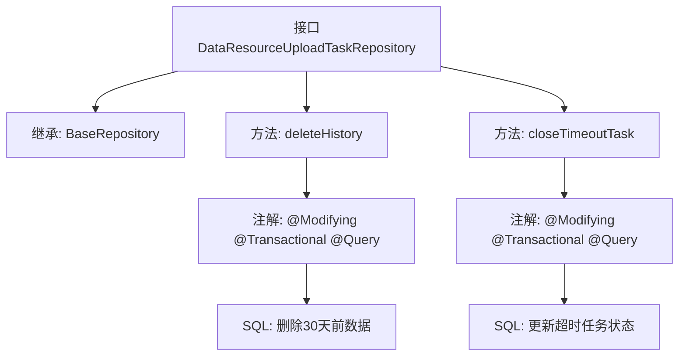

# 基础信息

|      |      |
|------|------|
| 名称 | DataResourceUploadTaskRepository |
| 编码语言 | .java |
| 代码路径 | WeFe/board/board-service/src/main/java/com/welab/wefe/board/service/database/repository/data_resource/DataResourceUploadTaskRepository.java |
| 包名 | com.welab.wefe.board.service.database.repository.data_resource |
| 依赖项 | ['com.welab.wefe.board.service.database.entity.data_resource.DataResourceUploadTaskMysqlModel', 'com.welab.wefe.board.service.database.repository.base.BaseRepository', 'org.springframework.data.jpa.repository.Modifying', 'org.springframework.data.jpa.repository.Query', 'org.springframework.stereotype.Repository', 'org.springframework.transaction.annotation.Transactional'] |
| 概述说明 | DataResourceUploadTaskRepository接口定义了两个方法：deleteHistory删除30天前的历史数据，closeTimeoutTask将超时5分钟的上传任务状态设为失败并记录错误信息。 |

# 说明

这是一个Spring Data JPA的Repository接口，用于管理数据资源上传任务。接口定义了两个数据库操作：1.删除超过30天的历史数据，使用原生SQL语句通过created_time字段判断时间差；2.关闭超时未响应的上传任务，将状态为uploading且超过5分钟未更新的任务状态改为failed，并设置错误信息为系统重启导致中断。两个方法都使用了@Modifying和@Transactional注解确保事务性操作。

# 类列表 Class Summary

| 名称   | 类型  | 说明 |
|-------|------|-------------|
| DataResourceUploadTaskRepository | interface | DataResourceUploadTaskRepository接口定义了两个方法：deleteHistory删除30天前的历史数据，closeTimeoutTask将超时5分钟未响应的上传任务状态设为失败并记录错误信息。 |

## 类 DataResourceUploadTaskRepository

|      |      |
|------|------|
| 访问范围 | @Repository;public |
| 类型 | interface |
| 名称 | DataResourceUploadTaskRepository |
| 说明 | DataResourceUploadTaskRepository接口定义了两个方法：deleteHistory删除30天前的历史数据，closeTimeoutTask将超时5分钟未响应的上传任务状态设为失败并记录错误信息。 |

### UML类图

类图描述：该图展示了一个Spring Data JPA仓库接口的结构。DataResourceUploadTaskRepository接口继承自泛型接口BaseRepository，并操作DataResourceUploadTaskMysqlModel实体类。接口包含两个核心方法：deleteHistory()用于删除30天前的历史数据，closeTimeoutTask()用于将超时5分钟未更新的任务标记为失败。通过JPA注解实现了原生SQL操作，体现了数据清理和任务状态维护的功能。

### 内部方法调用关系图

该流程图展示了Spring Data JPA仓库接口的结构，包含两个核心数据清理方法。deleteHistory方法通过原生SQL删除超过30天的历史数据，使用@Modifying和@Transactional确保事务性。closeTimeoutTask方法将上传超时(5分钟未更新)的任务标记为失败状态，同样采用事务注解保障操作原子性。两个方法均通过@Query注解直接定义数据库操作逻辑。

### 字段列表 Field List

| 名称  | 类型  | 说明 |
|-------|-------|------|

### 方法列表

| 名称  | 类型  | 说明 |
|-------|-------|------|
| closeTimeoutTask | void | 更新数据库中状态为uploading且超时5分钟的任务，将其状态改为failed并记录错误信息为系统重启导致中断。 |
| deleteHistory | void | 该代码片段定义了一个删除30天前历史数据的方法，使用JPA注解实现自动清理和事务管理。 |

