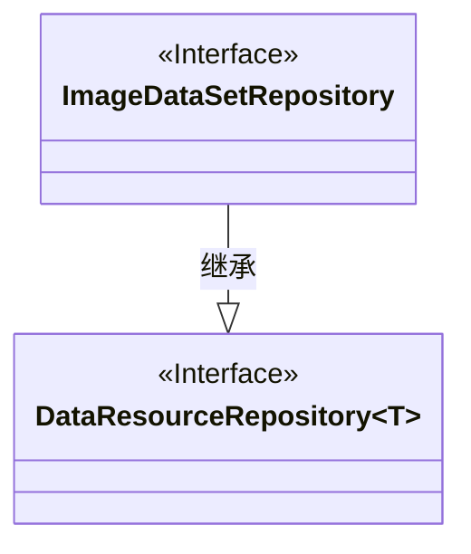
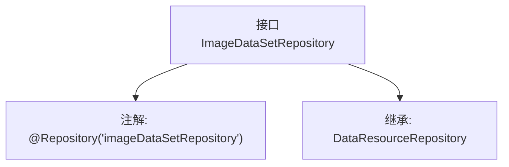

# 基础信息

|      |      |
|------|------|
| 名称 | ImageDataSetRepository |
| 编码语言 | .java |
| 代码路径 | WeFe/board/board-service/src/main/java/com/welab/wefe/board/service/database/repository/data_resource/ImageDataSetRepository.java |
| 包名 | com.welab.wefe.board.service.database.repository.data_resource |
| 依赖项 | ['com.welab.wefe.board.service.database.entity.data_resource.ImageDataSetMysqlModel', 'org.springframework.stereotype.Repository'] |
| 概述说明 | 这是一个名为imageDataSetRepository的Spring仓库接口，继承自DataResourceRepository，用于操作ImageDataSetMysqlModel数据模型。 |

# 说明

该内容定义了一个名为ImageDataSetRepository的Spring数据仓库接口，使用@Repository注解标记为"imageDataSetRepository"。该接口继承自DataResourceRepository，并指定泛型类型为ImageDataSetMysqlModel，表明这是一个用于操作ImageDataSetMysqlModel实体类数据的仓库接口。

# 类列表 Class Summary

| 名称   | 类型  | 说明 |
|-------|------|-------------|
| ImageDataSetRepository | interface | 这是一个名为imageDataSetRepository的Spring仓库接口，继承自DataResourceRepository，用于操作ImageDataSetMysqlModel数据模型。 |

## 类 ImageDataSetRepository

|      |      |
|------|------|
| 访问范围 | @Repository("imageDataSetRepository");public |
| 类型 | interface |
| 名称 | ImageDataSetRepository |
| 说明 | 这是一个名为imageDataSetRepository的Spring仓库接口，继承自DataResourceRepository，用于操作ImageDataSetMysqlModel数据模型。 |

### UML类图

这段类图展示了ImageDataSetRepository接口继承自泛型接口DataResourceRepository的关系。ImageDataSetRepository是一个Spring数据仓库接口（用@Repository标注），专门处理ImageDataSetMysqlModel类型的数据。作为接口间的继承关系，子接口继承了父接口的所有抽象方法，同时通过泛型参数指定了具体操作的数据模型类型为ImageDataSetMysqlModel。这种设计遵循了Spring Data JPA的仓库模式，为图像数据集提供了标准的数据访问接口。

### 内部方法调用关系图

这段代码定义了一个名为ImageDataSetRepository的Spring数据仓库接口，通过@Repository注解标记为Spring组件并指定bean名称为"imageDataSetRepository"。该接口继承了泛型化的DataResourceRepository接口，其泛型类型为ImageDataSetMysqlModel，表明这是一个专门用于处理ImageDataSetMysqlModel实体类数据访问的仓库接口。这种设计遵循了Spring Data JPA的规范，通过继承基础仓库接口自动获得CRUD操作能力。

### 字段列表 Field List

| 名称  | 类型  | 说明 |
|-------|-------|------|

### 方法列表

| 名称  | 类型  | 说明 |
|-------|-------|------|

