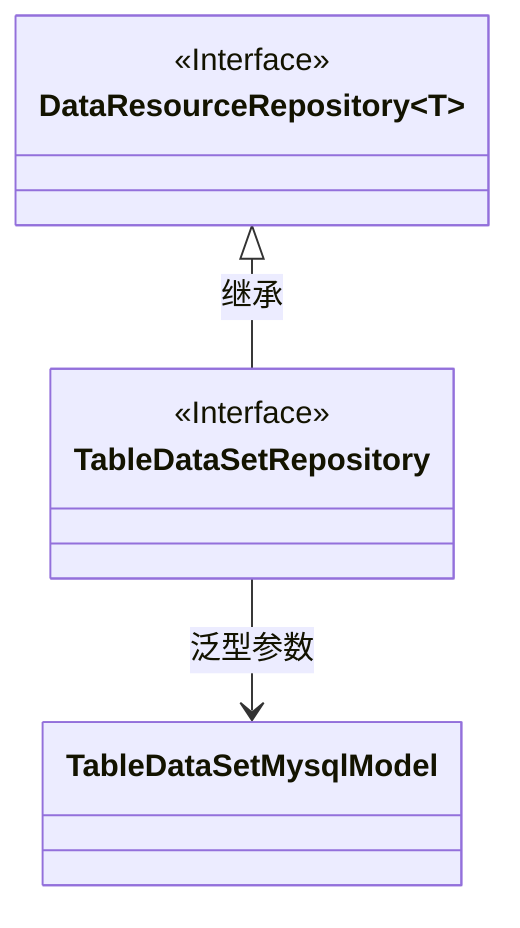
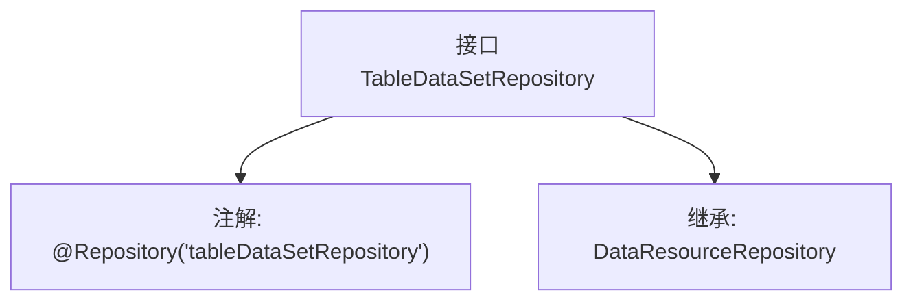

# 基础信息

|      |      |
|------|------|
| 名称 | TableDataSetRepository |
| 编码语言 | .java |
| 代码路径 | WeFe/board/board-service/src/main/java/com/welab/wefe/board/service/database/repository/data_resource/TableDataSetRepository.java |
| 包名 | com.welab.wefe.board.service.database.repository.data_resource |
| 依赖项 | ['com.welab.wefe.board.service.database.entity.data_resource.TableDataSetMysqlModel', 'org.springframework.stereotype.Repository'] |
| 概述说明 | 这是一个Spring数据仓库接口，继承自DataResourceRepository，用于操作TableDataSetMysqlModel类型的数据。 |

# 说明

该代码片段定义了一个名为TableDataSetRepository的Spring仓库接口，使用@Repository注解标注并指定了bean名称为"tableDataSetRepository"。该接口继承了DataResourceRepository泛型接口，其泛型类型参数为TableDataSetMysqlModel，表明该仓库用于操作TableDataSetMysqlModel类型的数据实体。这是一个典型的Spring Data JPA仓库接口定义，用于数据库访问操作。

# 类列表 Class Summary

| 名称   | 类型  | 说明 |
|-------|------|-------------|
| TableDataSetRepository | interface | 这是一个名为tableDataSetRepository的Spring仓库接口，继承自DataResourceRepository，用于操作TableDataSetMysqlModel数据模型。 |

## 类 TableDataSetRepository

|      |      |
|------|------|
| 访问范围 | @Repository("tableDataSetRepository");public |
| 类型 | interface |
| 名称 | TableDataSetRepository |
| 说明 | 这是一个名为tableDataSetRepository的Spring仓库接口，继承自DataResourceRepository，用于操作TableDataSetMysqlModel数据模型。 |

### UML类图

这段类图描述了一个基于Spring的仓库接口结构。TableDataSetRepository接口继承自泛型接口DataResourceRepository，并指定泛型参数为TableDataSetMysqlModel。其中DataResourceRepository被标记为接口，TableDataSetRepository通过继承关系与其关联，同时通过依赖关系与TableDataSetMysqlModel模型类相关联。整个结构展示了典型的Spring Data JPA仓库接口设计模式。

### 内部方法调用关系图

这段代码定义了一个名为TableDataSetRepository的Spring数据仓库接口，通过@Repository注解将其标记为Spring管理的组件，并指定了组件名称为"tableDataSetRepository"。该接口继承了泛型化的DataResourceRepository接口，其泛型参数为TableDataSetMysqlModel，表明这是一个针对TableDataSetMysqlModel实体类型的数据访问接口。这种结构通常用于Spring Data JPA或类似框架中，用于自动生成数据库操作的基本CRUD方法。

### 字段列表 Field List

| 名称  | 类型  | 说明 |
|-------|-------|------|

### 方法列表

| 名称  | 类型  | 说明 |
|-------|-------|------|

