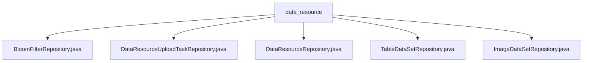

# 基础信息

|      |      |
|------|------|
| 名称 | data_resource |
| 编码语言 | .java |
| 代码路径 | WeFe/board/board-service/src/main/java/com/welab/wefe/board/service/database/repository/data_resource |
| 包名 | docs.board.board-service.src.main.java.com.welab.wefe.board.service.database.repository.data_resource |
| 概述说明 | Spring仓库接口定义：BloomFilterRepository操作布隆过滤器模型；DataResourceUploadTaskRepository管理上传任务，含清理和超时处理；DataResourceRepository提供标签查询、计数和更新方法；TableDataSetRepository和ImageDataSetRepository分别操作表数据和图像数据模型。 |

# 说明

## 概述  
该模块是Spring Data JPA实现的资源管理仓库层，核心职责为统一管理各类数据资源（如布隆过滤器、表格/图像数据集）的数据库操作。接口规范遵循JPA标准，提供基础CRUD能力扩展，例如DataResourceRepository定义标签查询、同名统计等原生SQL操作。关键数据结构包括BloomFilterMysqlModel、TableDataSetMysqlModel等实体类。依赖Spring Data JPA框架，通过@Transactional等注解保障事务。例如TableDataSetRepository通过泛型继承实现类型化查询。

## 主要业务场景  
主要处理数据资源的全生命周期管理，类似资源管理中心模式。包含数据清理（自动删除30天历史记录）、状态维护（超时任务置为failed）、使用统计（更新项目引用计数）等场景。交互模式统一通过JPA接口暴露，例如ImageDataSetRepository继承通用操作，同时支持特殊查询。典型应用包括数据集标签分析（listAllTags）、冲突检测（countByName）等。API类型涵盖查询/更新/删除，例如通过@Modifying实现批量状态变更。

### 包内部结构视图

该流程图展示了data_resource目录下的5个Java仓库类文件结构。所有文件都直接隶属于data_resource节点，没有更深层级的嵌套关系。这些仓库类包括BloomFilter、数据资源上传任务、数据资源、表数据集和图像数据集等不同功能的存储库实现。

# 文件列表

| 名称   | 类型  | 说明 |
|-------|------|-------------|
| [BloomFilterRepository.java](BloomFilterRepository.md) | file | 接口BloomFilterRepository继承DataResourceRepository，用于操作BloomFilterMysqlModel数据模型。 |
| [DataResourceUploadTaskRepository.java](DataResourceUploadTaskRepository.md) | file | DataResourceUploadTaskRepository接口定义了两个方法：deleteHistory删除30天前的历史数据，closeTimeoutTask将超时5分钟的上传任务状态设为失败并记录错误信息。 |
| [DataResourceRepository.java](DataResourceRepository.md) | file | DataResourceRepository接口扩展BaseRepository，提供按资源类型或全局查询标签统计、名称计数及更新项目使用次数的原生SQL方法。 |
| [TableDataSetRepository.java](TableDataSetRepository.md) | file | 这是一个Spring数据仓库接口，继承自DataResourceRepository，用于操作TableDataSetMysqlModel类型的数据。 |
| [ImageDataSetRepository.java](ImageDataSetRepository.md) | file | 这是一个名为imageDataSetRepository的Spring仓库接口，继承自DataResourceRepository，用于操作ImageDataSetMysqlModel数据模型。 |

