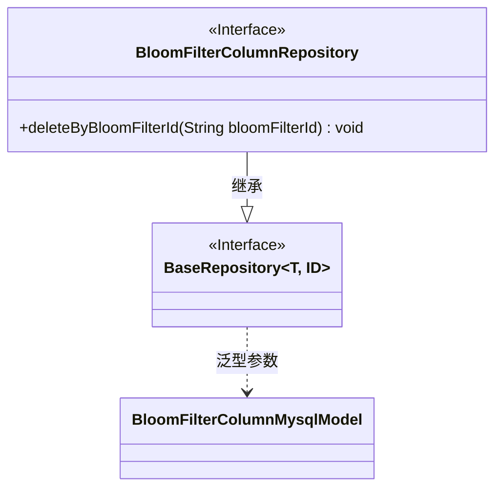
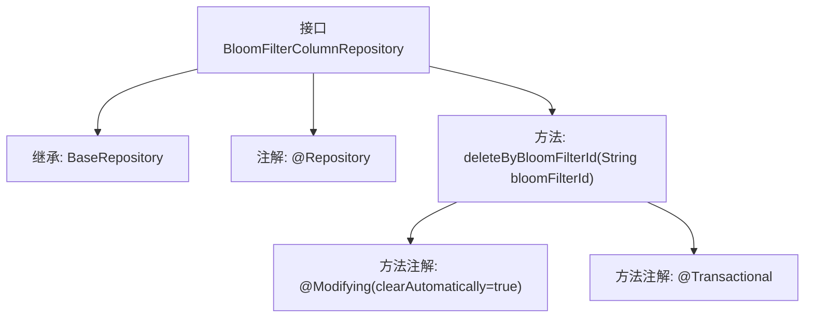

# 基础信息

|      |      |
|------|------|
| 名称 | BloomFilterColumnRepository |
| 编码语言 | .java |
| 代码路径 | WeFe/board/board-service/src/main/java/com/welab/wefe/board/service/database/repository/fusion/BloomFilterColumnRepository.java |
| 包名 | com.welab.wefe.board.service.database.repository.fusion |
| 依赖项 | ['com.welab.wefe.board.service.database.entity.fusion.bloomfilter.BloomFilterColumnMysqlModel', 'com.welab.wefe.board.service.database.repository.base.BaseRepository', 'org.springframework.data.jpa.repository.Modifying', 'org.springframework.stereotype.Repository', 'org.springframework.transaction.annotation.Transactional'] |
| 概述说明 | 接口BloomFilterColumnRepository继承BaseRepository，提供按bloomFilterId删除数据的方法，支持自动清除和事务处理。 |

# 说明

这是一个Spring Data JPA的仓库接口定义，扩展了基础仓库接口，用于操作布隆过滤器列模型数据。接口包含一个删除方法，通过布隆过滤器ID删除相关记录。该方法使用了@Modifying注解并启用了自动清除缓存，同时标记为@Transactional确保事务性。

# 类列表 Class Summary

| 名称   | 类型  | 说明 |
|-------|------|-------------|
| BloomFilterColumnRepository | interface | 接口BloomFilterColumnRepository继承BaseRepository，提供按bloomFilterId删除数据的方法，支持自动清理和事务。 |

## 类 BloomFilterColumnRepository

|      |      |
|------|------|
| 访问范围 | @Repository;public |
| 类型 | interface |
| 名称 | BloomFilterColumnRepository |
| 说明 | 接口BloomFilterColumnRepository继承BaseRepository，提供按bloomFilterId删除数据的方法，支持自动清理和事务。 |

### UML类图

类图描述：该图展示了一个Spring Data JPA仓库接口BloomFilterColumnRepository，它继承自泛型接口BaseRepository<BloomFilterColumnMysqlModel, String>。其中BaseRepository是带泛型参数T和ID的接口，BloomFilterColumnMysqlModel作为实体类型参数。BloomFilterColumnRepository接口定义了按bloomFilterId删除数据的方法，并标注了JPA事务和修改注解。

### 内部方法调用关系图

这段流程图展示了Spring Data JPA接口BloomFilterColumnRepository的结构。该接口继承自BaseRepository并标注@Repository注解，包含一个带@Modifying和@Transactional注解的删除方法。方法通过bloomFilterId参数执行删除操作，clearAutomatically=true表示执行后自动清除持久化上下文。整个设计体现了JPA仓库模式的特点，通过方法命名约定实现条件删除功能。

### 字段列表 Field List

| 名称  | 类型  | 说明 |
|-------|-------|------|

### 方法列表

| 名称  | 类型  | 说明 |
|-------|-------|------|
| deleteByBloomFilterId | void | 使用JPA删除指定布隆过滤器ID的数据，自动清除缓存并支持事务。 |

