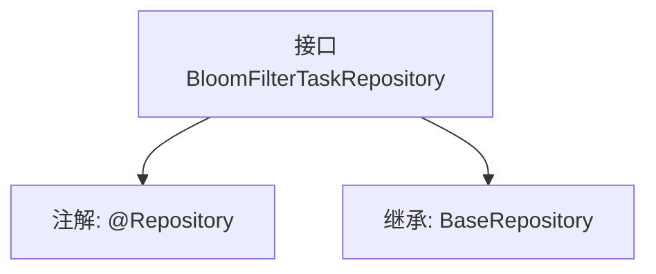

# 基础信息

|      |      |
|------|------|
| 名称 | BloomFilterTaskRepository |
| 编码语言 | .java |
| 代码路径 | WeFe/board/board-service/src/main/java/com/welab/wefe/board/service/database/repository/fusion/BloomFilterTaskRepository.java |
| 包名 | com.welab.wefe.board.service.database.repository.fusion |
| 依赖项 | ['com.welab.wefe.board.service.database.entity.fusion.bloomfilter.BloomFilterTaskMysqlModel', 'com.welab.wefe.board.service.database.repository.base.BaseRepository', 'org.springframework.stereotype.Repository'] |
| 概述说明 | 这是一个Spring Data JPA仓库接口，继承基础仓库接口，用于操作布隆过滤器任务数据模型。 |

# 说明

该代码片段定义了一个名为BloomFilterTaskRepository的Spring数据仓库接口，使用@Repository注解标识。该接口继承自BaseRepository泛型基类，指定了实体类型为BloomFilterTaskMysqlModel，主键类型为String。该设计表明这是一个用于操作布隆过滤器任务相关数据的持久层组件，遵循Spring Data JPA的规范实现基础CRUD操作。

# 类列表 Class Summary

| 名称   | 类型  | 说明 |
|-------|------|-------------|
| BloomFilterTaskRepository | interface | 该代码定义了一个BloomFilterTaskRepository接口，继承自BaseRepository，用于操作BloomFilterTaskMysqlModel类型数据，主键为String类型。 |


## 类 BloomFilterTaskRepository

|      |      |
|------|------|
| 访问范围 | @Repository;public |
| 类型 | interface |
| 名称 | BloomFilterTaskRepository |
| 说明 | 该代码定义了一个BloomFilterTaskRepository接口，继承自BaseRepository，用于操作BloomFilterTaskMysqlModel类型数据，主键为String类型。 |


### UML类图

```mermaid
classDiagram
    class BloomFilterTaskRepository {
        <<Interface>>
    }
    class BaseRepository~T, ID~ {
        <<Interface>>
    }
    BloomFilterTaskRepository --|> BaseRepository : 继承
    // BloomFilterTaskRepository 继承自泛型接口 BaseRepository
    // 泛型参数 T 绑定为 BloomFilterTaskMysqlModel，ID 绑定为 String
```

该类图展示了一个Spring数据仓库接口BloomFilterTaskRepository，它继承自泛型基础接口BaseRepository。其中BaseRepository定义了两个泛型参数T和ID，在此实现中分别被指定为BloomFilterTaskMysqlModel和String类型。通过@Repository注解表明这是一个Spring数据访问组件，用于处理BloomFilterTaskMysqlModel实体的持久化操作。


### 内部方法调用关系图



该流程图展示了BloomFilterTaskRepository接口的结构，它被标记为@Repository注解，并继承了BaseRepository泛型接口。BaseRepository的泛型参数指定了实体类型BloomFilterTaskMysqlModel和主键类型String。这是一个典型的数据访问层接口定义，用于实现与数据库的交互操作。

### 字段列表 Field List

| 名称  | 类型  | 说明 |
|-------|-------|------|

### 方法列表

| 名称  | 类型  | 说明 |
|-------|-------|------|


