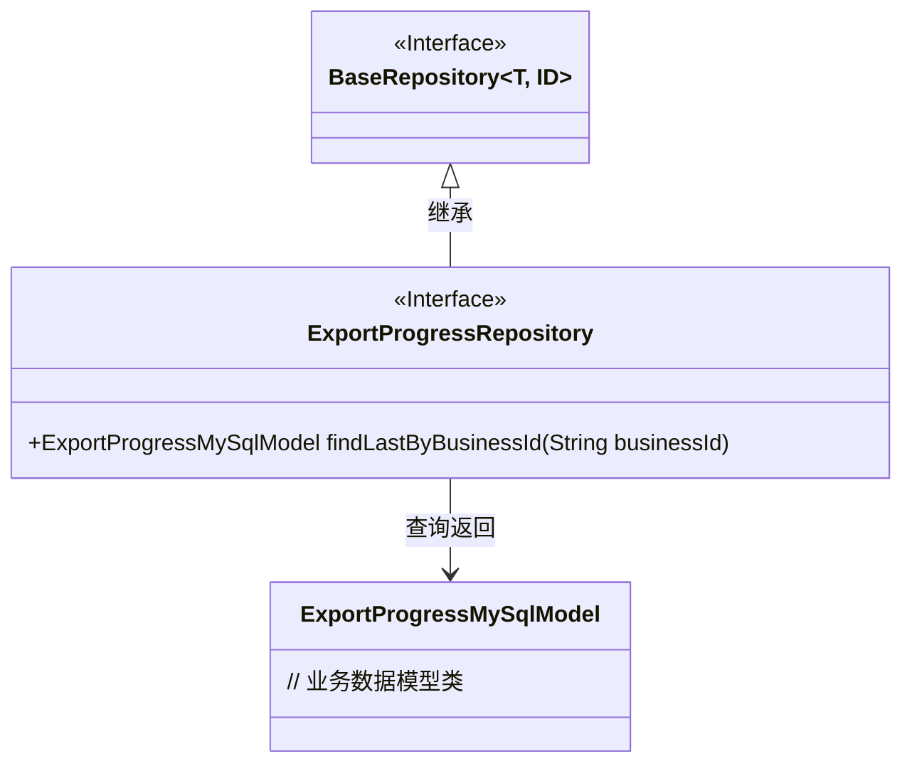
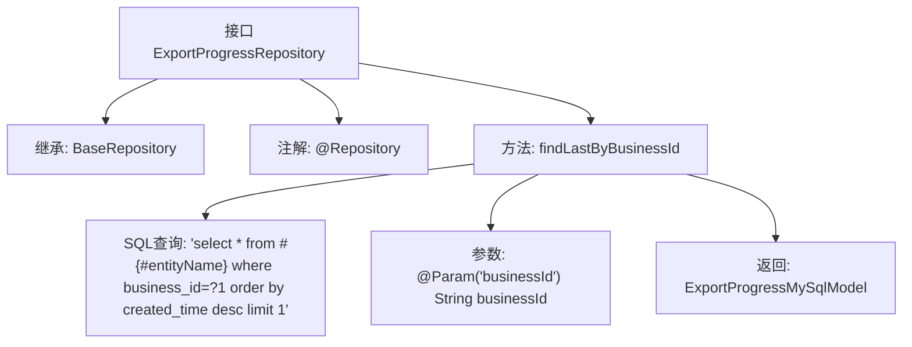

# 基础信息

|      |      |
|------|------|
| 名称 | ExportProgressRepository |
| 编码语言 | .java |
| 代码路径 | WeFe/board/board-service/src/main/java/com/welab/wefe/board/service/database/repository/fusion/ExportProgressRepository.java |
| 包名 | com.welab.wefe.board.service.database.repository.fusion |
| 依赖项 | ['com.welab.wefe.board.service.database.entity.fusion.ExportProgressMySqlModel', 'com.welab.wefe.board.service.database.entity.fusion.FusionResultMySqlModel', 'com.welab.wefe.board.service.database.repository.base.BaseRepository', 'org.springframework.data.jpa.repository.Query', 'org.springframework.data.repository.query.Param', 'org.springframework.stereotype.Repository'] |
| 概述说明 | 这是一个Spring Data JPA仓库接口，用于查询指定业务ID的最新导出进度记录。它继承基础仓库并包含原生SQL查询方法，按创建时间降序返回单条结果。 |

# 说明

该代码定义了一个名为ExportProgressRepository的Spring数据仓库接口，继承自BaseRepository，操作ExportProgressMySqlModel实体类，主键类型为String。接口包含一个原生SQL查询方法findLastByBusinessId，通过businessId参数查询对应业务ID的最新记录，按创建时间降序排序并返回第一条结果。该查询使用#{#entityName}引用实体名称，并通过@Param注解绑定参数。

# 类列表 Class Summary

| 名称   | 类型  | 说明 |
|-------|------|-------------|
| ExportProgressRepository | interface | 导出进度仓库接口，继承基础仓库，提供按业务ID查询最新记录的方法。 |

## 类 ExportProgressRepository

|      |      |
|------|------|
| 访问范围 | @Repository;public |
| 类型 | interface |
| 名称 | ExportProgressRepository |
| 说明 | 导出进度仓库接口，继承基础仓库，提供按业务ID查询最新记录的方法。 |

### UML类图

类图描述：该图展示了ExportProgressRepository接口继承自泛型接口BaseRepository，并关联到ExportProgressMySqlModel数据模型。ExportProgressRepository通过原生SQL查询方法findLastByBusinessId实现按业务ID获取最新记录的功能，体现了Spring Data JPA的仓库模式设计。接口标注了@Repository注解，表明其作为数据访问层的组件角色。

### 内部方法调用关系图

该流程图展示了Spring Data JPA接口`ExportProgressRepository`的结构，重点描述了其继承关系、注解标记和核心查询方法。接口通过`@Repository`标记为持久层组件，继承自泛型基础仓库，并定义了一个原生SQL查询方法`findLastByBusinessId`，该方法通过业务ID参数查询最新记录。箭头清晰表达了从接口定义到方法细节的层级关系。

### 字段列表 Field List

| 名称  | 类型  | 说明 |
|-------|-------|------|

### 方法列表

| 名称  | 类型  | 说明 |
|-------|-------|------|
| findLastByBusinessId | ExportProgressMySqlModel | 查询指定业务ID的最新导出进度记录，按创建时间降序排列并返回第一条结果。 |

