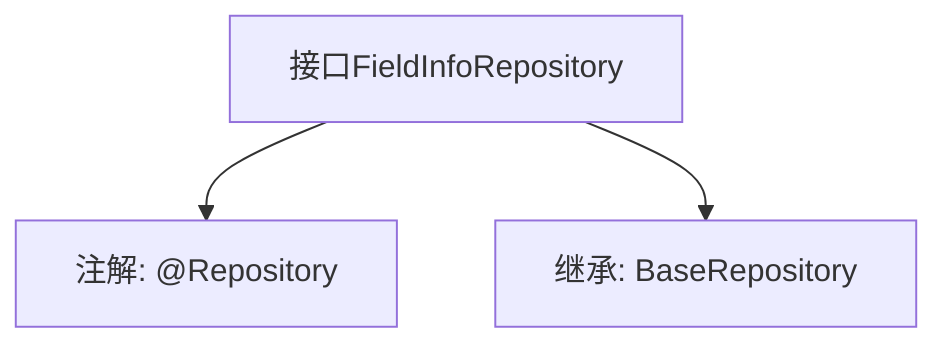

# 基础信息

|      |      |
|------|------|
| 名称 | FieldInfoRepository |
| 编码语言 | .java |
| 代码路径 | WeFe/board/board-service/src/main/java/com/welab/wefe/board/service/database/repository/fusion/FieldInfoRepository.java |
| 包名 | com.welab.wefe.board.service.database.repository.fusion |
| 依赖项 | ['com.welab.wefe.board.service.database.entity.fusion.FieldInfoMySqlModel', 'com.welab.wefe.board.service.database.repository.base.BaseRepository', 'org.springframework.stereotype.Repository'] |
| 概述说明 | 这是一个Spring Data JPA仓库接口，继承基础仓库接口，用于操作FieldInfoMySqlModel实体类，主键类型为String。 |

# 说明

该内容定义了一个名为FieldInfoRepository的Spring数据仓库接口，使用@Repository注解标识。该接口继承自BaseRepository泛型基类，指定了实体类型为FieldInfoMySqlModel，主键类型为String。这表明该仓库用于操作FieldInfoMySqlModel类型的数据实体，并提供了基础的CRUD操作功能。

# 类列表 Class Summary

| 名称   | 类型  | 说明 |
|-------|------|-------------|
| FieldInfoRepository | interface | 这是一个Spring Data JPA仓库接口，继承基础仓库类，用于操作FieldInfoMySqlModel类型数据，主键为String类型。 |


## 类 FieldInfoRepository

|      |      |
|------|------|
| 访问范围 | @Repository;public |
| 类型 | interface |
| 名称 | FieldInfoRepository |
| 说明 | 这是一个Spring Data JPA仓库接口，继承基础仓库类，用于操作FieldInfoMySqlModel类型数据，主键为String类型。 |


### UML类图

```mermaid
classDiagram
    class FieldInfoRepository {
        <<Interface>>
    }
    class BaseRepository~T, ID~ {
        <<Interface>>
    }
    
    FieldInfoRepository --|> BaseRepository : 继承
    // FieldInfoRepository接口继承自泛型接口BaseRepository，指定泛型参数为FieldInfoMySqlModel和String
```

这段类图展示了FieldInfoRepository接口继承自BaseRepository泛型接口的关系。FieldInfoRepository是一个Spring数据访问层的标记接口，通过继承BaseRepository获得了基本的CRUD操作能力，其中泛型参数T被指定为FieldInfoMySqlModel表示实体类型，ID被指定为String表示主键类型。这种设计遵循了Spring Data JPA的Repository模式，为特定实体提供标准化的数据访问接口。


### 内部方法调用关系图



这段流程图描述了FieldInfoRepository接口的结构关系。该接口被标记为Spring的@Repository组件，表明它是一个数据访问层组件。同时它继承了BaseRepository泛型接口，指定了实体类型为FieldInfoMySqlModel，主键类型为String。这种设计遵循了Spring Data JPA的规范，通过继承基础仓库接口自动获得基本的CRUD操作能力，无需手动实现这些方法。

### 字段列表 Field List

| 名称  | 类型  | 说明 |
|-------|-------|------|

### 方法列表

| 名称  | 类型  | 说明 |
|-------|-------|------|


