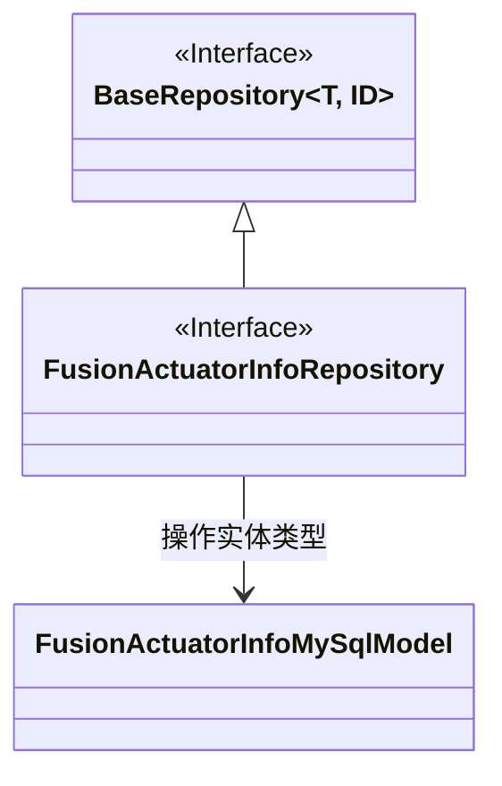
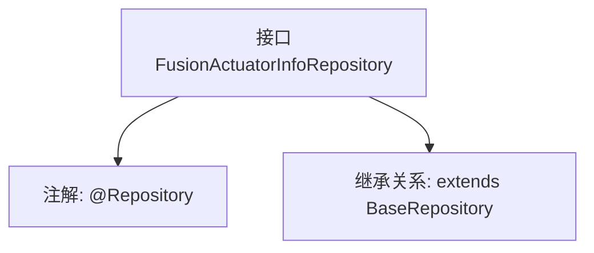

# 基础信息

|      |      |
|------|------|
| 名称 | FusionActuatorInfoRepository |
| 编码语言 | .java |
| 代码路径 | WeFe/board/board-service/src/main/java/com/welab/wefe/board/service/database/repository/fusion/FusionActuatorInfoRepository.java |
| 包名 | com.welab.wefe.board.service.database.repository.fusion |
| 依赖项 | ['com.welab.wefe.board.service.database.entity.fusion.FusionActuatorInfoMySqlModel', 'com.welab.wefe.board.service.database.repository.base.BaseRepository', 'org.springframework.stereotype.Repository'] |
| 概述说明 | FusionActuatorInfoRepository接口继承BaseRepository，用于操作FusionActuatorInfoMySqlModel数据，主键类型为String。 |

# 说明

该内容定义了一个名为FusionActuatorInfoRepository的Spring数据仓库接口，使用@Repository注解标记。该接口继承自BaseRepository基类，泛型参数指定了实体类型为FusionActuatorInfoMySqlModel，主键类型为String。这是一个典型的Spring Data JPA仓库接口声明，用于操作数据库中的FusionActuatorInfo实体数据。

# 类列表 Class Summary

| 名称   | 类型  | 说明 |
|-------|------|-------------|
| FusionActuatorInfoRepository | interface | FusionActuatorInfoRepository接口继承BaseRepository，用于操作FusionActuatorInfoMySqlModel数据，主键类型为String。 |

## 类 FusionActuatorInfoRepository

|      |      |
|------|------|
| 访问范围 | @Repository;public |
| 类型 | interface |
| 名称 | FusionActuatorInfoRepository |
| 说明 | FusionActuatorInfoRepository接口继承BaseRepository，用于操作FusionActuatorInfoMySqlModel数据，主键类型为String。 |

### UML类图

该类图展示了一个基于Spring Data的仓储接口设计。FusionActuatorInfoRepository接口继承自泛型接口BaseRepository，指定其操作实体类型为FusionActuatorInfoMySqlModel，主键类型为String。通过@Repository注解标记该接口会被Spring自动实现，遵循了JPA规范的设计模式，实现了对特定实体类型的基础CRUD操作能力。图中清晰体现了接口继承关系和泛型参数的具体化过程。

### 内部方法调用关系图

该流程图展示了FusionActuatorInfoRepository接口的结构，它是一个带有@Repository注解的Spring数据访问层接口，继承了泛型化的BaseRepository基类。BaseRepository指定了实体类型FusionActuatorInfoMySqlModel和主键类型String，表明该接口用于操作MySQL数据库中的执行器信息表。这种设计遵循了Spring Data JPA的规范，通过继承基础仓库接口自动获得CRUD等基础数据操作能力。

### 字段列表 Field List

| 名称  | 类型  | 说明 |
|-------|-------|------|

### 方法列表

| 名称  | 类型  | 说明 |
|-------|-------|------|

