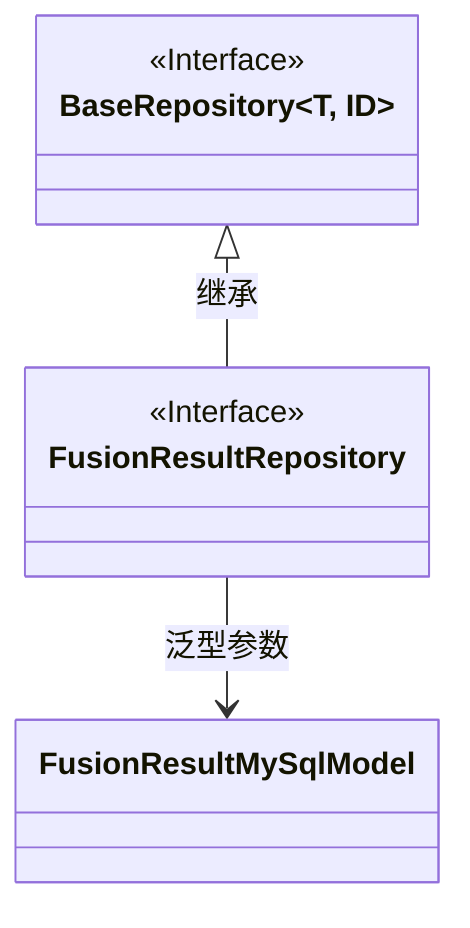
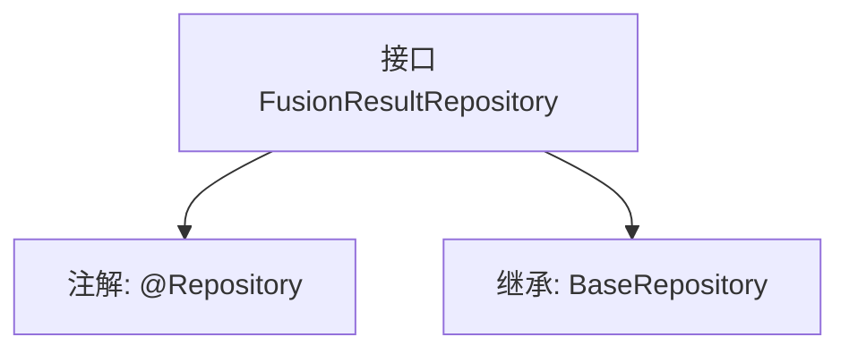

# 基础信息

|      |      |
|------|------|
| 名称 | FusionResultRepository |
| 编码语言 | .java |
| 代码路径 | WeFe/board/board-service/src/main/java/com/welab/wefe/board/service/database/repository/fusion/FusionResultRepository.java |
| 包名 | com.welab.wefe.board.service.database.repository.fusion |
| 依赖项 | ['com.welab.wefe.board.service.database.entity.fusion.FusionResultMySqlModel', 'com.welab.wefe.board.service.database.repository.base.BaseRepository', 'org.springframework.stereotype.Repository'] |
| 概述说明 | 这是一个Spring的FusionResult仓库接口，继承基础仓库，操作FusionResultMySqlModel实体，主键类型为String。 |

# 说明

该内容定义了一个名为FusionResultRepository的Spring数据仓库接口，使用@Repository注解标记为持久层组件。该接口继承自BaseRepository泛型基类，指定了实体类型为FusionResultMySqlModel，主键类型为String。这表明该仓库用于操作FusionResultMySqlModel类型的数据实体，并提供了基础的CRUD操作功能。

# 类列表 Class Summary

| 名称   | 类型  | 说明 |
|-------|------|-------------|
| FusionResultRepository | interface | 这是一个Spring Data JPA仓库接口，继承基础仓库类，用于操作FusionResultMySqlModel实体，主键类型为String。 |

## 类 FusionResultRepository

|      |      |
|------|------|
| 访问范围 | @Repository;public |
| 类型 | interface |
| 名称 | FusionResultRepository |
| 说明 | 这是一个Spring Data JPA仓库接口，继承基础仓库类，用于操作FusionResultMySqlModel实体，主键类型为String。 |

### UML类图

这段类图展示了FusionResultRepository接口继承自泛型接口BaseRepository的层级关系。BaseRepository是一个带有两个泛型参数(T和ID)的接口，FusionResultRepository通过继承将其特化为操作FusionResultMySqlModel类型数据、主键为String的仓储接口。图中清晰体现了接口间的继承关系以及泛型参数的具体化过程，符合Spring Data JPA的仓储接口设计模式。

### 内部方法调用关系图

这段代码定义了一个Spring Data JPA仓库接口FusionResultRepository，通过@Repository注解标记为持久层组件，并继承BaseRepository获得基础CRUD操作能力。该接口专用于操作FusionResultMySqlModel类型实体，主键类型为String，体现了JPA的泛型仓库模式，无需手动实现即可自动生成数据库访问逻辑。

### 字段列表 Field List

| 名称  | 类型  | 说明 |
|-------|-------|------|

### 方法列表

| 名称  | 类型  | 说明 |
|-------|-------|------|

