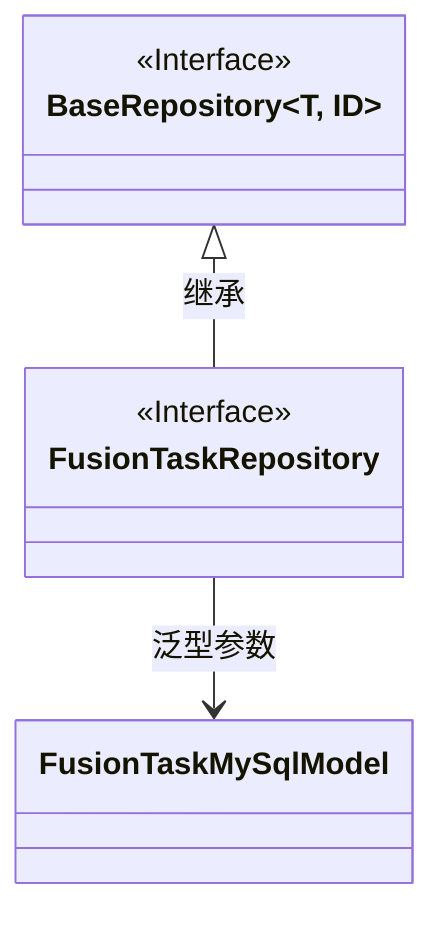
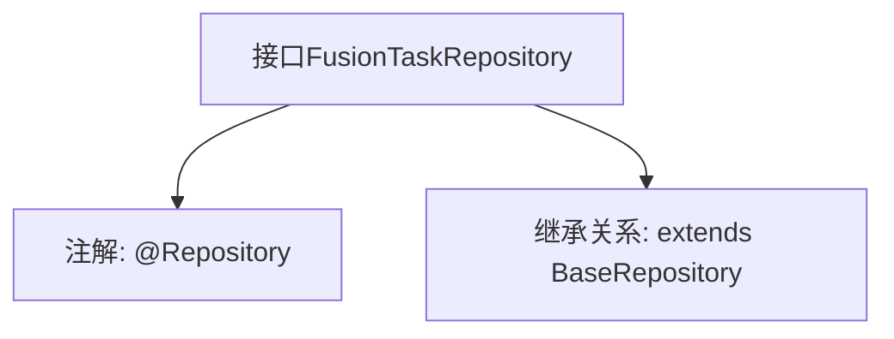

# 基础信息

|      |      |
|------|------|
| 名称 | FusionTaskRepository |
| 编码语言 | .java |
| 代码路径 | WeFe/board/board-service/src/main/java/com/welab/wefe/board/service/database/repository/fusion/FusionTaskRepository.java |
| 包名 | com.welab.wefe.board.service.database.repository.fusion |
| 依赖项 | ['com.welab.wefe.board.service.database.entity.fusion.FusionTaskMySqlModel', 'com.welab.wefe.board.service.database.repository.base.BaseRepository', 'org.springframework.stereotype.Repository'] |
| 概述说明 | 这是一个Spring数据仓库接口，继承基础仓库类，用于操作FusionTaskMySqlModel类型数据，主键为String类型。 |

# 说明

该内容定义了一个名为FusionTaskRepository的Spring数据仓库接口，使用@Repository注解标识。该接口继承自BaseRepository，指定了实体类型为FusionTaskMySqlModel，主键类型为String。这表明它是一个用于操作FusionTaskMySqlModel实体的数据访问层组件，遵循Spring Data的仓库模式设计。

# 类列表 Class Summary

| 名称   | 类型  | 说明 |
|-------|------|-------------|
| FusionTaskRepository | interface | 这是一个Spring的FusionTaskRepository接口，继承自BaseRepository，用于操作FusionTaskMySqlModel类型数据，主键类型为String。 |

## 类 FusionTaskRepository

|      |      |
|------|------|
| 访问范围 | @Repository;public |
| 类型 | interface |
| 名称 | FusionTaskRepository |
| 说明 | 这是一个Spring的FusionTaskRepository接口，继承自BaseRepository，用于操作FusionTaskMySqlModel类型数据，主键类型为String。 |

### UML类图

这段类图展示了FusionTaskRepository接口继承自泛型接口BaseRepository的关系。BaseRepository是一个带有两个泛型参数T和ID的接口，其中T被具体化为FusionTaskMySqlModel，ID为String类型。FusionTaskRepository作为数据访问层接口，通过继承BaseRepository获得了基本的CRUD操作能力，同时指定了实体类型为FusionTaskMySqlModel，主键类型为String。该设计遵循了Spring Data JPA的仓库模式，实现了对MySQL数据库表的操作抽象。

### 内部方法调用关系图

这段代码定义了一个名为FusionTaskRepository的Spring数据仓库接口，使用@Repository注解标记为持久层组件。该接口继承自泛型基类BaseRepository，指定了实体类型为FusionTaskMySqlModel，主键类型为String。流程图清晰地展示了接口的注解和继承关系，体现了Spring Data JPA中通过继承基础仓库接口快速实现CRUD操作的典型模式。

### 字段列表 Field List

| 名称  | 类型  | 说明 |
|-------|-------|------|

### 方法列表

| 名称  | 类型  | 说明 |
|-------|-------|------|

