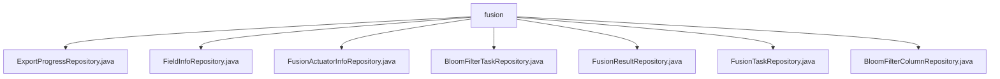

# 基础信息

|      |      |
|------|------|
| 名称 | fusion |
| 编码语言 | .java |
| 代码路径 | WeFe/board/board-service/src/main/java/com/welab/wefe/board/service/database/repository/fusion |
| 包名 | docs.board.board-service.src.main.java.com.welab.wefe.board.service.database.repository.fusion |
| 概述说明 | 定义了多个Spring数据仓库接口，均继承BaseRepository，操作不同实体类，主键为String。包含CRUD操作和特定查询方法，如按业务ID查询最新记录或按ID删除记录。 |

# 说明

## 概述  
该模块是数据融合处理的核心持久层，基于Spring Data JPA规范实现多实体CRUD操作。通过继承BaseRepository基类，统一管理ExportProgress、FieldInfo等7类实体，主键均为String类型，类似标准化数据访问层设计。  

接口规范遵循JPA查询语法，支持原生SQL（例如findLastByBusinessId按业务ID查最新记录）和派生查询，使用@Param绑定参数。关键数据结构包括ExportProgressMySqlModel等7种MySqlModel实体，对应不同业务阶段数据。  

外部依赖仅Spring Data JPA框架。实现案例丰富，例如BloomFilterColumnRepository提供基于布隆过滤器ID的删除操作，通过@Modifying和@Transactional确保事务安全。  

## 主要业务场景  
模块支撑数据融合全流程，包括任务调度（FusionTaskRepository）、结果存储（FusionResultRepository）和中间处理（如BloomFilterTaskRepository）。采用仓库模式统一交互，例如FieldInfoRepository管理字段元数据，ActuatorInfoRepository维护执行器状态。  

典型应用为流水线式处理：先配置字段，再触发布隆过滤（BloomFilterColumnRepository记录列映射），最后持久化结果。API类型涵盖基础CRUD和定制查询（如按业务ID排序查询），集成案例包括事务性删除和多条件检索，类似数据中台架构。

### 包内部结构视图

该流程图展示了WeFe项目中board-service模块下fusion仓库的层级结构。所有Java仓库接口文件都直接隶属于fusion目录，包括7个不同的Repository实现类，涉及导出进度、字段信息、融合执行器信息、布隆过滤器任务等核心功能的数据访问层组件。这些Repository类共同构成了该模块与数据库交互的基础设施层。

# 文件列表

| 名称   | 类型  | 说明 |
|-------|------|-------------|
| [ExportProgressRepository.java](ExportProgressRepository.md) | file | 这是一个Spring Data JPA仓库接口，用于查询指定业务ID的最新导出进度记录。它继承基础仓库并包含原生SQL查询方法，按创建时间降序返回单条结果。 |
| [FieldInfoRepository.java](FieldInfoRepository.md) | file | 这是一个Spring Data JPA仓库接口，继承基础仓库接口，用于操作FieldInfoMySqlModel实体类，主键类型为String。 |
| [FusionActuatorInfoRepository.java](FusionActuatorInfoRepository.md) | file | FusionActuatorInfoRepository接口继承BaseRepository，用于操作FusionActuatorInfoMySqlModel数据，主键类型为String。 |
| [BloomFilterTaskRepository.java](BloomFilterTaskRepository.md) | file | 这是一个Spring Data JPA仓库接口，继承基础仓库接口，用于操作布隆过滤器任务数据模型。 |
| [FusionResultRepository.java](FusionResultRepository.md) | file | 这是一个Spring的FusionResult仓库接口，继承基础仓库，操作FusionResultMySqlModel实体，主键类型为String。 |
| [FusionTaskRepository.java](FusionTaskRepository.md) | file | 这是一个Spring数据仓库接口，继承基础仓库类，用于操作FusionTaskMySqlModel类型数据，主键为String类型。 |
| [BloomFilterColumnRepository.java](BloomFilterColumnRepository.md) | file | 接口BloomFilterColumnRepository继承BaseRepository，提供按bloomFilterId删除数据的方法，支持自动清除和事务处理。 |

