# 基础信息

|      |      |
|------|------|
| 名称 | dto |
| 编码语言 | .java |
| 代码路径 | WeFe/board/board-service/src/main/java/com/welab/wefe/board/service/dto |
| 包名 | docs.board.board-service.src.main.java.com.welab.wefe.board.service.dto |
| 概述说明 | 模块统一管理多类型业务实体生命周期，含数据资源、消息、标注和任务处理。支持联邦学习全流程，包括任务配置、成员拓扑管理、数据融合及分页查询。采用分层设计，依赖多种框架，实现标准化接口与状态驱动交互。 |

# 说明

## 概述  
该模块是联邦学习与数据治理的综合管理平台，核心职责包括多类型业务实体（数据/消息/标注/任务）的全生命周期管理，以及跨机构联合建模的任务调度与配置管理，类似工作流引擎与数据中台的混合体。接口规范形成五大体系：1)数据资源类继承AbstractDataResourceUpdateInputModel 2)消息类遵循AbstractMessageContent模板 3)标注类双轨处理 4)任务配置采用JavaBean标准 5)分页处理PagingInput/Output。关键数据结构呈现分层特征：基础类（ProjectOutputModel）、流程类（KernelJob）、成员拓扑（Member）、标注坐标（Bndbox）和分页元数据（total/pageSize）。外部依赖包含XStream、JSON库、PaddleFL框架、MySQL及Spring校验框架。例如Env类切换存储策略，类似策略模式的应用。

## 主要业务场景  
模块支持联邦学习全流程协同与数据治理，典型场景为：1)数据资源管理（图像/表格CRUD与布隆过滤器字段初始化）2)任务编排（KernelJob派发与DAG关系定义）3)成员协作（角色管理/状态同步）4)数据融合（布隆过滤器去重统计）5)分页查询（PagingInput标准化）。交互模式多样：资源类通过继承实现校验（如BloomFilterAddInputModel）、消息类动态组装内容、标注类分侧处理、任务类配置驱动。功能完整性体现在多后端切换（CalculationEngineConfig）、可视化监控（useVdl开关）和进度跟踪（progressPercentage）。API集成案例包括环境预检（Env）、模型推送（ProviderModelPushResult）和分页转换（PagingOutput.of），例如通过projectId关联任务实例，类似多租户SaaS系统的协作模式。

### 包内部结构视图

```mermaid
graph TD
    dto --> vo
    dto --> kernel
    dto --> entity
    dto --> serving
    dto --> union
    dto --> fusion
    dto --> base
    vo --> data_resource
    vo --> message
    vo --> data_set
    vo --> RoleCounts.java
    vo --> AuditStatusCounts.java
    vo --> FeatureOutput.java
    vo --> JobMemberWithDataSetOutputModel.java
    vo --> OnlineAccountOutput.java
    vo --> AccountInputModel.java
    vo --> JobArbiterInfo.java
    vo --> JobProgressOutput.java
    vo --> ProjectFlowStatisticsResult.java
    vo --> FlowDataSetOutputModel.java
    data_resource --> image_data_set
    data_resource --> DataResourceAddOutputModel.java
    data_resource --> TableDataSetAddInputModel.java
    data_resource --> ImageDataSetAddInputModel.java
    data_resource --> AbstractDataResourceUpdateInputModel.java
    data_resource --> TableDataSetUpdateInputModel.java
    data_resource --> BloomFilterAddInputModel.java
    data_resource --> BloomFilterUpdateInputModel.java
    data_resource --> ImageDataSetUpdateInputModel.java
    image_data_set --> Bndbox.java
    image_data_set --> Size.java
    image_data_set --> Annotation.java
    image_data_set --> Source.java
    image_data_set --> LabelInfo.java
    image_data_set --> Object.java
    message --> AuditApplyDataResourceMessageContent.java
    message --> AuditJoinProjectMessageContent.java
    message --> AbstractMessageContent.java
    message --> ApplyJoinProjectMessageContent.java
    message --> TextMessageContent.java
    message --> AbstractMessageContentWithProject.java
    message --> ApplyDataResourceMessageContent.java
    data_set --> table_data_set
    data_set --> image_data_set
    table_data_set --> LabelDistributionItem.java
    table_data_set --> LabelDistribution.java
    image_data_set --> Bndbox.java
    image_data_set --> Size.java
    image_data_set --> Annotation.java
    image_data_set --> Source.java
    image_data_set --> LabelInfo.java
    image_data_set --> Object.java
    kernel --> deep_learning
    kernel --> machine_learning
    kernel --> Member.java
    deep_learning --> KernelJob.java
    deep_learning --> Env.java
    machine_learning --> StorageConfig.java
    machine_learning --> KernelTask.java
    machine_learning --> CalculationEngineConfig.java
    machine_learning --> KernelJob.java
    machine_learning --> TaskConfig.java
    machine_learning --> JobDataSet.java
    machine_learning --> Project.java
    machine_learning --> Env.java
    entity --> data_resource
    entity --> job
    entity --> modeling_config
    entity --> data_set
    entity --> project
    entity --> component
    entity --> BlacklistOutputModel.java
    entity --> ProjectDataSetInput.java
    entity --> MemberOutputModel.java
    entity --> ProjectMemberAuditOutput.java
    entity --> MessageOutputModel.java
    entity --> OperationLogOutputModel.java
    entity --> MemberFeatureInfoModel.java
    entity --> ProjectMemberInput.java
    entity --> DataIoTaskFeatureInfoOutputModel.java
    entity --> MemberModel.java
    entity --> AccountListAllOutputModel.java
    entity --> AbstractOutputModel.java
    entity --> AccountOutputModel.java
    entity --> MemberChatOutputModel.java
    entity --> PartnerConfigOutputModel.java
    entity --> ChatLastAccountOutputModel.java
    entity --> BloomFilterDataResourceListOutputModel.java
    data_resource --> output
    output --> ImageDataSetOutputModel.java
    output --> TableDataSetOutputModel.java
    output --> DataResourceUploadTaskOutputModel.java
    output --> BloomFilterOutputModel.java
    output --> DataResourceOutputModel.java
    job --> gateway
    job --> RelateDataSetOutputModel.java
    job --> TaskOutputModel.java
    job --> ProjectFlowNodeOutputModel.java
    job --> PreviewJobNodeOutputModel.java
    job --> JobOutputModel.java
    job --> TaskProgressOuputModel.java
    job --> TaskResultOutputModel.java
    job --> TaskOutputView.java
    job --> JobMemberOutputModel.java
    job --> JobListOutputModel.java
    gateway --> ProjectForGatewayDataSetOutputModel.java
    gateway --> ProjectForGatewayMemberOutputModel.java
    modeling_config --> ModelingConfigLogisticRegressionOutputModel.java
    modeling_config --> AbstractModelingConfigOutputModel.java
    modeling_config --> ModelingInfoOutputModel.java
    data_set --> ImageDataSetSampleOutputModel.java
    data_set --> DataSetColumnOutputModel.java
    data_set --> DataSetOutputModel.java
    data_set --> DataSetColumnInputModel.java
    project --> ProjectFlowListOutputModel.java
    project --> ProjectModelingOutputModel.java
    project --> ProjectMemberOutputModel.java
    project --> ProjectFlowDetailOutputModel.java
    project --> data_set
    project --> ProjectQueryOutputModel.java
    project --> ProjectDetailMemberOutputModel.java
    project --> ProjectFlowOutputModel.java
    project --> ProjectOutputModel.java
    project --> ProjectFlowProgressOutputModel.java
    project --> ProjectUsageDetailOutputModel.java
    data_set --> DerivedProjectDataSetOutputModel.java
    data_set --> ProjectDataResourceOutputModel.java
    component --> ComponentOutputModel.java
    serving --> ProviderModelPushResult.java
    union --> UnionDataSetOutput.java
    fusion --> PsiMeta.java
    fusion --> FusionResultExportProgress.java
    fusion --> FusionMemberInfo.java
    fusion --> BloomFilterTaskOutputModel.java
    fusion --> BloomFilterColumnInputModel.java
    fusion --> BloomFilterColumnOutputModel.java
    fusion --> FusionTaskOutput.java
    base --> PagingOutput.java
    base --> PagingInput.java
```

该流程图展示了WeFe/board/board-service项目中dto目录的完整层级结构，包含7个主要子目录（vo、kernel、entity、serving、union、fusion、base）及其下属文件。其中vo目录包含数据资源和消息相关类，kernel目录包含机器学习和深度学习相关配置类，entity目录包含项目核心实体类，serving/union/fusion目录包含特定功能模块类，base目录包含基础分页类。整个结构采用树状布局清晰呈现了多达158个文件的层级关系。

# 文件列表

| 名称   | 类型  | 说明 |
|-------|------|-------------|
| [vo](vo/_module.md) | package | 该模块统一管理多类型数据资源（图像/表格/布隆过滤器）的增删改查，采用分层输入模型设计。支持数据资源审核、消息内容生成、标注信息管理等功能，涵盖标签统计、格式转换、状态计数等场景。各类通过继承实现差异化校验，依赖XStream和JSON库，形成标准化管理流程。 |
| [serving](serving/_module.md) | package | ProviderModelPushResult类包含成员ID、名称和操作状态，提供创建和访问方法。 |
| [base](base/_module.md) | package | PagingOutput封装分页数据，含total和list属性，提供静态工厂方法。PagingInput处理分页参数，含pageIndex和pageSize属性，确保pageIndex非负。 |
| [fusion](fusion/_module.md) | package | PsiMeta类封装Base64字符串列表。FusionResultExportProgress跟踪导出进度。FusionMemberInfo存储成员信息。BloomFilterTaskOutputModel记录布隆过滤器任务状态。BloomFilterColumnInputModel校验字段输入。BloomFilterColumnOutputModel描述字段输出。FusionTaskOutput封装融合任务信息。 |
| [union](union/_module.md) | package | UnionDataSetOutput类包含成员ID、创建更新时间、维度数、描述、标签、是否含Y、使用次数、名称、样本数、ID和维度列表等属性及其getter/setter方法。 |
| [entity](entity/_module.md) | package | 该模块提供联邦学习项目的数据资源管理、任务流编排、成员协作及状态跟踪功能。采用Java Bean模式，通过继承和注解实现标准化接口，支持数据生命周期管理和多场景应用。 |
| [kernel](kernel/_module.md) | package | 模块管理联邦学习任务配置与执行，含KernelJob任务结构、Env环境配置。支持多方协作，主从交互，流程包括初始化、资源配置、提交集群。Member类定义成员信息，提供工厂方法创建不同学习类型成员对象。 |

