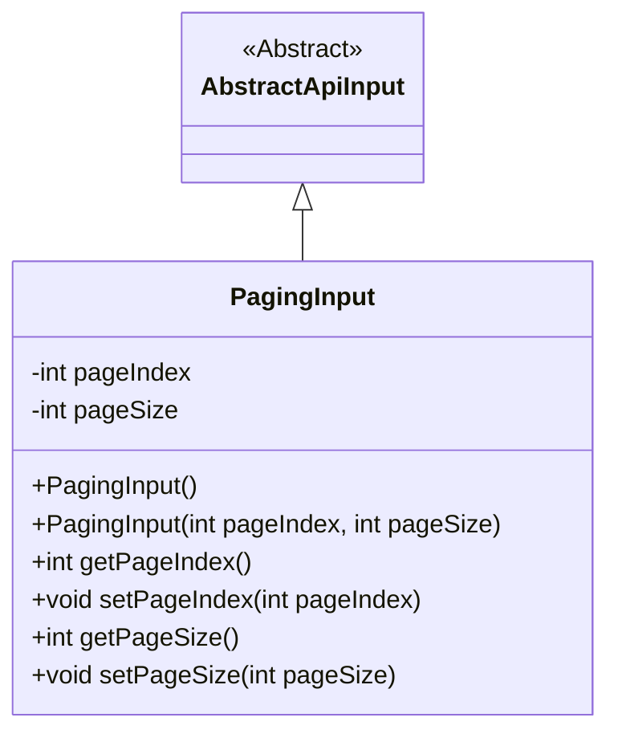
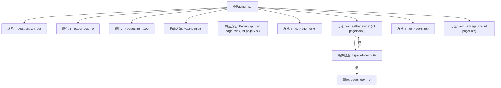

# 基础信息

|      |      |
|------|------|
| 名称 | PagingInput |
| 编码语言 | .java |
| 代码路径 | WeFe/board/board-service/src/main/java/com/welab/wefe/board/service/dto/base/PagingInput.java |
| 包名 | com.welab.wefe.board.service.dto.base |
| 依赖项 | ['com.welab.wefe.common.fieldvalidate.annotation.Check', 'com.welab.wefe.common.web.dto.AbstractApiInput'] |
| 概述说明 | 分页输入类，包含页码和页面大小属性，页码默认为0，页面大小默认为100，提供构造方法和getter/setter。 |

# 说明

PagingInput类继承自AbstractApiInput，用于分页输入参数处理。包含两个属性：pageIndex表示页码，0为第一页，默认值0；pageSize表示页面大小，默认值100。提供无参构造器和带参构造器。pageIndex的setter方法确保值不小于0。提供标准的getter和setter方法。

# 类列表 Class Summary

| 名称   | 类型  | 说明 |
|-------|------|-------------|
| PagingInput | class | 分页输入类，包含页码和页大小属性，页码默认为0，页大小默认为100，提供构造方法和getter/setter。 |

## 类 PagingInput

|      |      |
|------|------|
| 访问范围 | public |
| 类型 | class |
| 名称 | PagingInput |
| 说明 | 分页输入类，包含页码和页大小属性，页码默认为0，页大小默认为100，提供构造方法和getter/setter。 |

### UML类图

这段代码定义了一个分页输入类PagingInput，它继承自抽象类AbstractApiInput。PagingInput包含两个私有字段pageIndex和pageSize，分别表示页码和页面大小，其中pageIndex默认为0（第一页），pageSize默认为100。类中提供了两个构造方法和对应的getter/setter方法，其中setPageIndex方法会对负值进行自动校正（设为0）。这个类主要用于封装分页查询时的输入参数。

### 内部方法调用关系图

这段代码定义了一个名为PagingInput的类，继承自AbstractApiInput，用于处理分页输入参数。类中包含两个私有属性pageIndex和pageSize，分别表示页码和页面大小，默认值为0和100。提供了两个构造方法，一个无参构造方法和一个带参数的构造方法。同时提供了getter和setter方法，其中setPageIndex方法包含对输入参数的校验逻辑，确保页码不小于0。流程图清晰地展示了类的继承关系、属性、方法以及方法内部的逻辑流程。

### 字段列表 Field List

| 名称  | 类型  | 说明 |
|-------|-------|------|
| pageIndex = 0 | int | 页码索引，0表示第一页。 |
| pageSize = 100 | int | 页面大小默认值为100。 |

### 方法列表

| 名称  | 类型  | 说明 |
|-------|-------|------|
| getPageSize | int | 获取当前页面大小的方法，返回整型值pageSize。 |
| getPageIndex | int | 获取当前页码值的方法，返回整型变量pageIndex。 |
| setPageIndex | void | 设置页码，若小于0则设为0。 |
| setPageSize | void | 设置每页显示数量的方法，参数为pageSize。 |

