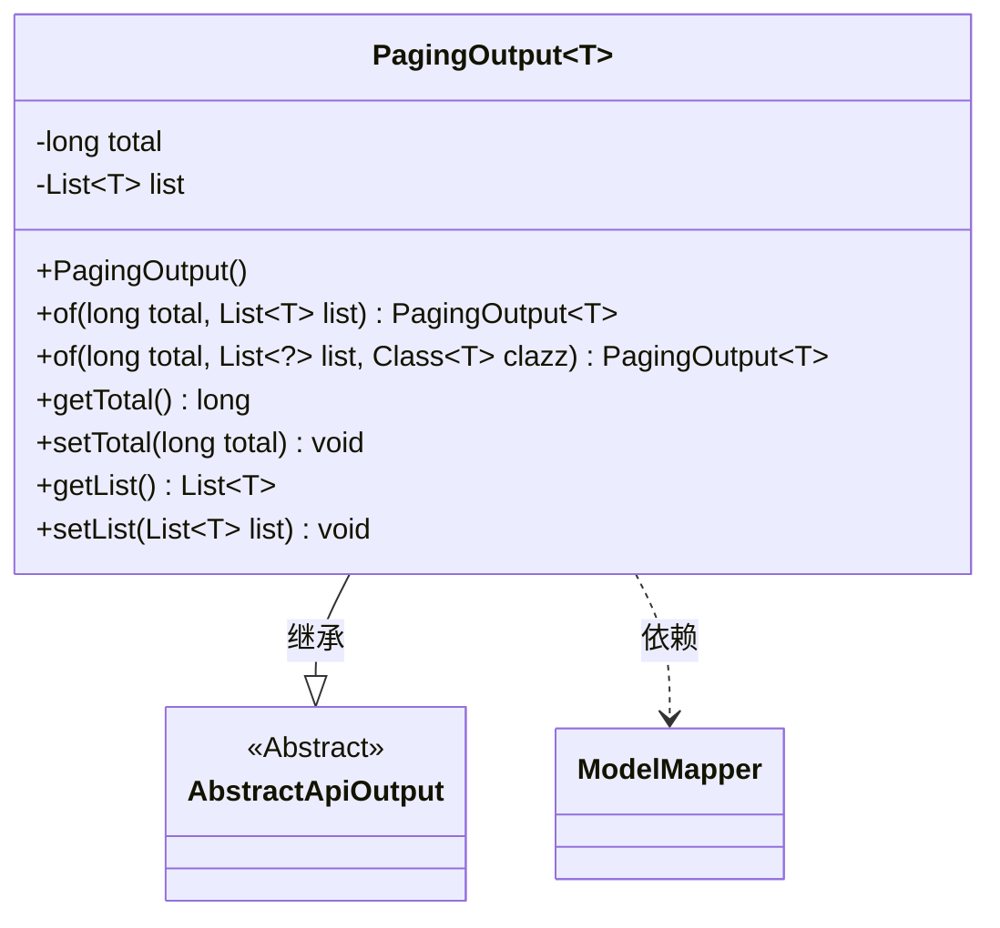
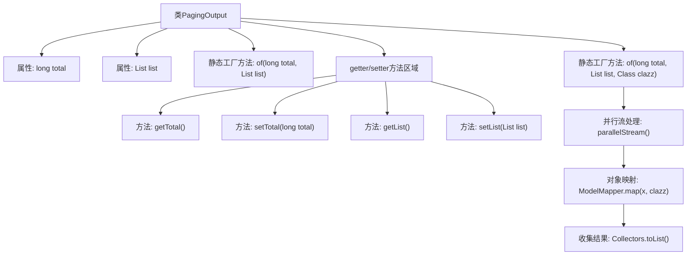

# 基础信息

|      |      |
|------|------|
| 名称 | PagingOutput |
| 编码语言 | .java |
| 代码路径 | WeFe/board/board-service/src/main/java/com/welab/wefe/board/service/dto/base/PagingOutput.java |
| 包名 | com.welab.wefe.board.service.dto.base |
| 依赖项 | ['com.welab.wefe.common.web.dto.AbstractApiOutput', 'com.welab.wefe.common.web.util.ModelMapper', 'java.util.List', 'java.util.stream.Collectors'] |
| 概述说明 | 分页输出类PagingOutput<T>继承AbstractApiOutput，包含总数total和列表list。提供两个静态方法of创建实例，支持直接赋值或自动映射DTO。含getter/setter方法。 |

# 说明

PagingOutput是一个泛型类，继承自AbstractApiOutput，用于封装分页数据。包含两个主要属性：total表示总记录数，list存储当前页数据列表。提供了两个静态工厂方法：of(long total, List<T> list)直接创建实例；of(long total, List<?> list, Class<T> clazz)支持自动将数据库实体映射为DTO对象。类中还包含标准的getter和setter方法用于属性访问和修改。

# 类列表 Class Summary

| 名称   | 类型  | 说明 |
|-------|------|-------------|
| PagingOutput | class | 分页输出类PagingOutput，包含总数和列表数据，提供两种构建方法：直接赋值和自动映射DTO。支持getter/setter操作。 |

## 类 PagingOutput

|      |      |
|------|------|
| 访问范围 | public |
| 类型 | class |
| 名称 | PagingOutput |
| 说明 | 分页输出类PagingOutput，包含总数和列表数据，提供两种构建方法：直接赋值和自动映射DTO。支持getter/setter操作。 |

### UML类图

类图描述：PagingOutput<T>是一个泛型类，继承自AbstractApiOutput抽象类，用于封装分页查询结果。它包含两个私有字段：total表示总记录数，list存储当前页数据列表。提供了两个静态工厂方法of()来创建实例，其中一个支持自动将数据库实体映射为DTO。类图展示了继承关系和与ModelMapper的依赖关系，体现了分页结果封装的核心功能。

### 内部方法调用关系图

该流程图展示了PagingOutput泛型类的结构和主要方法调用关系。类包含两个核心属性(total和list)和两种静态工厂方法，其中第二种工厂方法实现了数据库实体到DTO的自动映射。流程特别突出了带类型转换的工厂方法内部处理逻辑，包括并行流处理、对象映射和结果收集三个关键步骤。getter/setter方法被归为一个独立区域，体现了良好的代码组织方式。整个设计实现了分页数据的高效处理和类型安全转换。

### 字段列表 Field List

| 名称  | 类型  | 说明 |
|-------|-------|------|
| list | List<T> | 声明一个私有泛型列表变量list，类型为T。 |
| total | long | 私有长整型变量total，用于存储总计数值。 |

### 方法列表

| 名称  | 类型  | 说明 |
|-------|-------|------|
| of | PagingOutput<T> | 这是一个Java静态方法，用于创建分页输出对象。方法接收总记录数、数据列表和目标类类型，通过并行流处理列表数据并映射到目标类型，最后返回包含总数和处理后列表的分页输出对象。 |
| getTotal | long | 该方法返回一个名为total的长整型变量值。 |
| of | PagingOutput<T> | 这是一个静态工厂方法，用于创建分页输出对象。方法接收总记录数和数据列表，设置到分页输出对象中并返回。 |
| setTotal | void | 这是一个Java方法，用于设置类成员变量total的值。方法接受一个long类型参数，并将其赋值给当前对象的total属性。 |
| getList | List<T> | 返回列表对象。 |
| setList | void | 这是一个Java方法，用于设置类的List类型成员变量list。方法接受一个泛型List参数，并将其赋值给当前对象的list属性。 |

