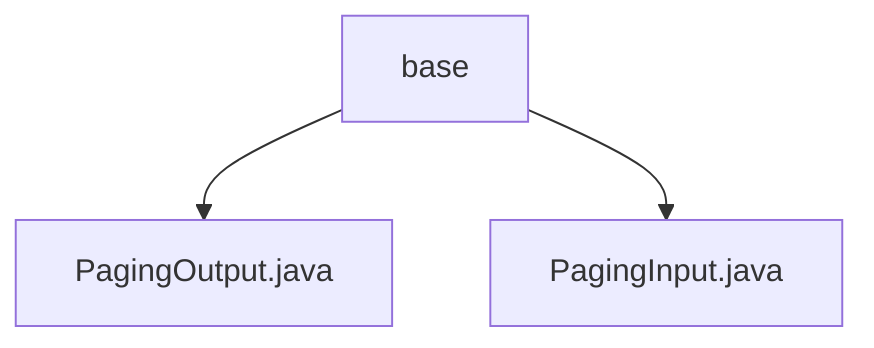

# 基础信息

|      |      |
|------|------|
| 名称 | base |
| 编码语言 | .java |
| 代码路径 | WeFe/board/board-service/src/main/java/com/welab/wefe/board/service/dto/base |
| 包名 | docs.board.board-service.src.main.java.com.welab.wefe.board.service.dto.base |
| 概述说明 | PagingOutput封装分页数据，含total和list属性，提供静态工厂方法。PagingInput处理分页参数，含pageIndex和pageSize属性，确保pageIndex非负。 |

# 说明

## 概述  
该模块核心职责是提供标准化的分页输入输出处理能力，类似Spring Data的分页抽象。PagingInput封装页码和页大小参数，PagingOutput包装分页结果集和总数。接口规范统一采用Getter/Setter模式，支持DTO自动映射。关键数据结构包括分页元数据(total/pageIndex/pageSize)和数据列表(List<T>)。无外部依赖项。例如PagingOutput.of()支持实体到DTO的自动转换。

## 主要业务场景  
主要应用于数据分页查询场景，形成"输入参数校验→分页查询→结果封装"的标准流程。交互模式遵循请求-响应模型，输入通过PagingInput标准化分页参数，输出通过PagingOutput统一包装。典型如后台管理系统表格分页，例如设置pageSize=20获取第二页数据。API类型包含基础CRUD分页接口，集成案例涉及数据库实体与DTO的分页转换。

### 包内部结构视图

该流程图展示了WeFe项目中board-service模块的DTO基础包结构。base目录下包含两个分页相关的数据传输对象文件：PagingOutput.java用于处理分页输出数据，PagingInput.java用于接收分页输入参数。这两个类共同构成了服务层分页功能的基础数据结构，体现了简洁清晰的层级关系。

# 文件列表

| 名称   | 类型  | 说明 |
|-------|------|-------------|
| [PagingOutput.java](PagingOutput.md) | file | 分页输出类PagingOutput<T>继承AbstractApiOutput，包含总数total和列表list。提供两个静态方法of创建实例，支持直接赋值或自动映射DTO。含getter/setter方法。 |
| [PagingInput.java](PagingInput.md) | file | 分页输入类，包含页码和页面大小属性，页码默认为0，页面大小默认为100，提供构造方法和getter/setter。 |

