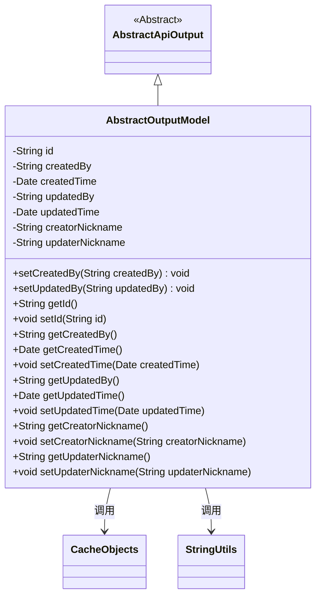

# 基础信息

|      |      |
|------|------|
| 名称 | AbstractOutputModel |
| 编码语言 | .java |
| 代码路径 | WeFe/board/board-service/src/main/java/com/welab/wefe/board/service/dto/entity/AbstractOutputModel.java |
| 包名 | com.welab.wefe.board.service.dto.entity |
| 依赖项 | ['com.welab.wefe.board.service.service.CacheObjects', 'com.welab.wefe.common.fieldvalidate.annotation.Check', 'com.welab.wefe.common.web.dto.AbstractApiOutput', 'org.apache.commons.lang3.StringUtils', 'java.util.Date'] |
| 概述说明 | AbstractOutputModel类包含ID、创建/更新人和时间等字段，通过set方法自动设置创建者和更新者昵称。 |

# 说明

AbstractOutputModel类继承自AbstractApiOutput，包含id、createdBy、createdTime、updatedBy、updatedTime等基础字段，以及creatorNickname和updaterNickname两个昵称字段。通过setCreatedBy和setUpdatedBy方法自动设置昵称，优先从CacheObjects获取昵称，若为空则获取成员名。提供所有字段的getter和setter方法，用于操作和访问这些属性。

# 类列表 Class Summary

| 名称   | 类型  | 说明 |
|-------|------|-------------|
| AbstractOutputModel | class | AbstractOutputModel类继承AbstractApiOutput，包含ID、创建/更新人和时间等字段，自动设置创建者和更新者昵称。 |

## 类 AbstractOutputModel

|      |      |
|------|------|
| 访问范围 | public |
| 类型 | class |
| 名称 | AbstractOutputModel |
| 说明 | AbstractOutputModel类继承AbstractApiOutput，包含ID、创建/更新人和时间等字段，自动设置创建者和更新者昵称。 |

### UML类图

类图描述：AbstractOutputModel继承自AbstractApiOutput，是一个包含创建/更新信息的抽象输出模型类。它包含ID、创建/更新者和时间等核心字段，并通过CacheObjects和StringUtils工具类实现昵称自动填充逻辑。setCreatedBy/setUpdatedBy方法会在设置用户ID时自动查询对应的昵称或成员名称，体现了业务对象与缓存系统的交互。

### 内部方法调用关系图

```mermaid
graph TD
    A["类AbstractOutputModel"]
    B["继承自: AbstractApiOutput"]
    C["属性: @Check String id"]
    D["属性: @Check String createdBy"]
    E["属性: @Check Date createdTime"]
    F["属性: @Check String updatedBy"]
    G["属性: @Check Date updatedTime"]
    H["属性: @Check String creatorNickname"]
    I["属性: @Check String updaterNickname"]
    J["方法: setCreatedBy(String)"]
    K["方法: setUpdatedBy(String)"]
    L["方法: getter/setter群"]

    A --> B
    A --> C
    A --> D
    A --> E
    A --> F
    A --> G
    A --> H
    A --> I
    A --> J
    A --> K
    A --> L

    J --> M["赋值createdBy"]
    J --> N["调用CacheObjects.getNickname"]
    J --> O["检查StringUtils.isBlank"]
    J --> P["调用CacheObjects.getMemberName"]

    K --> Q["赋值updatedBy"]
    K --> R["调用CacheObjects.getNickname"]
    K --> S["检查StringUtils.isBlank"]
    K --> T["调用CacheObjects.getMemberName"]
```

这段代码展示了一个继承自AbstractApiOutput的AbstractOutputModel类，主要用于管理带有校验注解的实体属性。核心逻辑体现在setCreatedBy和setUpdatedBy方法中，这两个方法不仅设置属性值，还会通过CacheObjects获取昵称或成员名作为备用值。流程图清晰地反映了属性声明、方法调用链以及条件判断的完整流程，特别是展示了当昵称为空时的备用方案处理机制。

### 字段列表 Field List

| 名称  | 类型  | 说明 |
|-------|-------|------|
| id | String | 字段id使用@Check注解标记为全局唯一标识。 |
| updaterNickname | String | 字段updaterNickname用于存储修改者昵称，通过@Check注解进行校验。 |
| updatedBy | String | 私有字符串变量updatedBy，使用@Check注解标记为"更新人"。 |
| creatorNickname | String | 定义私有字符串变量creatorNickname，使用@Check注解校验创建者昵称。 |
| createdBy | String | 字段createdBy标注为检查项"创建人"，类型为String。 |
| createdTime | Date | 字段createdTime用@Check注解标记，表示需校验创建时间。 |
| updatedTime | Date | 字段updatedTime用@Check注解标记，校验规则为"更新时间"。 |

### 方法列表

| 名称  | 类型  | 说明 |
|-------|-------|------|
| setUpdatedBy | void | 该方法设置更新者信息，包括ID和昵称。若昵称为空，则使用成员名称替代。 |
| setId | void | 设置对象ID的方法，将参数id赋值给当前对象的id属性。 |
| setCreatorNickname | void | 设置创建者昵称的方法，将输入参数赋值给类的成员变量creatorNickname。 |
| getUpdaterNickname | String | 获取更新者昵称的方法，返回字符串类型的updaterNickname。 |
| setCreatedTime | void | 设置对象创建时间的方法，参数为Date类型。 |
| getUpdatedTime | Date | 获取更新时间的方法，返回updatedTime值。 |
| getCreatorNickname | String | 获取创建者昵称的方法，返回字符串类型的creatorNickname值。 |
| setUpdatedTime | void | 设置更新时间的公共方法，参数为Date类型。 |
| getUpdatedBy | String | 方法返回更新者信息。 |
| getCreatedTime | Date | 获取创建时间的方法，返回Date类型。 |
| getId | String | 这是一个Java方法，返回字符串类型的id字段值。 |
| getCreatedBy | String | 方法getCreatedBy返回字符串类型变量createdBy的值。 |
| setCreatedBy | void | 设置创建者信息，包括ID和昵称。若昵称为空则使用成员名。 |
| setUpdaterNickname | void | 设置更新者昵称的方法，将传入参数赋值给类成员变量updaterNickname。 |

