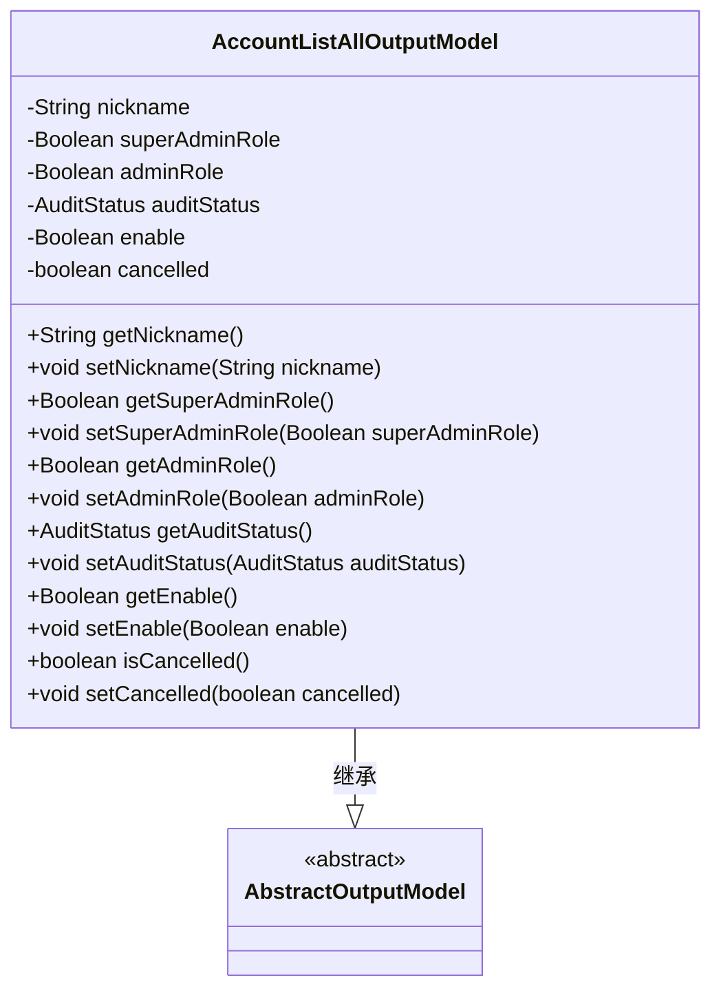

# 基础信息

|      |      |
|------|------|
| 名称 | AccountListAllOutputModel |
| 编码语言 | .java |
| 代码路径 | WeFe/board/board-service/src/main/java/com/welab/wefe/board/service/dto/entity/AccountListAllOutputModel.java |
| 包名 | com.welab.wefe.board.service.dto.entity |
| 依赖项 | ['com.welab.wefe.common.fieldvalidate.annotation.Check', 'com.welab.wefe.common.wefe.enums.AuditStatus'] |
| 概述说明 | AccountListAllOutputModel类包含用户昵称、超级管理员标识、管理员标识、审核状态、可用状态及注销状态字段及其getter/setter方法。 |

# 说明

AccountListAllOutputModel类继承AbstractOutputModel，包含用户账户信息字段：昵称、超级管理员标识（系统初始化者）、管理员标识（拥有更高权限）、审核状态、可用状态及注销状态。每个字段均有对应的getter和setter方法，便于数据访问和修改。

# 类列表 Class Summary

| 名称   | 类型  | 说明 |
|-------|------|-------------|
| AccountListAllOutputModel | class | AccountListAllOutputModel类包含昵称、超级管理员标识、管理员标识、审核状态、可用状态和注销状态字段及其getter/setter方法。 |

## 类 AccountListAllOutputModel

|      |      |
|------|------|
| 访问范围 | public |
| 类型 | class |
| 名称 | AccountListAllOutputModel |
| 说明 | AccountListAllOutputModel类包含昵称、超级管理员标识、管理员标识、审核状态、可用状态和注销状态字段及其getter/setter方法。 |

### UML类图

这段代码定义了一个`AccountListAllOutputModel`类，继承自抽象类`AbstractOutputModel`。该类包含多个私有字段，分别表示用户昵称、超级管理员角色、管理员角色、审核状态、可用状态和注销状态，并为每个字段提供了对应的getter和setter方法。这些字段通过`@Check`注解进行校验，其中部分字段还包含详细的注释说明其用途。该类主要用于封装账户列表查询的输出数据模型。

### 内部方法调用关系图

```mermaid
graph TD
    A["类AccountListAllOutputModel"]
    B["继承自: AbstractOutputModel"]
    C["属性: String nickname @Check('昵称')"]
    D["属性: Boolean superAdminRole @Check('是否是超级管理员')"]
    E["属性: Boolean adminRole @Check('是否是管理员')"]
    F["属性: AuditStatus auditStatus @Check('审核状态')"]
    G["属性: Boolean enable @Check('是否可用')"]
    H["属性: boolean cancelled"]
    I["方法: getNickname()/setNickname()"]
    J["方法: getSuperAdminRole()/setSuperAdminRole()"]
    K["方法: getAdminRole()/setAdminRole()"]
    L["方法: getAuditStatus()/setAuditStatus()"]
    M["方法: getEnable()/setEnable()"]
    N["方法: isCancelled()/setCancelled()"]

    A --> B
    A --> C
    A --> D
    A --> E
    A --> F
    A --> G
    A --> H
    A --> I
    A --> J
    A --> K
    A --> L
    A --> M
    A --> N
```

该流程图展示了AccountListAllOutputModel类的完整结构，包括其继承关系、属性字段（含注解说明）和所有getter/setter方法。该类作为输出模型，包含用户账号的昵称、角色权限标识（超级管理员/普通管理员）、审核状态、启用状态和注销状态等核心字段，所有属性均通过标准JavaBean规范提供访问方法。特别值得注意的是多个属性使用@Check注解进行业务语义标注，体现了模型验证的设计意图。

### 字段列表 Field List

| 名称  | 类型  | 说明 |
|-------|-------|------|
| nickname | String | Java字段注解：检查昵称的字符串类型私有变量。 |
| adminRole | Boolean | 私有布尔类型字段adminRole，用于检查用户是否为管理员，管理员拥有如设置成员可见性等额外权限。 |
| auditStatus | AuditStatus | 类成员变量auditStatus，使用@Check注解标记为"审核状态"，类型为AuditStatus。 |
| superAdminRole | Boolean | 字段superAdminRole用于检查用户是否为超级管理员，即系统初始创建者。 |
| enable | Boolean | 类私有布尔字段enable，标注@Check(name="是否可用")，表示可用性状态。 |
| cancelled | boolean | 布尔变量cancelled，表示取消状态。 |

### 方法列表

| 名称  | 类型  | 说明 |
|-------|-------|------|
| setNickname | void | 设置用户昵称的方法，将输入参数赋值给对象的nickname属性。 |
| getSuperAdminRole | Boolean | 获取超级管理员角色状态的方法，返回布尔值表示是否为超级管理员。 |
| getNickname | String | 方法返回用户昵称字符串。 |
| setAuditStatus | void | 设置审计状态的方法，将传入的auditStatus赋值给当前对象的auditStatus属性。 |
| getAuditStatus | AuditStatus | 获取审核状态的方法，返回auditStatus变量值。 |
| setAdminRole | void | 定义方法setAdminRole，接受布尔参数adminRole，用于设置对象的adminRole属性。 |
| getAdminRole | Boolean | 获取管理员角色状态的方法，返回布尔值表示是否为管理员。 |
| getEnable | Boolean | 这是一个Java方法，返回布尔类型的enable变量值。 |
| setEnable | void | 这是一个Java方法，用于设置布尔类型的enable属性值。方法接受一个Boolean参数，并将其赋值给类的成员变量enable。 |
| isCancelled | boolean | 该方法返回布尔值，表示是否已取消。 |
| setCancelled | void | 方法`setCancelled`用于设置布尔值`cancelled`的状态。 |
| setSuperAdminRole | void | 设置超级管理员角色的方法，参数为布尔值。 |

