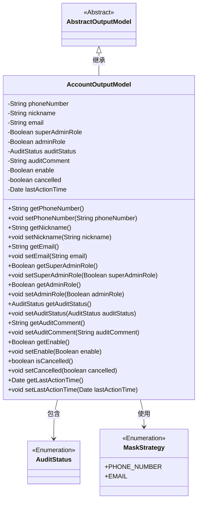

# 基础信息

|      |      |
|------|------|
| 名称 | AccountOutputModel |
| 编码语言 | .java |
| 代码路径 | WeFe/board/board-service/src/main/java/com/welab/wefe/board/service/dto/entity/AccountOutputModel.java |
| 包名 | com.welab.wefe.board.service.dto.entity |
| 依赖项 | ['com.welab.wefe.common.fieldvalidate.annotation.Check', 'com.welab.wefe.common.fieldvalidate.secret.MaskStrategy', 'com.welab.wefe.common.fieldvalidate.secret.Secret', 'com.welab.wefe.common.wefe.enums.AuditStatus', 'java.util.Date'] |
| 概述说明 | AccountOutputModel类包含用户账号信息，如手机号、昵称、邮箱、管理员角色、审核状态及最后活动时间等字段，并提供getter/setter方法。 |

# 说明

AccountOutputModel类继承自AbstractOutputModel，包含用户账户相关属性。phoneNumber和email字段使用注解进行校验和脱敏处理。nickname为昵称字段。superAdminRole标识超级管理员，adminRole标识管理员权限。auditStatus和auditComment记录审核状态和意见。enable控制账户可用性，cancelled表示是否注销，lastActionTime记录最后活动时间。所有字段均提供getter和setter方法。

# 类列表 Class Summary

| 名称   | 类型  | 说明 |
|-------|------|-------------|
| AccountOutputModel | class | AccountOutputModel类包含用户账号信息，如手机号、昵称、邮箱、管理员角色、审核状态、可用性等字段，并提供getter/setter方法。 |

## 类 AccountOutputModel

|      |      |
|------|------|
| 访问范围 | public |
| 类型 | class |
| 名称 | AccountOutputModel |
| 说明 | AccountOutputModel类包含用户账号信息，如手机号、昵称、邮箱、管理员角色、审核状态、可用性等字段，并提供getter/setter方法。 |

### UML类图

这段代码定义了一个AccountOutputModel类，继承自AbstractOutputModel，用于表示账户输出模型。该类包含多个私有字段，如手机号、昵称、邮箱等，并提供了相应的getter和setter方法。其中phoneNumber和email字段使用了@Secret注解进行脱敏处理，@Check注解用于字段校验。AuditStatus和MaskStrategy是枚举类型，分别用于表示审核状态和脱敏策略。类图清晰地展示了继承关系和依赖关系。

### 内部方法调用关系图

```mermaid
graph TD
    A["类AccountOutputModel"]
    B["继承自: AbstractOutputModel"]
    C["属性: String phoneNumber"]
    D["属性: String nickname"]
    E["属性: String email"]
    F["属性: Boolean superAdminRole"]
    G["属性: Boolean adminRole"]
    H["属性: AuditStatus auditStatus"]
    I["属性: String auditComment"]
    J["属性: Boolean enable"]
    K["属性: boolean cancelled"]
    L["属性: Date lastActionTime"]
    M["方法: getPhoneNumber()"]
    N["方法: setPhoneNumber(String)"]
    O["方法: getNickname()"]
    P["方法: setNickname(String)"]
    Q["方法: getEmail()"]
    R["方法: setEmail(String)"]
    S["方法: getSuperAdminRole()"]
    T["方法: setSuperAdminRole(Boolean)"]
    U["方法: getAdminRole()"]
    V["方法: setAdminRole(Boolean)"]
    W["方法: getAuditStatus()"]
    X["方法: setAuditStatus(AuditStatus)"]
    Y["方法: getAuditComment()"]
    Z["方法: setAuditComment(String)"]
    AA["方法: getEnable()"]
    AB["方法: setEnable(Boolean)"]
    AC["方法: isCancelled()"]
    AD["方法: setCancelled(boolean)"]
    AE["方法: getLastActionTime()"]
    AF["方法: setLastActionTime(Date)"]

    A --> B
    A --> C
    A --> D
    A --> E
    A --> F
    A --> G
    A --> H
    A --> I
    A --> J
    A --> K
    A --> L
    A --> M
    A --> N
    A --> O
    A --> P
    A --> Q
    A --> R
    A --> S
    A --> T
    A --> U
    A --> V
    A --> W
    A --> X
    A --> Y
    A --> Z
    A --> AA
    A --> AB
    A --> AC
    A --> AD
    A --> AE
    A --> AF
```

这段代码定义了一个AccountOutputModel类，继承自AbstractOutputModel，包含用户账户相关的属性和对应的getter/setter方法。属性包括手机号、昵称、邮箱、管理员角色标识、审核状态等，其中部分属性使用了@Check和@Secret注解进行校验和脱敏处理。类结构清晰，通过标准的JavaBean规范封装数据，便于在系统中传递账户信息。

### 字段列表 Field List

| 名称  | 类型  | 说明 |
|-------|-------|------|
| lastActionTime | Date | 最后操作时间字段，记录最近一次操作的时间戳。 |
| nickname | String | 代码定义了一个私有字符串变量nickname，并使用了@Check注解标记该字段需进行"昵称"校验。 |
| adminRole | Boolean | 字段adminRole用于检查用户是否为管理员，管理员拥有如设置成员可见性等额外权限。 |
| enable | Boolean | 定义私有布尔变量enable，使用@Check注解标记为"是否可用"检查项。 |
| cancelled | boolean | 布尔变量cancelled，表示取消状态。 |
| auditComment | String | 实体类字段：审核意见，类型为字符串，用于存储审核相关备注信息。 |
| email | String | Java字段注解：邮箱校验，使用EMAIL掩码策略保护隐私。 |
| superAdminRole | Boolean | 检查是否为超级管理员，即系统初始创建者。 |
| auditStatus | AuditStatus | 类私有字段auditStatus，标注为审核状态检查。 |
| phoneNumber | String | 代码定义了一个私有字符串变量phoneNumber，使用@Check注解验证手机号格式，并通过@Secret注解对手机号进行脱敏处理，采用PHONE_NUMBER掩码策略。 |

### 方法列表

| 名称  | 类型  | 说明 |
|-------|-------|------|
| setAdminRole | void | 设置管理员角色的方法，参数为布尔值adminRole。 |
| getNickname | String | 方法返回用户昵称字符串。 |
| setAuditStatus | void | 设置审计状态的方法，将传入的auditStatus赋值给当前对象的auditStatus属性。 |
| setSuperAdminRole | void | 设置超级管理员角色的方法，参数为布尔值。 |
| setEmail | void | 这是一个Java方法，用于设置对象的email属性值。方法接收一个字符串参数email，并将其赋值给当前对象的email字段。 |
| setEnable | void | 设置启用状态的公共方法，参数为布尔值enable，将其赋值给类成员变量enable。 |
| getAuditComment | String | 获取审计评语的方法，返回auditComment字符串。 |
| getAdminRole | Boolean | 这是一个Java方法，返回布尔类型的adminRole值，用于判断用户是否具有管理员角色。 |
| getEmail | String | 获取email值的公共方法。 |
| setPhoneNumber | void | 设置电话号码的方法，将输入参数赋值给类的成员变量phoneNumber。 |
| setAuditComment | void | 这是一个Java方法，用于设置auditComment属性的值。方法接收一个字符串参数auditComment，并将其赋值给类的成员变量this.auditComment。 |
| getAuditStatus | AuditStatus | 方法返回审计状态auditStatus。 |
| getPhoneNumber | String | 获取电话号码的方法，返回字符串phoneNumber。 |
| getSuperAdminRole | Boolean | 获取超级管理员角色状态的方法，返回布尔值表示是否拥有该权限。 |
| isCancelled | boolean | 方法返回布尔值，表示是否已取消。 |
| setCancelled | void | 设置取消状态的公共方法，参数为布尔值cancelled，用于更新实例变量cancelled的值。 |
| getLastActionTime | Date | 方法返回最后操作时间。 |
| setLastActionTime | void | 设置最后操作时间的方法，将参数lastActionTime赋值给类的同名成员变量。 |
| setNickname | void | 设置用户昵称的方法，将输入参数赋值给成员变量nickname。 |
| getEnable | Boolean | 获取enable布尔值的公共方法。 |

