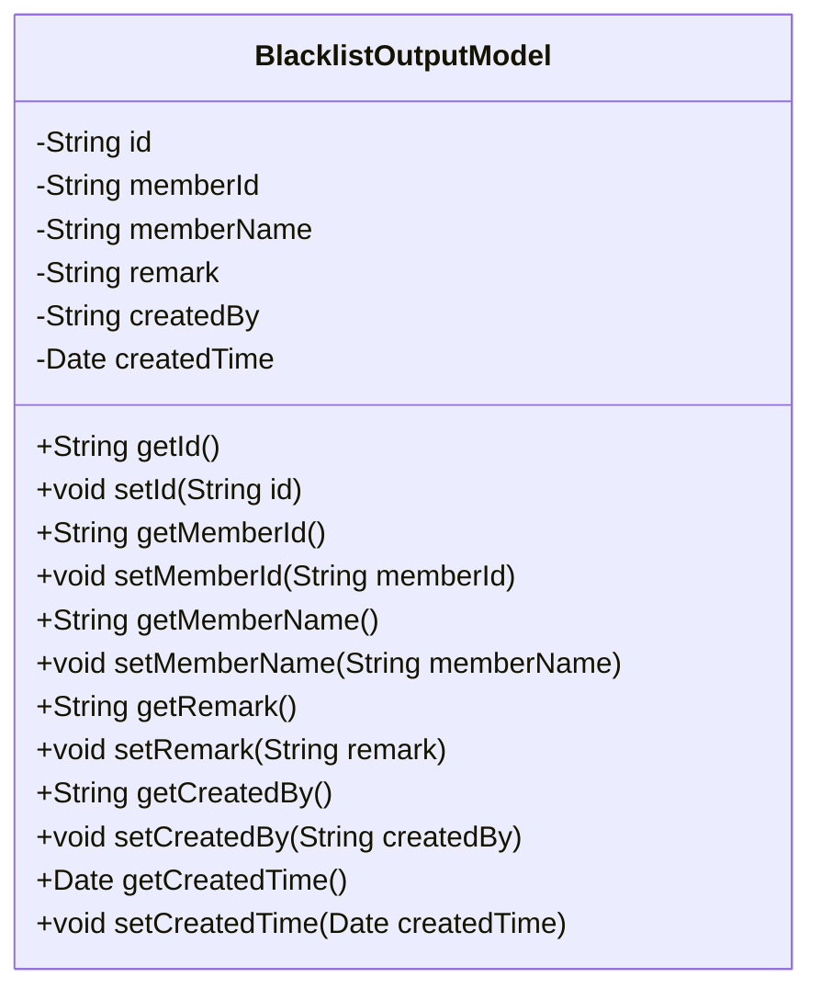

# 基础信息

|      |      |
|------|------|
| 名称 | BlacklistOutputModel |
| 编码语言 | .java |
| 代码路径 | WeFe/board/board-service/src/main/java/com/welab/wefe/board/service/dto/entity/BlacklistOutputModel.java |
| 包名 | com.welab.wefe.board.service.dto.entity |
| 依赖项 | ['com.welab.wefe.common.fieldvalidate.annotation.Check', 'java.util.Date'] |
| 概述说明 | BlacklistOutputModel类包含ID、会员ID、姓名、备注、创建者和创建时间字段，提供getter和setter方法。 |

# 说明

BlacklistOutputModel类定义了黑名单输出模型，包含id、memberId（会员ID）、memberName（会员名称）、remark（备注）、createdBy（创建人）和createdTime（创建时间）字段。每个字段都有对应的getter和setter方法，部分字段使用@Check注解进行校验标注。该类用于封装黑名单相关数据。

# 类列表 Class Summary

| 名称   | 类型  | 说明 |
|-------|------|-------------|
| BlacklistOutputModel | class | 黑名单输出模型类，包含ID、会员ID、姓名、备注、创建人及时间字段，提供各属性的getter和setter方法。 |

## 类 BlacklistOutputModel

|      |      |
|------|------|
| 访问范围 | public |
| 类型 | class |
| 名称 | BlacklistOutputModel |
| 说明 | 黑名单输出模型类，包含ID、会员ID、姓名、备注、创建人及时间字段，提供各属性的getter和setter方法。 |

### UML类图

这段代码定义了一个名为BlacklistOutputModel的类，用于表示黑名单输出模型。该类包含多个私有字段，如id、memberId、memberName等，每个字段都有对应的getter和setter方法。这些字段通过注解@Check进行校验，表明在设置这些字段值时需要进行合法性检查。该类主要用于封装黑名单相关的数据，便于在系统中传递和处理黑名单信息。

### 内部方法调用关系图

```mermaid
graph TD
    A["类BlacklistOutputModel"]
    B["属性: String id"]
    C["属性: @Check String memberId"]
    D["属性: @Check String memberName"]
    E["属性: @Check String remark"]
    F["属性: @Check String createdBy"]
    G["属性: @Check Date createdTime"]
    H["方法: getId()"]
    I["方法: setId(String id)"]
    J["方法: getMemberId()"]
    K["方法: setMemberId(String memberId)"]
    L["方法: getMemberName()"]
    M["方法: setMemberName(String memberName)"]
    N["方法: getRemark()"]
    O["方法: setRemark(String remark)"]
    P["方法: getCreatedBy()"]
    Q["方法: setCreatedBy(String createdBy)"]
    R["方法: getCreatedTime()"]
    S["方法: setCreatedTime(Date createdTime)"]

    A --> B
    A --> C
    A --> D
    A --> E
    A --> F
    A --> G
    A --> H
    A --> I
    A --> J
    A --> K
    A --> L
    A --> M
    A --> N
    A --> O
    A --> P
    A --> Q
    A --> R
    A --> S
```

该流程图展示了BlacklistOutputModel类的完整结构，包含6个带@Check注解的属性和对应的getter/setter方法。这是一个典型的Java Bean类，用于封装黑名单数据，每个属性都有明确的校验注解标注，体现了数据模型的完整性和校验约束。类结构清晰，属性与方法一一对应，适合用于数据传输和表单验证场景。

### 字段列表 Field List

| 名称  | 类型  | 说明 |
|-------|-------|------|
| memberName | String | 成员变量memberName带有@Check注解，用于校验名称。 |
| createdBy | String | 代码定义了一个私有字符串变量createdBy，并用@Check注解标记，参数name设为"Creator"。 |
| id | String | 私有字符串类型变量id。 |
| remark | String | 字段remark带有@Check注解，用于校验。 |
| createdTime | Date | 字段createdTime用@Check注解标记，表示需要校验创建时间。 |
| memberId | String | 成员ID校验字段。 |

### 方法列表

| 名称  | 类型  | 说明 |
|-------|-------|------|
| setMemberId | void | 设置成员ID的方法，将输入参数赋值给类的成员变量memberId。 |
| setId | void | 设置对象ID的方法，将参数id赋值给对象的id属性。 |
| setMemberName | void | 设置成员名称的方法，将输入参数赋值给成员变量memberName。 |
| getMemberId | String | 获取成员ID的方法，返回字符串类型的memberId。 |
| setRemark | void | 设置备注信息的方法，将输入字符串赋值给类的remark属性。 |
| getRemark | String | 获取备注信息的公共方法，返回字符串类型备注内容。 |
| getMemberName | String | 获取成员名称的方法，返回成员变量memberName的值。 |
| getId | String | 这是一个Java方法，返回字符串类型的id字段值。 |
| getCreatedBy | String | 方法getCreatedBy返回字符串类型变量createdBy的值。 |
| setCreatedBy | void | 这是一个Java方法，用于设置对象的创建者属性。方法接受一个字符串参数createdBy，并将其赋值给类的成员变量this.createdBy。 |
| getCreatedTime | Date | 获取创建时间的方法，返回Date类型。 |
| setCreatedTime | void | 设置对象创建时间的方法，将参数createdTime赋值给成员变量this.createdTime。 |

