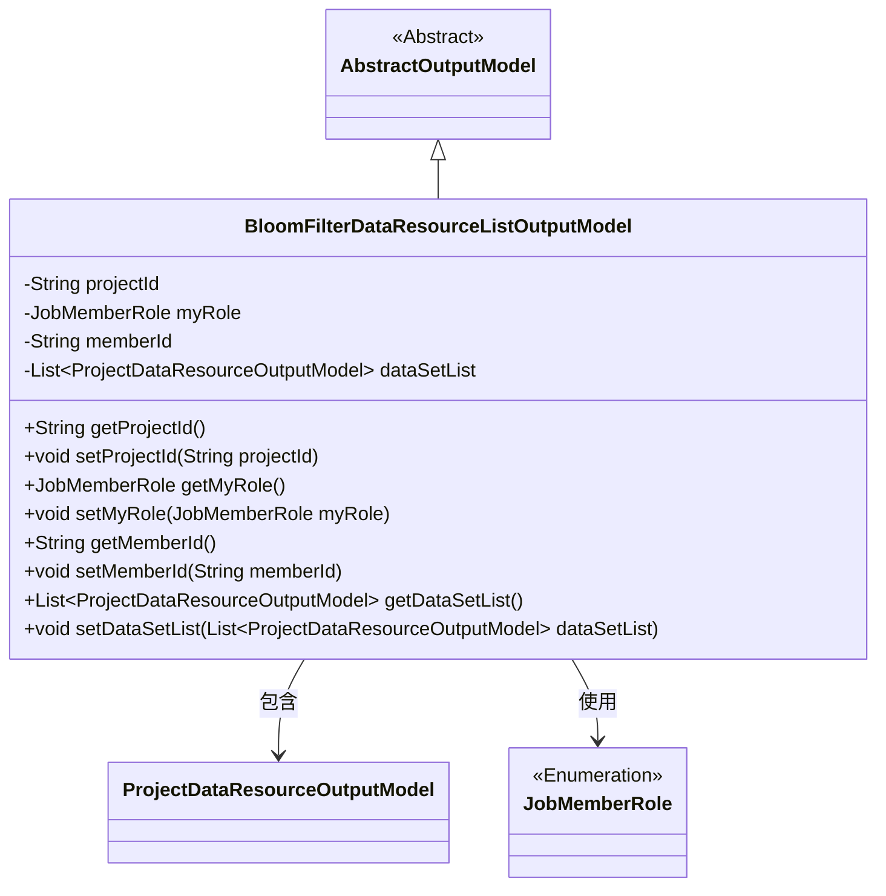

# 基础信息

|      |      |
|------|------|
| 名称 | BloomFilterDataResourceListOutputModel |
| 编码语言 | .java |
| 代码路径 | WeFe/board/board-service/src/main/java/com/welab/wefe/board/service/dto/entity/BloomFilterDataResourceListOutputModel.java |
| 包名 | com.welab.wefe.board.service.dto.entity |
| 依赖项 | ['com.welab.wefe.board.service.dto.entity.project.data_set.ProjectDataResourceOutputModel', 'com.welab.wefe.common.fieldvalidate.annotation.Check', 'com.welab.wefe.common.wefe.enums.JobMemberRole', 'java.util.List'] |
| 概述说明 | BloomFilter数据资源列表输出模型，包含项目ID、身份角色、成员ID及数据集列表字段。 |

# 说明

BloomFilterDataResourceListOutputModel类继承自AbstractOutputModel，包含四个主要属性：项目ID（projectId）、我方身份（myRole，枚举值为promoter或provider）、我方成员ID（memberId）以及数据集列表（dataSetList）。每个属性都有对应的getter和setter方法，其中前三个属性带有@Check注解用于验证。该类用于表示布隆过滤器数据资源列表的输出模型。

# 类列表 Class Summary

| 名称   | 类型  | 说明 |
|-------|------|-------------|
| BloomFilterDataResourceListOutputModel | class | BloomFilterDataResourceListOutputModel类包含项目ID、身份角色、成员ID和数据资源列表字段及其getter/setter方法。 |

## 类 BloomFilterDataResourceListOutputModel

|      |      |
|------|------|
| 访问范围 | public |
| 类型 | class |
| 名称 | BloomFilterDataResourceListOutputModel |
| 说明 | BloomFilterDataResourceListOutputModel类包含项目ID、身份角色、成员ID和数据资源列表字段及其getter/setter方法。 |

### UML类图

类图描述：该图展示了BloomFilterDataResourceListOutputModel继承自抽象类AbstractOutputModel，包含项目ID、成员角色、成员ID和数据集列表等私有属性，并通过getter/setter方法提供访问接口。该类与ProjectDataResourceOutputModel构成聚合关系，同时依赖枚举类型JobMemberRole。整体结构体现了数据资源列表的输出模型设计。

### 内部方法调用关系图

```mermaid
graph TD
    A["类BloomFilterDataResourceListOutputModel"]
    B["继承: AbstractOutputModel"]
    C["属性: String projectId"]
    D["属性: JobMemberRole myRole"]
    E["属性: String memberId"]
    F["属性: List<ProjectDataResourceOutputModel> dataSetList"]
    G["方法: String getProjectId()"]
    H["方法: void setProjectId(String)"]
    I["方法: JobMemberRole getMyRole()"]
    J["方法: void setMyRole(JobMemberRole)"]
    K["方法: String getMemberId()"]
    L["方法: void setMemberId(String)"]
    M["方法: List<ProjectDataResourceOutputModel> getDataSetList()"]
    N["方法: void setDataSetList(List<ProjectDataResourceOutputModel>)"]

    A --> B
    A --> C
    A --> D
    A --> E
    A --> F
    A --> G
    A --> H
    A --> I
    A --> J
    A --> K
    A --> L
    A --> M
    A --> N
```

这段代码展示了一个名为BloomFilterDataResourceListOutputModel的类，它继承自AbstractOutputModel。该类包含四个属性：projectId、myRole、memberId和dataSetList，分别用于存储项目ID、身份角色、成员ID和数据集列表。每个属性都有对应的getter和setter方法，用于获取和设置属性值。该类主要用于数据资源的输出模型，通过注解@Check对部分属性进行校验，确保数据的有效性和完整性。

### 字段列表 Field List

| 名称  | 类型  | 说明 |
|-------|-------|------|
| projectId | String | 定义私有字符串变量projectId，使用@Check注解校验项目ID。 |
| memberId | String | 代码定义了一个私有字符串变量memberId，使用@Check注解标记，参数name为"我方成员ID"。 |
| dataSetList | List<ProjectDataResourceOutputModel> | 私有项目数据资源输出模型列表。 |
| myRole | JobMemberRole | 注解@Check验证myRole字段，限定为我方身份枚举值promoter或provider。 |

### 方法列表

| 名称  | 类型  | 说明 |
|-------|-------|------|
| getMemberId | String | 获取成员ID的方法，返回字符串类型的memberId。 |
| setProjectId | void | 设置项目ID的方法，将输入参数projectId赋值给当前对象的projectId属性。 |
| getMyRole | JobMemberRole | 获取当前用户的角色信息，返回值为JobMemberRole类型。 |
| getProjectId | String | 获取项目ID的方法，返回字符串类型变量projectId。 |
| setMyRole | void | 这是一个Java方法，用于设置当前对象的角色属性。方法接受一个JobMemberRole类型的参数myRole，并将其赋值给对象的myRole字段。 |
| setMemberId | void | 设置成员ID的方法，将输入参数赋值给类的成员变量memberId。 |
| getDataSetList | List<ProjectDataResourceOutputModel> | 获取数据集列表的方法，返回类型为ProjectDataResourceOutputModel的列表。 |
| setDataSetList | void | 设置数据集列表方法，将输入参数赋值给类的成员变量dataSetList。 |

