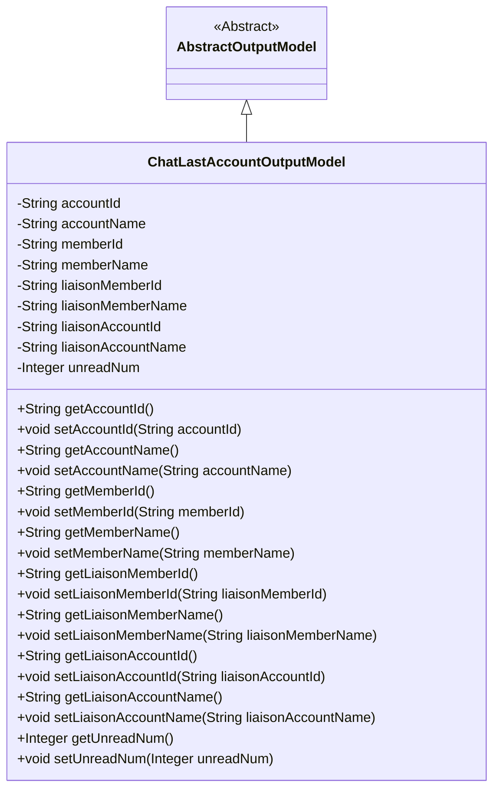

# 基础信息

|      |      |
|------|------|
| 名称 | ChatLastAccountOutputModel |
| 编码语言 | .java |
| 代码路径 | WeFe/board/board-service/src/main/java/com/welab/wefe/board/service/dto/entity/ChatLastAccountOutputModel.java |
| 包名 | com.welab.wefe.board.service.dto.entity |
| 依赖项 | ['com.welab.wefe.common.fieldvalidate.annotation.Check'] |
| 概述说明 | ChatLastAccountOutputModel类包含账户、成员及联络人信息，以及未读消息数。提供各字段的getter和setter方法。 |

# 说明

该代码定义了一个名为ChatLastAccountOutputModel的类，继承自AbstractOutputModel。类中包含多个带@Check注解的私有字段，包括accountId、accountName、memberId、memberName、liaisonMemberId、liaisonMemberName、liaisonAccountId、liaisonAccountName以及unreadNum，并提供了对应的getter和setter方法。这些字段用于存储账户、成员及联络人相关信息，以及未读消息数量。

# 类列表 Class Summary

| 名称   | 类型  | 说明 |
|-------|------|-------------|
| ChatLastAccountOutputModel | class | ChatLastAccountOutputModel类包含账户、成员及联络人信息，含ID、名称和未读消息数。 |

## 类 ChatLastAccountOutputModel

|      |      |
|------|------|
| 访问范围 | public |
| 类型 | class |
| 名称 | ChatLastAccountOutputModel |
| 说明 | ChatLastAccountOutputModel类包含账户、成员及联络人信息，含ID、名称和未读消息数。 |

### UML类图

该代码定义了一个名为ChatLastAccountOutputModel的类，继承自抽象类AbstractOutputModel，用于存储聊天相关的账户信息。类中包含多个私有字段，如账户ID、名称、成员ID、名称，以及联络人相关的ID和名称，还有未读消息数量。每个字段都有对应的getter和setter方法，用于获取和设置字段值。这个类主要用于封装聊天系统中最后账户的输出数据模型。

### 内部方法调用关系图

```mermaid
graph TD
    A["类ChatLastAccountOutputModel"]
    B["继承自: AbstractOutputModel"]
    C["属性: String accountId"]
    D["属性: String accountName"]
    E["属性: String memberId"]
    F["属性: String memberName"]
    G["属性: String liaisonMemberId"]
    H["属性: String liaisonMemberName"]
    I["属性: String liaisonAccountId"]
    J["属性: String liaisonAccountName"]
    K["属性: Integer unreadNum"]
    L["方法: getAccountId()"]
    M["方法: setAccountId(String)"]
    N["方法: getAccountName()"]
    O["方法: setAccountName(String)"]
    P["方法: getMemberId()"]
    Q["方法: setMemberId(String)"]
    R["方法: getMemberName()"]
    S["方法: setMemberName(String)"]
    T["方法: getLiaisonMemberId()"]
    U["方法: setLiaisonMemberId(String)"]
    V["方法: getLiaisonMemberName()"]
    W["方法: setLiaisonMemberName(String)"]
    X["方法: getLiaisonAccountId()"]
    Y["方法: setLiaisonAccountId(String)"]
    Z["方法: getLiaisonAccountName()"]
    AA["方法: setLiaisonAccountName(String)"]
    AB["方法: getUnreadNum()"]
    AC["方法: setUnreadNum(Integer)"]

    A --> B
    A --> C
    A --> D
    A --> E
    A --> F
    A --> G
    A --> H
    A --> I
    A --> J
    A --> K
    A --> L
    A --> M
    A --> N
    A --> O
    A --> P
    A --> Q
    A --> R
    A --> S
    A --> T
    A --> U
    A --> V
    A --> W
    A --> X
    A --> Y
    A --> Z
    A --> AA
    A --> AB
    A --> AC
```

该流程图展示了ChatLastAccountOutputModel类的结构，包括其继承关系、属性和方法。该类继承自AbstractOutputModel，包含多个字符串类型的属性和对应的getter/setter方法，主要用于存储和操作聊天相关的账户信息。每个属性都带有@Check注解，表明这些字段需要进行校验。类结构清晰，属性与方法一一对应，便于数据封装和访问控制。

### 字段列表 Field List

| 名称  | 类型  | 说明 |
|-------|-------|------|
| liaisonAccountName | String | 字段liaisonAccountName用于关联账户名称，带有@Check注解进行校验。 |
| unreadNum = 0 | Integer | Java代码片段：定义私有整型变量unreadNum，初始值为0，使用@Check注解标记，参数name为"unread num"。 |
| memberName | String | 定义成员变量memberName，使用@Check注解校验名称。 |
| memberId | String | 成员ID字段，使用@Check注解进行校验。 |
| liaisonMemberId | String | 字段liaisonMemberId用于校验联络成员ID，标注为@Check。 |
| accountId | String | 字段accountId带有账户ID校验注解。 |
| liaisonMemberName | String | 检查联络员姓名字段注解 |
| accountName | String | 代码定义了一个私有字符串变量accountName，并使用@Check注解校验其名称属性。 |
| liaisonAccountId | String | 检查联络账户ID的私有字符串字段。 |

### 方法列表

| 名称  | 类型  | 说明 |
|-------|-------|------|
| setMemberName | void | 设置成员变量memberName的值。 |
| setAccountId | void | 设置账户ID的方法，将参数accountId赋值给当前对象的accountId属性。 |
| getLiaisonMemberId | String | 获取联络成员ID的方法，返回字符串类型的成员ID。 |
| setLiaisonAccountId | void | 这是一个Java方法，用于设置联络账户ID。方法接收一个字符串参数liaisonAccountId，并将其赋值给当前对象的同名成员变量。 |
| getMemberId | String | 获取成员ID的方法，返回字符串类型的memberId。 |
| setMemberId | void | 设置成员ID的方法，将输入参数赋给类的成员变量memberId。 |
| setAccountName | void | 设置账户名称的方法，将参数accountName赋值给当前对象的同名属性。 |
| setLiaisonMemberName | void | 设置联络成员姓名的方法，将参数值赋给类成员变量liaisonMemberName。 |
| setLiaisonMemberId | void | 设置联络员ID的方法，参数为字符串类型liaisonMemberId，将其赋值给当前对象的同名属性。 |
| getUnreadNum | Integer | 获取未读消息数量的方法，返回整数类型的未读数值。 |
| setLiaisonAccountName | void | 设置联络账户名称的方法，将参数值赋给类成员变量liaisonAccountName。 |
| getLiaisonMemberName | String | 获取联络成员姓名的方法，返回字符串类型的成员姓名变量。 |
| getLiaisonAccountName | String | 获取联络账户名称的方法，返回字符串类型变量liaisonAccountName。 |
| getAccountName | String | 获取账户名称的方法，直接返回accountName变量值。 |
| getMemberName | String | 获取成员名称的方法，返回成员名字符串。 |
| getAccountId | String | 这是一个Java方法，返回字符串类型的accountId成员变量值。 |
| getLiaisonAccountId | String | 获取联络账户ID的方法，返回字符串类型的liaisonAccountId。 |
| setUnreadNum | void | 设置未读消息数量的方法，参数为整数类型。 |

