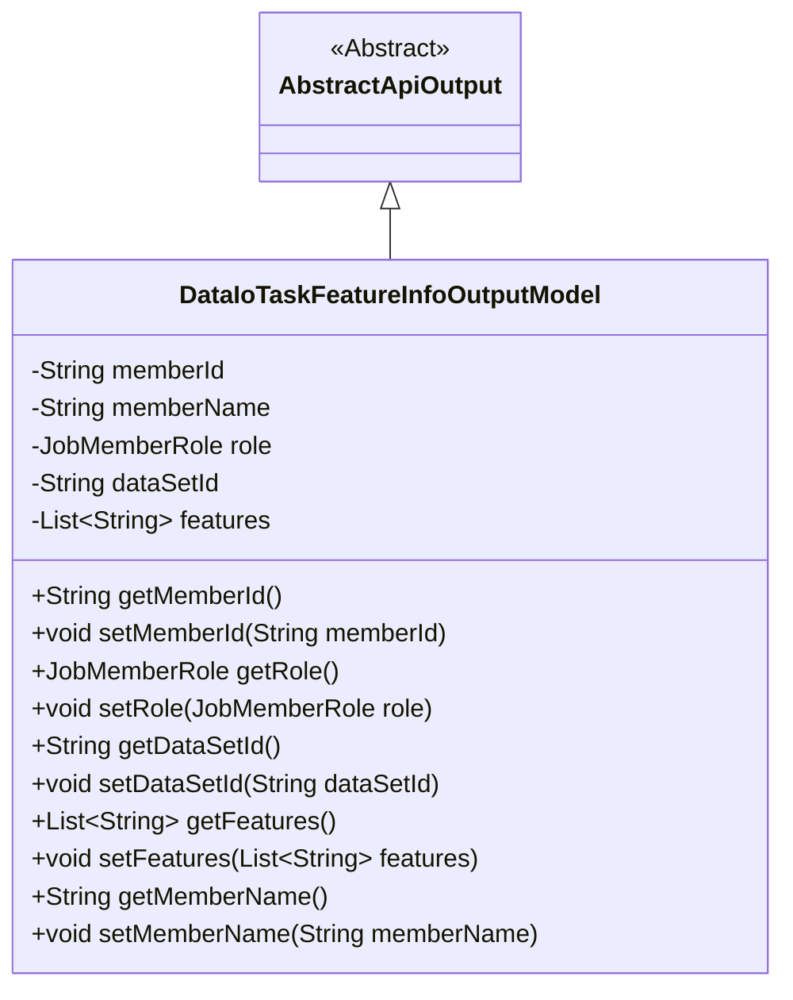

# 基础信息

|      |      |
|------|------|
| 名称 | DataIoTaskFeatureInfoOutputModel |
| 编码语言 | .java |
| 代码路径 | WeFe/board/board-service/src/main/java/com/welab/wefe/board/service/dto/entity/DataIoTaskFeatureInfoOutputModel.java |
| 包名 | com.welab.wefe.board.service.dto.entity |
| 依赖项 | ['com.welab.wefe.common.fieldvalidate.annotation.Check', 'com.welab.wefe.common.web.dto.AbstractApiOutput', 'com.welab.wefe.common.wefe.enums.JobMemberRole', 'java.util.List'] |
| 概述说明 | 数据IO任务特征信息输出模型，包含成员ID、名称、角色、数据集ID及特征列列表。 |

# 说明

该内容定义了一个名为DataIoTaskFeatureInfoOutputModel的Java类，继承自AbstractApiOutput。类中包含五个私有字段：memberId（成员ID）、memberName（成员名称）、role（角色）、dataSetId（数据集ID）和features（选择入模的特征列列表）。每个字段都带有@Check注解并指定了名称。类中还为每个字段提供了对应的getter和setter方法，用于访问和修改这些字段的值。

# 类列表 Class Summary

| 名称   | 类型  | 说明 |
|-------|------|-------------|
| DataIoTaskFeatureInfoOutputModel | class | DataIoTaskFeatureInfoOutputModel类包含成员ID、名称、角色、数据集ID及特征列列表，提供对应getter和setter方法。 |

## 类 DataIoTaskFeatureInfoOutputModel

|      |      |
|------|------|
| 访问范围 | public |
| 类型 | class |
| 名称 | DataIoTaskFeatureInfoOutputModel |
| 说明 | DataIoTaskFeatureInfoOutputModel类包含成员ID、名称、角色、数据集ID及特征列列表，提供对应getter和setter方法。 |

### UML类图

这段代码定义了一个名为DataIoTaskFeatureInfoOutputModel的类，继承自抽象类AbstractApiOutput。该类主要用于封装数据IO任务中特征信息的输出模型，包含成员ID、名称、角色、数据集ID和特征列等属性，并提供了相应的getter和setter方法。通过注解@Check对字段进行校验标记，体现了数据验证的设计意图。类图清晰地展示了继承关系和类成员结构。

### 内部方法调用关系图

```mermaid
graph TD
    A["类DataIoTaskFeatureInfoOutputModel"]
    B["继承: AbstractApiOutput"]
    C["属性: @Check String memberId"]
    D["属性: @Check String memberName"]
    E["属性: @Check JobMemberRole role"]
    F["属性: @Check String dataSetId"]
    G["属性: @Check List<String> features"]
    H["方法: getMemberId()"]
    I["方法: setMemberId(String)"]
    J["方法: getRole()"]
    K["方法: setRole(JobMemberRole)"]
    L["方法: getDataSetId()"]
    M["方法: setDataSetId(String)"]
    N["方法: getFeatures()"]
    O["方法: setFeatures(List<String>)"]
    P["方法: getMemberName()"]
    Q["方法: setMemberName(String)"]

    A --> B
    A --> C
    A --> D
    A --> E
    A --> F
    A --> G
    A --> H
    A --> I
    A --> J
    A --> K
    A --> L
    A --> M
    A --> N
    A --> O
    A --> P
    A --> Q
```

该流程图展示了DataIoTaskFeatureInfoOutputModel类的结构，它继承自AbstractApiOutput类，包含5个带有@Check注解的属性和对应的getter/setter方法。每个属性都标注了类型，包括基本类型String、自定义类型JobMemberRole和集合类型List<String>。所有方法均按标准命名规范实现属性访问功能，形成完整的Java Bean结构。

### 字段列表 Field List

| 名称  | 类型  | 说明 |
|-------|-------|------|
| memberId | String | 成员ID校验字段声明。 |
| role | JobMemberRole | 代码定义了一个私有字段role，使用@Check注解校验其name属性为"角色"，类型为JobMemberRole。 |
| dataSetId | String | 定义私有字符串变量dataSetId，使用@Check注解校验数据集ID。 |
| features | List<String> | 定义私有特征列列表，用于选择入模特征。 |
| memberName | String | 代码定义了一个私有字符串变量memberName，并通过@Check注解进行名称校验。 |

### 方法列表

| 名称  | 类型  | 说明 |
|-------|-------|------|
| getRole | JobMemberRole | 获取当前对象的角色信息。 |
| getMemberName | String | 方法返回成员变量memberName的字符串值。 |
| getFeatures | List<String> | 方法返回字符串列表features。 |
| setRole | void | 这是一个Java方法，用于设置成员角色属性。方法接受一个JobMemberRole类型的参数role，并将其赋值给当前对象的role字段。 |
| setMemberId | void | 设置成员ID的方法，将输入字符串赋值给类的成员变量memberId。 |
| getDataSetId | String | 获取数据集ID的方法，返回字符串类型的数据集ID。 |
| setFeatures | void | 设置对象特性列表的方法。 |
| setDataSetId | void | 设置数据集ID的方法，将输入参数赋值给类的dataSetId成员变量。 |
| getMemberId | String | 方法返回成员ID字符串。 |
| setMemberName | void | 这是一个Java方法，用于设置成员变量memberName的值。方法接受一个字符串参数memberName，并将其赋值给当前对象的同名成员变量。 |

