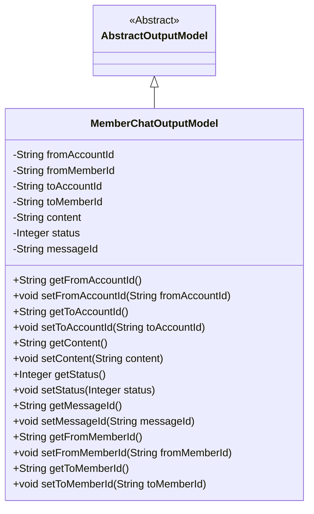

# 基础信息

|      |      |
|------|------|
| 名称 | MemberChatOutputModel |
| 编码语言 | .java |
| 代码路径 | WeFe/board/board-service/src/main/java/com/welab/wefe/board/service/dto/entity/MemberChatOutputModel.java |
| 包名 | com.welab.wefe.board.service.dto.entity |
| 依赖项 | ['com.welab.wefe.common.fieldvalidate.annotation.Check'] |
| 概述说明 | 成员聊天输出模型类，包含发送接收方账号ID、成员ID、聊天内容、消息状态及消息ID等字段及其getter/setter方法。 |

# 说明

MemberChatOutputModel类继承自AbstractOutputModel，用于表示成员聊天输出数据。包含发送方账号ID和成员ID、接收方账号ID和成员名称、聊天内容、消息状态（0已读、1未读、2发送成功、3发送失败）以及消息ID等字段。每个字段都有对应的getter和setter方法，用于获取和设置属性值。

# 类列表 Class Summary

| 名称   | 类型  | 说明 |
|-------|------|-------------|
| MemberChatOutputModel | class | 成员聊天输出模型类，包含发送接收方账号ID、成员ID、聊天内容、消息状态和消息ID等字段及对应getter/setter方法。 |

## 类 MemberChatOutputModel

|      |      |
|------|------|
| 访问范围 | public |
| 类型 | class |
| 名称 | MemberChatOutputModel |
| 说明 | 成员聊天输出模型类，包含发送接收方账号ID、成员ID、聊天内容、消息状态和消息ID等字段及对应getter/setter方法。 |

### UML类图

该类图展示了MemberChatOutputModel继承自AbstractOutputModel的结构，包含8个私有字段（发送方/接收方账号ID、成员ID、消息内容、状态、消息ID）及其对应的getter/setter方法。注解@Check表明字段需要校验，status字段用数值表示消息状态（0-3）。这个模型主要用于封装聊天消息的传输数据，继承关系表明它是抽象输出模型的具体实现。

### 内部方法调用关系图

```mermaid
graph TD
    A["类MemberChatOutputModel"]
    B["继承: AbstractOutputModel"]
    C["属性: String fromAccountId"]
    D["属性: String fromMemberId"]
    E["属性: String toAccountId"]
    F["属性: String toMemberId"]
    G["属性: String content"]
    H["属性: Integer status"]
    I["属性: String messageId"]
    J["方法: getFromAccountId()"]
    K["方法: setFromAccountId(String)"]
    L["方法: getToAccountId()"]
    M["方法: setToAccountId(String)"]
    N["方法: getContent()"]
    O["方法: setContent(String)"]
    P["方法: getStatus()"]
    Q["方法: setStatus(Integer)"]
    R["方法: getMessageId()"]
    S["方法: setMessageId(String)"]
    T["方法: getFromMemberId()"]
    U["方法: setFromMemberId(String)"]
    V["方法: getToMemberId()"]
    W["方法: setToMemberId(String)"]

    A --> B
    A --> C
    A --> D
    A --> E
    A --> F
    A --> G
    A --> H
    A --> I
    A --> J
    A --> K
    A --> L
    A --> M
    A --> N
    A --> O
    A --> P
    A --> Q
    A --> R
    A --> S
    A --> T
    A --> U
    A --> V
    A --> W
```

该流程图展示了MemberChatOutputModel类的完整结构，包括其继承关系和所有属性与方法。该类继承自AbstractOutputModel，包含8个私有属性（如发送方/接收方ID、消息内容和状态等）以及对应的16个getter/setter方法。每个属性都带有@Check注解用于参数校验，其中status属性明确标注了状态值的含义（0-3分别代表不同状态）。图形清晰地呈现了类成员的组织关系和访问控制方式。

### 字段列表 Field List

| 名称  | 类型  | 说明 |
|-------|-------|------|
| messageId | String | 私有字符串变量messageId，使用@Check注解标记名称为"消息ID"。 |
| status | Integer | 状态字段：0已读，1未读，2发送成功，3发送失败。 |
| toMemberId | String | 代码定义了一个私有字符串变量toMemberId，并标注了检查注解，参数name为"发送方成员名称"。 |
| fromMemberId | String | 发送方成员ID字段，使用@Check注解校验。 |
| content | String | 聊天内容检查字段 |
| fromAccountId | String | 发送方账号ID的字符串类型字段，使用@Check注解校验。 |
| toAccountId | String | 接收方账号ID字段，使用@Check注解校验。 |

### 方法列表

| 名称  | 类型  | 说明 |
|-------|-------|------|
| getFromMemberId | String | 获取成员ID的方法，返回fromMemberId。 |
| getToAccountId | String | 获取目标账户ID的方法，返回字符串类型的账户ID。 |
| setToAccountId | void | 设置目标账户ID的方法，将参数toAccountId赋值给类的同名成员变量。 |
| getStatus | Integer | 方法getStatus返回整型状态值status。 |
| setContent | void | 这是一个Java方法，用于设置类的content属性值。方法接收一个字符串参数content，并将其赋值给类的成员变量this.content。 |
| setStatus | void | 这是一个Java方法，用于设置对象的状态值。方法名为setStatus，接受一个Integer类型参数status，并将其赋值给当前对象的status属性。 |
| getContent | String | 获取内容字符串的方法。 |
| getMessageId | String | 获取messageId的字符串方法。 |
| getFromAccountId | String | 这是一个Java方法，返回字符串类型的fromAccountId字段值。 |
| getToMemberId | String | 获取接收方成员ID的方法，返回字符串类型的toMemberId值。 |
| setFromMemberId | void | 设置成员ID的方法，将参数fromMemberId赋值给当前对象的fromMemberId属性。 |
| setMessageId | void | 定义了一个公共方法setMessageId，用于设置messageId属性的值。 |
| setFromAccountId | void | 设置来源账户ID的方法，将参数值赋给类的成员变量fromAccountId。 |
| setToMemberId | void | 设置接收成员ID的方法，将参数toMemberId赋值给类的成员变量toMemberId。 |

