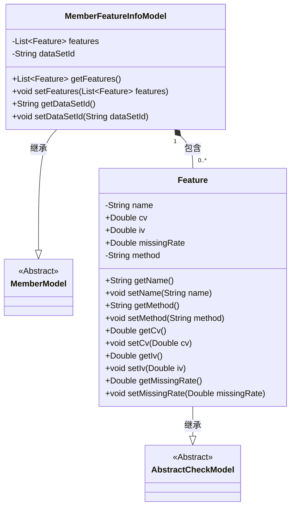
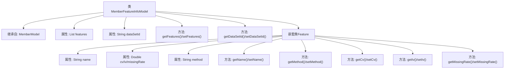

# 基础信息

|      |      |
|------|------|
| 名称 | MemberFeatureInfoModel |
| 编码语言 | .java |
| 代码路径 | WeFe/board/board-service/src/main/java/com/welab/wefe/board/service/dto/entity/MemberFeatureInfoModel.java |
| 包名 | com.welab.wefe.board.service.dto.entity |
| 依赖项 | ['com.welab.wefe.common.fieldvalidate.AbstractCheckModel', 'com.welab.wefe.common.fieldvalidate.annotation.Check', 'java.util.ArrayList', 'java.util.List'] |
| 概述说明 | MemberFeatureInfoModel继承MemberModel，包含必填特征列表features和数据集ID dataSetId。Feature类有特征名name、cv、iv、缺失率missingRate和方法method等属性。 |

# 说明

MemberFeatureInfoModel继承MemberModel，包含必填特征列features和数据集ID dataSetId。Feature内部类继承AbstractCheckModel，包含特征名name、方法method及统计指标cv、iv、missingRate。所有字段均提供getter和setter方法。

# 类列表 Class Summary

| 名称   | 类型  | 说明 |
|-------|------|-------------|
| MemberFeatureInfoModel | class | MemberFeatureInfoModel继承MemberModel，包含必填特征列表features和数据集ID dataSetId。Feature类有特征名name、方法method及统计指标cv、iv、missingRate。 |

## 类 MemberFeatureInfoModel

|      |      |
|------|------|
| 访问范围 | public |
| 类型 | class |
| 名称 | MemberFeatureInfoModel |
| 说明 | MemberFeatureInfoModel继承MemberModel，包含必填特征列表features和数据集ID dataSetId。Feature类有特征名name、方法method及统计指标cv、iv、missingRate。 |

### UML类图

这段代码展示了一个继承体系，MemberFeatureInfoModel继承自抽象类MemberModel，并包含多个Feature对象。Feature是MemberFeatureInfoModel的内部类，继承自AbstractCheckModel，存储特征分析数据（如cv/iv/missingRate等）。MemberFeatureInfoModel通过features集合管理特征列表，同时维护datasetId字段。注解@Check用于字段校验，体现了数据验证功能。整体结构清晰地表达了模型间的继承和组合关系。

### 内部方法调用关系图

这段代码定义了一个继承自MemberModel的MemberFeatureInfoModel类，包含特征列表和数据集ID属性，以及对应的getter/setter方法。内部嵌套了Feature类，用于存储特征名、统计指标（CV/IV/缺失率）和计算方法，同样提供了完整的属性访问方法。流程图清晰地展示了类继承关系、属性结构和方法的调用层级。

### 字段列表 Field List

| 名称  | 类型  | 说明 |
|-------|-------|------|
| features = new ArrayList<>() | List<Feature> | 代码定义了一个私有列表features，初始化为空ArrayList，使用@Check注解标记为必填项，名称为"特征列"。 |
| dataSetId | String | 私有字符串类型变量dataSetId，用于存储数据集ID。 |

### 方法列表

| 名称  | 类型  | 说明 |
|-------|-------|------|
| getFeatures | List<Feature> | 获取特征列表的方法，直接返回成员变量features。 |
| setFeatures | void | 这是一个Java方法，用于设置对象的features属性，接收一个Feature类型的列表作为参数。 |
| getDataSetId | String | 获取数据集ID的方法，返回字符串类型的数据集ID。 |
| setDataSetId | void | 这是一个Java方法，用于设置类的dataSetId属性值。方法接收一个字符串参数dataSetId，并将其赋值给类的同名成员变量。 |

