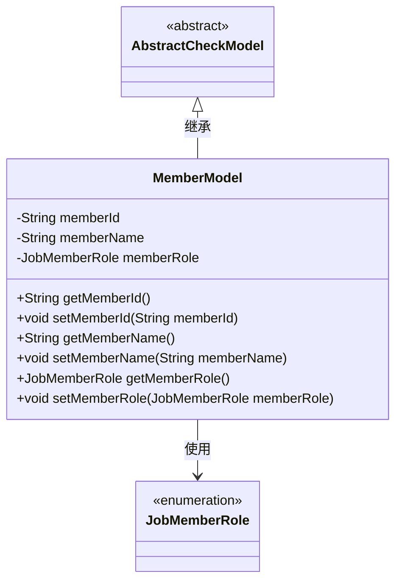
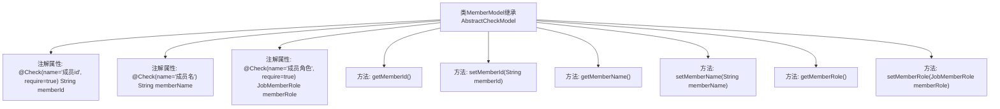

# 基础信息

|      |      |
|------|------|
| 名称 | MemberModel |
| 编码语言 | .java |
| 代码路径 | WeFe/board/board-service/src/main/java/com/welab/wefe/board/service/dto/entity/MemberModel.java |
| 包名 | com.welab.wefe.board.service.dto.entity |
| 依赖项 | ['com.welab.wefe.common.fieldvalidate.AbstractCheckModel', 'com.welab.wefe.common.fieldvalidate.annotation.Check', 'com.welab.wefe.common.wefe.enums.JobMemberRole'] |
| 概述说明 | MemberModel类继承AbstractCheckModel，包含必填成员id、可选成员名和必填成员角色字段，提供各字段的getter和setter方法。 |

# 说明

该内容定义了一个名为MemberModel的类，继承自AbstractCheckModel。类中包含三个成员变量：memberId（必须）、memberName和memberRole（必须），分别通过注解标注了检查规则和必要性。每个变量都有对应的getter和setter方法，用于获取和设置其值。memberRole的类型为JobMemberRole。整体结构用于管理成员信息，并确保必要字段的校验。

# 类列表 Class Summary

| 名称   | 类型  | 说明 |
|-------|------|-------------|
| MemberModel | class | MemberModel类继承AbstractCheckModel，包含必填成员id、可选成员名和必填成员角色字段，提供getter/setter方法。 |

## 类 MemberModel

|      |      |
|------|------|
| 访问范围 | public |
| 类型 | class |
| 名称 | MemberModel |
| 说明 | MemberModel类继承AbstractCheckModel，包含必填成员id、可选成员名和必填成员角色字段，提供getter/setter方法。 |

### UML类图

这段代码展示了一个成员模型类MemberModel，它继承自抽象类AbstractCheckModel，并包含三个主要属性：memberId、memberName和memberRole。其中memberId和memberRole通过@Check注解标记为必填字段。该类提供了标准的getter和setter方法，并与枚举类型JobMemberRole存在关联关系。整体结构体现了Java Bean的设计模式，同时通过注解实现了简单的校验功能。

### 内部方法调用关系图

这段代码展示了一个继承自AbstractCheckModel的MemberModel类，包含三个带校验注解的属性（memberId、memberName、memberRole）及其对应的getter和setter方法。流程图清晰地呈现了类继承关系、属性注解配置以及方法调用结构，其中每个属性都通过@Check注解标注了校验规则，require参数表示是否必填。该设计主要用于实现带校验功能的成员数据模型，适用于需要字段级验证的业务场景。

### 字段列表 Field List

| 名称  | 类型  | 说明 |
|-------|-------|------|
| memberRole | JobMemberRole | 检查成员角色，必填字段，类型为JobMemberRole。 |
| memberName | String | 定义私有字符串成员变量memberName，使用@Check注解校验成员名。 |
| memberId | String | 成员ID字段，必填校验。 |

### 方法列表

| 名称  | 类型  | 说明 |
|-------|-------|------|
| getMemberName | String | 获取成员名称的方法，返回成员变量memberName的值。 |
| getMemberRole | JobMemberRole | 获取成员角色方法，返回成员角色对象。 |
| setMemberName | void | 设置成员变量memberName的方法。 |
| setMemberId | void | 设置成员ID的方法，将输入参数赋值给类的成员变量。 |
| getMemberId | String | 获取成员ID的方法，返回成员ID字符串。 |
| setMemberRole | void | 方法setMemberRole用于设置成员角色，参数为JobMemberRole类型，赋值给当前对象的memberRole属性。 |

