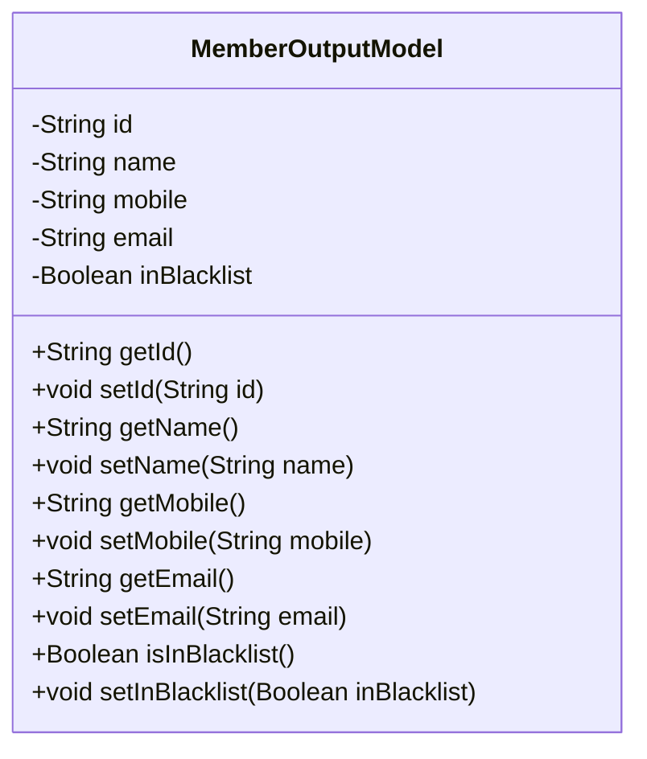

# 基础信息

|      |      |
|------|------|
| 名称 | MemberOutputModel |
| 编码语言 | .java |
| 代码路径 | WeFe/board/board-service/src/main/java/com/welab/wefe/board/service/dto/entity/MemberOutputModel.java |
| 包名 | com.welab.wefe.board.service.dto.entity |
| 依赖项 | [] |
| 概述说明 | 成员输出模型类，包含ID、姓名、手机、邮箱和黑名单状态字段及对应getter/setter方法。 |

# 说明

MemberOutputModel 是一个 Java 类，用于表示会员输出模型。该类包含五个私有属性：id（会员ID）、name（会员姓名）、mobile（手机号）、email（电子邮箱）和 inBlacklist（是否在黑名单中，默认为 false）。每个属性都有对应的 getter 和 setter 方法，用于获取和设置属性值。该类主要用于封装会员信息，便于在系统中传递和处理会员数据。

# 类列表 Class Summary

| 名称   | 类型  | 说明 |
|-------|------|-------------|
| MemberOutputModel | class | MemberOutputModel类包含成员ID、姓名、手机、邮箱和黑名单状态字段，提供各属性的getter和setter方法。 |

## 类 MemberOutputModel

|      |      |
|------|------|
| 访问范围 | public |
| 类型 | class |
| 名称 | MemberOutputModel |
| 说明 | MemberOutputModel类包含成员ID、姓名、手机、邮箱和黑名单状态字段，提供各属性的getter和setter方法。 |

### UML类图

这段代码定义了一个名为MemberOutputModel的类，用于表示会员输出模型。该类包含五个私有属性：id、name、mobile、email和inBlacklist，分别表示会员的唯一标识、姓名、手机号、电子邮箱和是否在黑名单中。每个属性都有对应的getter和setter方法，用于获取和设置属性值。该类主要用于封装会员信息，便于在系统中传递和处理会员数据。

### 内部方法调用关系图

```mermaid
graph TD
    A["类MemberOutputModel"]
    B["属性: String id"]
    C["属性: String name"]
    D["属性: String mobile"]
    E["属性: String email"]
    F["属性: Boolean inBlacklist = false"]
    G["方法: String getId()"]
    H["方法: void setId(String id)"]
    I["方法: String getName()"]
    J["方法: void setName(String name)"]
    K["方法: String getMobile()"]
    L["方法: void setMobile(String mobile)"]
    M["方法: String getEmail()"]
    N["方法: void setEmail(String email)"]
    O["方法: Boolean isInBlacklist()"]
    P["方法: void setInBlacklist(Boolean inBlacklist)"]

    A --> B
    A --> C
    A --> D
    A --> E
    A --> F
    A --> G
    A --> H
    A --> I
    A --> J
    A --> K
    A --> L
    A --> M
    A --> N
    A --> O
    A --> P
```

这段代码定义了一个名为MemberOutputModel的Java类，用于表示会员输出模型。该类包含五个私有属性：id、name、mobile、email和inBlacklist，其中inBlacklist默认值为false。每个属性都有对应的getter和setter方法，用于获取和设置属性值。isInBlacklist方法用于检查会员是否在黑名单中。这个类主要用于封装会员信息，便于在系统中传递和处理会员数据。

### 字段列表 Field List

| 名称  | 类型  | 说明 |
|-------|-------|------|
| id | String | 私有字符串类型变量id。 |
| name | String | 私有字符串变量name。 |
| mobile | String | 定义私有字符串变量mobile。 |
| email | String | 私有字符串类型变量email |
| inBlacklist = false | Boolean | 布尔变量inBlacklist初始值为false，表示默认不在黑名单中。 |

### 方法列表

| 名称  | 类型  | 说明 |
|-------|-------|------|
| setEmail | void | 这是一个Java方法，用于设置对象的email属性。方法接收一个字符串参数email，并将其赋值给当前对象的email字段。 |
| getId | String | 方法getId返回字符串类型的id。 |
| setId | void | 设置对象ID的方法，将参数id赋值给对象的id属性。 |
| setMobile | void | 设置手机号的方法，将参数mobile赋值给当前对象的mobile属性。 |
| setName | void | 设置对象名称的方法，将输入参数赋值给成员变量name。 |
| getName | String | 获取名称的方法，返回字符串类型的name变量。 |
| getMobile | String | 这是一个Java方法，返回字符串类型的mobile变量值。 |
| isInBlacklist | Boolean | 这是一个Java方法，用于返回布尔值，表示对象是否在黑名单中。方法名为isInBlacklist，返回成员变量inBlacklist的值。 |
| getEmail | String | 获取email的字符串值方法。 |
| setInBlacklist | void | 设置黑名单状态的方法，参数为布尔值。 |

