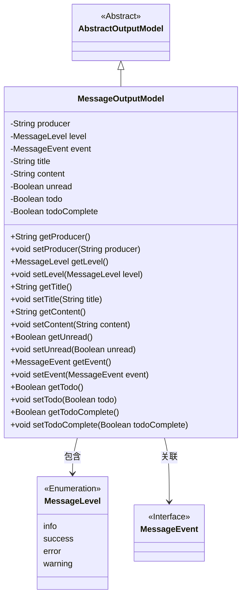

# 基础信息

|      |      |
|------|------|
| 名称 | MessageOutputModel |
| 编码语言 | .java |
| 代码路径 | WeFe/board/board-service/src/main/java/com/welab/wefe/board/service/dto/entity/MessageOutputModel.java |
| 包名 | com.welab.wefe.board.service.dto.entity |
| 依赖项 | ['com.welab.wefe.common.fieldvalidate.annotation.Check', 'com.welab.wefe.common.wefe.enums.MessageEvent', 'com.welab.wefe.common.wefe.enums.MessageLevel'] |
| 概述说明 | 消息输出模型类，包含生产者、级别、事件、标题、内容、未读状态、待办事项及完成状态等属性及对应getter/setter方法。 |

# 说明

MessageOutputModel类继承自AbstractOutputModel，用于定义消息输出模型。包含以下属性：producer表示消息生产者，枚举值为board或gateway；level表示消息级别，枚举值为info、success、error或warning；event表示消息关联的事件；title和content分别表示消息标题和内容；unread表示消息是否未读；todo表示是否为待办事项；todoComplete表示待办事项是否完成。每个属性都有对应的getter和setter方法。

# 类列表 Class Summary

| 名称   | 类型  | 说明 |
|-------|------|-------------|
| MessageOutputModel | class | MessageOutputModel类继承AbstractOutputModel，包含消息生产者、级别、事件、标题、内容、未读状态、待办事项标记及完成状态等属性及其getter/setter方法。 |

## 类 MessageOutputModel

|      |      |
|------|------|
| 访问范围 | public |
| 类型 | class |
| 名称 | MessageOutputModel |
| 说明 | MessageOutputModel类继承AbstractOutputModel，包含消息生产者、级别、事件、标题、内容、未读状态、待办事项标记及完成状态等属性及其getter/setter方法。 |

### UML类图

该类图展示了消息输出模型的结构。MessageOutputModel继承自抽象类AbstractOutputModel，包含生产者、消息级别、事件、标题、内容等私有字段及对应的getter/setter方法。其中MessageLevel是枚举类型，MessageEvent是接口类型。类图清晰地反映了实体间的继承关系和属性关联，适用于消息通知系统的领域建模。

### 内部方法调用关系图

```mermaid
graph TD
    A["类MessageOutputModel"]
    B["继承: AbstractOutputModel"]
    C["属性: String producer"]
    D["属性: MessageLevel level"]
    E["属性: MessageEvent event"]
    F["属性: String title"]
    G["属性: String content"]
    H["属性: Boolean unread"]
    I["属性: Boolean todo"]
    J["属性: Boolean todoComplete"]
    K["方法: getProducer()"]
    L["方法: setProducer(String)"]
    M["方法: getLevel()"]
    N["方法: setLevel(MessageLevel)"]
    O["方法: getTitle()"]
    P["方法: setTitle(String)"]
    Q["方法: getContent()"]
    R["方法: setContent(String)"]
    S["方法: getUnread()"]
    T["方法: setUnread(Boolean)"]
    U["方法: getEvent()"]
    V["方法: setEvent(MessageEvent)"]
    W["方法: getTodo()"]
    X["方法: setTodo(Boolean)"]
    Y["方法: getTodoComplete()"]
    Z["方法: setTodoComplete(Boolean)"]

    A --> B
    A --> C
    A --> D
    A --> E
    A --> F
    A --> G
    A --> H
    A --> I
    A --> J
    A --> K
    A --> L
    A --> M
    A --> N
    A --> O
    A --> P
    A --> Q
    A --> R
    A --> S
    A --> T
    A --> U
    A --> V
    A --> W
    A --> X
    A --> Y
    A --> Z
```

该流程图展示了MessageOutputModel类的完整结构，包括其继承关系和所有属性/方法。该类继承自AbstractOutputModel，包含9个带校验注解的属性和对应的getter/setter方法。属性涵盖消息生产者、级别、事件、标题、内容等核心字段，并通过Boolean类型字段管理未读状态和待办事项状态。每个属性都有严格的数据校验要求，如producer和level使用枚举值限制。

### 字段列表 Field List

| 名称  | 类型  | 说明 |
|-------|-------|------|
| event | MessageEvent | 消息关联的事件字段，使用@Check注解标记。 |
| unread | Boolean | 类成员变量unread，布尔类型，标注为未读检查项。 |
| producer | String | 消息生产者字段，枚举类型（board/gateway），用于标识来源。 |
| content | String | 定义私有字符串变量content，使用@Check注解标记名称属性为"内容"。 |
| todoComplete | Boolean | 字段todoComplete标记待办事项完成状态，使用@Check注解校验是否完成。 |
| todo | Boolean | 类私有布尔字段todo，用@Check注解标记为待办事项检查项。 |
| level | MessageLevel | 消息级别枚举字段，可选值为info/success/error/warning。 |
| title | String | 代码定义了一个私有字符串变量title，并标注了@Check(name = "标题")的检查注解。 |

### 方法列表

| 名称  | 类型  | 说明 |
|-------|-------|------|
| getProducer | String | 获取生产者名称的方法，返回字符串类型的producer值。 |
| setUnread | void | 设置未读状态的方法，参数为布尔值unread，用于更新当前对象的unread属性。 |
| getLevel | MessageLevel | 获取消息级别的方法，返回level属性值。 |
| setTitle | void | 设置对象标题的方法，将传入的字符串赋值给对象的title属性。 |
| setProducer | void | 这是一个Java方法，用于设置类的producer属性值。方法接收一个字符串参数producer，并将其赋值给当前对象的producer成员变量。 |
| getContent | String | 这是一个Java方法，返回字符串类型的content变量值。 |
| getEvent | MessageEvent | 获取事件对象的方法，返回MessageEvent类型。 |
| setLevel | void | 设置消息等级的方法，将输入参数level赋值给当前对象的level属性。 |
| setContent | void | 这是一个Java方法，用于设置类成员变量content的值。方法接收一个字符串参数content，并将其赋值给当前对象的content属性。 |
| setEvent | void | 设置事件方法，将传入的MessageEvent赋值给当前对象的event属性。 |
| getUnread | Boolean | 获取未读状态的布尔值方法。 |
| getTitle | String | 获取标题的方法，返回字符串类型的title变量值。 |
| getTodo | Boolean | 这是一个Java方法，返回布尔类型的todo变量值。 |
| setTodo | void | 设置待办状态的方法，将布尔值赋给类变量todo。 |
| getTodoComplete | Boolean | 获取待办事项完成状态的布尔值方法。 |
| setTodoComplete | void | 设置待办事项完成状态的方法，参数为布尔值。 |

