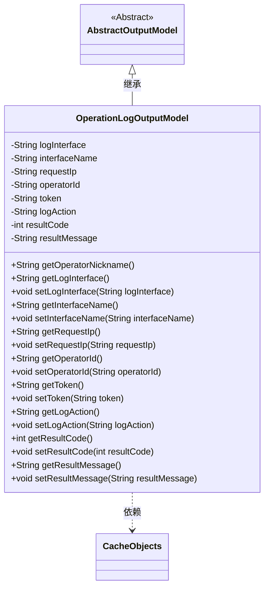
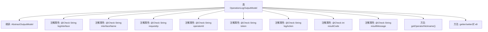

# 基础信息

|      |      |
|------|------|
| 名称 | OperationLogOutputModel |
| 编码语言 | .java |
| 代码路径 | WeFe/board/board-service/src/main/java/com/welab/wefe/board/service/dto/entity/OperationLogOutputModel.java |
| 包名 | com.welab.wefe.board.service.dto.entity |
| 依赖项 | ['com.welab.wefe.board.service.service.CacheObjects', 'com.welab.wefe.common.fieldvalidate.annotation.Check'] |
| 概述说明 | OperationLogOutputModel类继承AbstractOutputModel，包含日志接口、名称、IP、操作员ID、token、行为、结果编码和消息等字段，提供getter和setter方法。 |

# 说明

OperationLogOutputModel类继承自AbstractOutputModel，包含多个带@Check注解的字段：logInterface（请求接口）、interfaceName（接口名称）、requestIp（请求IP）、operatorId（操作人员编号）、token（请求token）、logAction（操作行为）、resultCode（结果编码）、resultMessage（结果信息）。提供各字段的getter和setter方法，以及通过operatorId获取操作人员昵称的getOperatorNickname方法。

# 类列表 Class Summary

| 名称   | 类型  | 说明 |
|-------|------|-------------|
| OperationLogOutputModel | class | OperationLogOutputModel类继承AbstractOutputModel，包含日志接口、名称、IP、操作员ID、token、行为、结果编码和消息等字段，提供各字段的getter和setter方法。 |

## 类 OperationLogOutputModel

|      |      |
|------|------|
| 访问范围 | public |
| 类型 | class |
| 名称 | OperationLogOutputModel |
| 说明 | OperationLogOutputModel类继承AbstractOutputModel，包含日志接口、名称、IP、操作员ID、token、行为、结果编码和消息等字段，提供各字段的getter和setter方法。 |

### UML类图

类图描述：OperationLogOutputModel继承自抽象类AbstractOutputModel，包含多个私有字段用于记录操作日志信息，如请求接口、IP、操作人员编号等，每个字段都有对应的getter和setter方法。该类通过CacheObjects获取操作人员昵称，体现了对缓存对象的依赖关系。所有字段都带有@Check注解，表明需要进行校验。

### 内部方法调用关系图

该流程图展示了OperationLogOutputModel类的完整结构，该类继承自AbstractOutputModel，包含8个带@Check注解的属性和9个方法。其中getOperatorNickname()方法通过operatorId从CacheObjects获取昵称，其余8个方法均为标准的属性getter/setter对。所有属性均被@Check注解标记，表明这是一个用于日志记录和参数校验的数据模型类，主要用于记录接口请求、操作行为和结果等关键信息。

### 字段列表 Field List

| 名称  | 类型  | 说明 |
|-------|-------|------|
| operatorId | String | 字段operatorId用@Check注解校验操作人员编号。 |
| resultMessage | String | 类成员变量resultMessage，用于存储请求结果，带@Check注解。 |
| interfaceName | String | 定义接口名称检查字段，用于标识请求接口名称。 |
| logAction | String | 日志操作行为字段，用于记录操作类型。 |
| logInterface | String | 定义了一个名为logInterface的私有字符串变量，用于标记请求接口。 |
| token | String | 代码定义了一个私有字符串变量token，并添加了名为"请求token"的检查注解。 |
| resultCode | int | 私有整型变量resultCode，用于存储请求结果编码，通过@Check注解标记。 |
| requestIp | String | 定义私有字符串变量requestIp，使用@Check注解标记为"请求IP"校验项。 |

### 方法列表

| 名称  | 类型  | 说明 |
|-------|-------|------|
| setLogInterface | void | 这是一个Java方法，用于设置日志接口的字符串值。方法名为setLogInterface，接受一个String参数logInterface，并将其赋值给当前对象的同名属性。 |
| getToken | String | 获取token的字符串值方法。 |
| getInterfaceName | String | 获取接口名称的方法，返回字符串类型的interfaceName。 |
| getOperatorNickname | String | 获取操作员昵称的方法，通过operatorId从缓存中查询并返回昵称。 |
| setLogAction | void | 定义方法setLogAction，用于设置logAction属性值。 |
| getResultCode | int | 获取返回结果代码的方法。 |
| setResultCode | void | 设置结果代码的方法，将传入的整数值赋给类的resultCode成员变量。 |
| getResultMessage | String | 获取结果消息的方法，返回字符串类型的resultMessage。 |
| setResultMessage | void | 这是一个Java方法，用于设置类的resultMessage属性值。方法接收一个字符串参数，并将其赋值给类的成员变量resultMessage。 |
| setToken | void | 设置token字符串值的方法。 |
| setRequestIp | void | 这是一个Java方法，用于设置请求IP地址，将传入的requestIp参数赋值给类的成员变量requestIp。 |
| getRequestIp | String | 获取请求IP的方法，返回requestIp变量值。 |
| setOperatorId | void | 设置操作员ID的方法，将参数operatorId赋值给当前对象的operatorId属性。 |
| getLogInterface | String | 方法返回logInterface字符串。 |
| getOperatorId | String | 获取操作员ID的方法，返回operatorId字符串。 |
| setInterfaceName | void | 设置接口名称的方法，将参数值赋给类的成员变量interfaceName。 |
| getLogAction | String | 获取日志动作的方法，返回字符串类型logAction。 |

