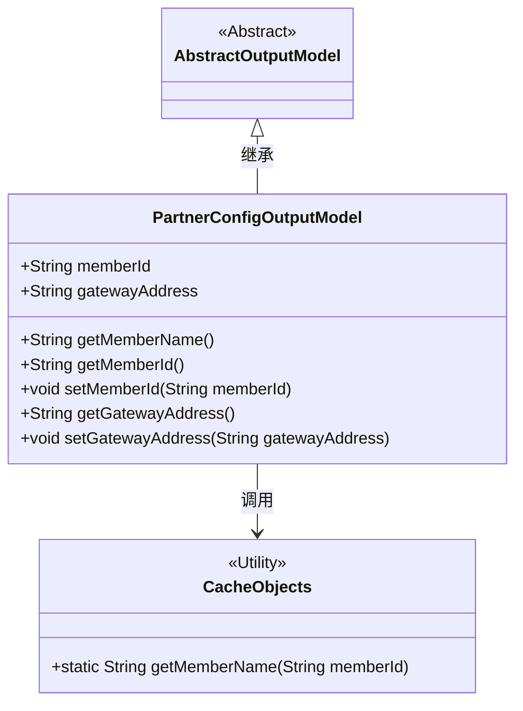
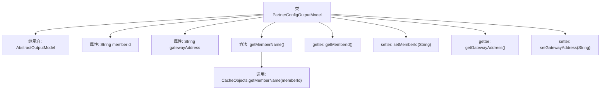

# 基础信息

|      |      |
|------|------|
| 名称 | PartnerConfigOutputModel |
| 编码语言 | .java |
| 代码路径 | WeFe/board/board-service/src/main/java/com/welab/wefe/board/service/dto/entity/PartnerConfigOutputModel.java |
| 包名 | com.welab.wefe.board.service.dto.entity |
| 依赖项 | ['com.welab.wefe.board.service.service.CacheObjects'] |
| 概述说明 | PartnerConfigOutputModel类继承AbstractOutputModel，包含memberId和gatewayAddress字段及其getter/setter方法，提供getMemberName方法通过CacheObjects获取成员名称。 |

# 说明

PartnerConfigOutputModel类继承自AbstractOutputModel，包含两个成员变量：memberId和gatewayAddress。该类提供了获取成员名称的方法getMemberName，通过CacheObjects.getMemberName实现。同时包含memberId和gatewayAddress的getter和setter方法，用于访问和修改这两个变量。

# 类列表 Class Summary

| 名称   | 类型  | 说明 |
|-------|------|-------------|
| PartnerConfigOutputModel | class | PartnerConfigOutputModel类继承AbstractOutputModel，包含memberId和gatewayAddress字段及其getter/setter方法，并提供通过memberId获取memberName的方法。 |

## 类 PartnerConfigOutputModel

|      |      |
|------|------|
| 访问范围 | public |
| 类型 | class |
| 名称 | PartnerConfigOutputModel |
| 说明 | PartnerConfigOutputModel类继承AbstractOutputModel，包含memberId和gatewayAddress字段及其getter/setter方法，并提供通过memberId获取memberName的方法。 |

### UML类图

这段类图展示了PartnerConfigOutputModel继承自抽象类AbstractOutputModel，包含两个公有字段(memberId和gatewayAddress)以及对应的getter/setter方法。其中getMemberName()方法依赖CacheObjects工具类的静态方法。该设计实现了配置数据的封装和缓存查询功能，体现了简单的DTO(数据传输对象)模式与工具类的协作关系。

### 内部方法调用关系图

这段代码展示了一个PartnerConfigOutputModel类，继承自AbstractOutputModel，包含两个成员变量memberId和gatewayAddress。类中定义了获取成员名称的方法getMemberName()，该方法通过调用CacheObjects的静态方法getMemberName()来实现。此外，还提供了标准的getter和setter方法用于访问和修改成员变量。流程图清晰地展示了类的继承关系、属性结构以及方法间的调用链。

### 字段列表 Field List

| 名称  | 类型  | 说明 |
|-------|-------|------|
| memberId | String | 定义公共字符串类型成员变量memberId。 |
| gatewayAddress | String | 声明一个公共字符串变量gatewayAddress。 |

### 方法列表

| 名称  | 类型  | 说明 |
|-------|-------|------|
| getMemberId | String | 获取成员ID的方法，返回字符串类型的memberId。 |
| getMemberName | String | 获取会员名称方法，通过会员ID从缓存中返回名称。 |
| setMemberId | void | 设置成员ID的方法，将输入参数赋值给类的成员变量memberId。 |
| getGatewayAddress | String | 这是一个Java方法，返回字符串类型的网关地址变量gatewayAddress。 |
| setGatewayAddress | void | 设置网关地址的方法，将输入参数gatewayAddress赋值给类的同名成员变量。 |

