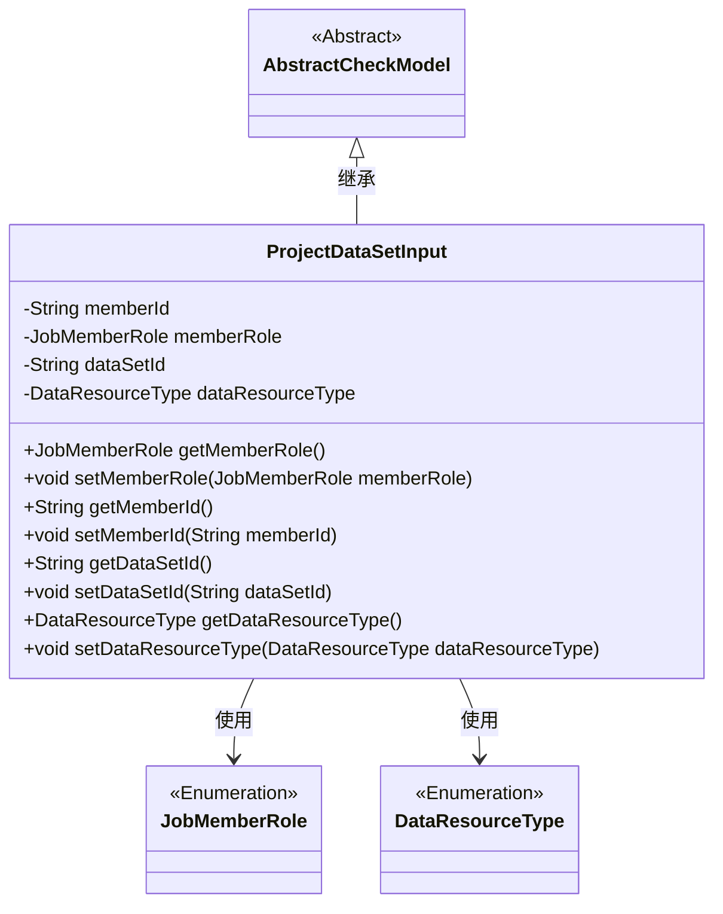

# 基础信息

|      |      |
|------|------|
| 名称 | ProjectDataSetInput |
| 编码语言 | .java |
| 代码路径 | WeFe/board/board-service/src/main/java/com/welab/wefe/board/service/dto/entity/ProjectDataSetInput.java |
| 包名 | com.welab.wefe.board.service.dto.entity |
| 依赖项 | ['com.welab.wefe.common.fieldvalidate.AbstractCheckModel', 'com.welab.wefe.common.fieldvalidate.annotation.Check', 'com.welab.wefe.common.wefe.enums.DataResourceType', 'com.welab.wefe.common.wefe.enums.JobMemberRole'] |
| 概述说明 | ProjectDataSetInput类继承AbstractCheckModel，包含成员ID、角色、数据集ID和类型字段，均需校验非空，并提供getter/setter方法。 |

# 说明

ProjectDataSetInput类继承自AbstractCheckModel，包含四个关键字段：memberId（必填，表示成员Id）、memberRole（必填，描述成员角色以区分自己和自己联邦的情况）、dataSetId（必填，表示数据集Id）和dataResourceType（必填，表示数据集类型）。每个字段都通过@Check注解进行校验，并提供了相应的getter和setter方法。

# 类列表 Class Summary

| 名称   | 类型  | 说明 |
|-------|------|-------------|
| ProjectDataSetInput | class | ProjectDataSetInput类包含成员ID、角色、数据集ID和类型字段，均为必填项，用于项目合作方数据校验。 |

## 类 ProjectDataSetInput

|      |      |
|------|------|
| 访问范围 | public |
| 类型 | class |
| 名称 | ProjectDataSetInput |
| 说明 | ProjectDataSetInput类包含成员ID、角色、数据集ID和类型字段，均为必填项，用于项目合作方数据校验。 |

### UML类图

这段类图展示了ProjectDataSetInput类继承自AbstractCheckModel抽象类，并包含四个私有字段（memberId、memberRole、dataSetId、dataResourceType）及其对应的getter/setter方法。其中memberRole和dataResourceType分别关联到JobMemberRole和DataResourceType两个枚举类型。该类通过注解实现了字段校验功能，用于处理项目数据集输入时的各种约束条件，包括必填项检查和业务逻辑验证。

### 内部方法调用关系图

```mermaid
graph TD
    A["类ProjectDataSetInput"]
    B["继承自: AbstractCheckModel"]
    C["注解属性: @Check memberId"]
    D["注解属性: @Check memberRole"]
    E["注解属性: @Check dataSetId"]
    F["注解属性: @Check dataResourceType"]
    G["方法: getMemberRole()"]
    H["方法: setMemberRole(JobMemberRole)"]
    I["方法: getMemberId()"]
    J["方法: setMemberId(String)"]
    K["方法: getDataSetId()"]
    L["方法: setDataSetId(String)"]
    M["方法: getDataResourceType()"]
    N["方法: setDataResourceType(DataResourceType)"]

    A --> B
    A --> C
    A --> D
    A --> E
    A --> F
    A --> G
    A --> H
    A --> I
    A --> J
    A --> K
    A --> L
    A --> M
    A --> N
```

这段代码定义了一个名为ProjectDataSetInput的类，继承自AbstractCheckModel。该类包含四个带有@Check注解的属性：memberId、memberRole、dataSetId和dataResourceType，分别表示成员ID、成员角色、数据集ID和数据集类型。每个属性都有对应的getter和setter方法，用于获取和设置属性值。该类主要用于数据集的输入验证和封装，通过注解实现了对必填字段的校验功能。

### 字段列表 Field List

| 名称  | 类型  | 说明 |
|-------|-------|------|
| memberId | String | 成员Id字段校验：必填项，为空时提示"请选择项目合作方"。 |
| dataSetId | String | 字段dataSetId需非空，标注为必填数据集ID。 |
| dataResourceType | DataResourceType | 代码定义了一个私有变量dataResourceType，带有必填注解，指定数据集类型检查。 |
| memberRole | JobMemberRole | 成员角色字段用于区分自己和自己联邦的情况，必填。 |

### 方法列表

| 名称  | 类型  | 说明 |
|-------|-------|------|
| getMemberId | String | 获取成员ID的方法，返回字符串类型的memberId。 |
| getDataSetId | String | 获取数据集ID的方法，返回字符串类型的数据集ID。 |
| getMemberRole | JobMemberRole | 方法getMemberRole返回成员角色对象memberRole。 |
| setMemberRole | void | 该方法用于设置成员角色，将传入的memberRole参数赋值给当前对象的memberRole属性。 |
| setMemberId | void | 设置成员ID的方法，将参数memberId赋值给当前对象的memberId属性。 |
| setDataSetId | void | 设置数据集ID的方法，将参数值赋给类的成员变量dataSetId。 |
| getDataResourceType | DataResourceType | 获取数据资源类型的方法，返回dataResourceType对象。 |
| setDataResourceType | void | 设置数据资源类型的方法，参数为DataResourceType类型，赋值给成员变量dataResourceType。 |

