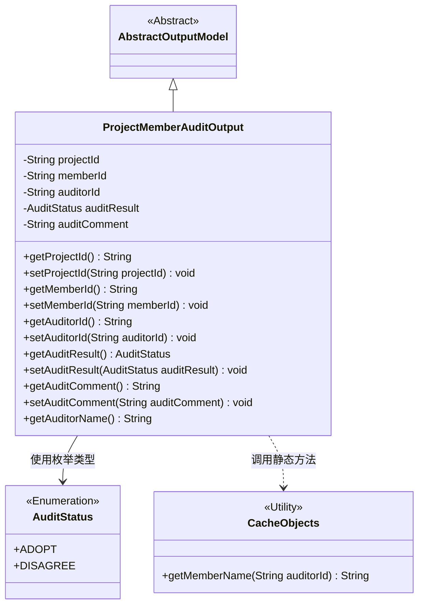
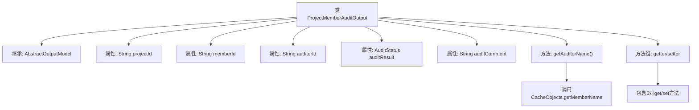

# 基础信息

|      |      |
|------|------|
| 名称 | ProjectMemberAuditOutput |
| 编码语言 | .java |
| 代码路径 | WeFe/board/board-service/src/main/java/com/welab/wefe/board/service/dto/entity/ProjectMemberAuditOutput.java |
| 包名 | com.welab.wefe.board.service.dto.entity |
| 依赖项 | ['com.welab.wefe.board.service.service.CacheObjects', 'com.welab.wefe.common.fieldvalidate.annotation.Check', 'com.welab.wefe.common.wefe.enums.AuditStatus'] |
| 概述说明 | ProjectMemberAuditOutput类用于项目成员审核，包含项目ID、成员ID、审核人ID、审核结果（adopt/disagree）和审核意见字段，提供getter/setter方法。 |

# 说明

ProjectMemberAuditOutput类继承AbstractOutputModel，包含项目ID、成员ID、审核人ID、审核结果（枚举值adopt/disagree）和审核意见字段。提供各字段的getter/setter方法，其中审核人名称通过CacheObjects.getMemberName方法获取。所有字段均用@Check注解标注名称。

# 类列表 Class Summary

| 名称   | 类型  | 说明 |
|-------|------|-------------|
| ProjectMemberAuditOutput | class | 项目成员审核输出类，包含项目ID、成员ID、审核人ID、审核结果和意见等字段及对应getter/setter方法。 |

## 类 ProjectMemberAuditOutput

|      |      |
|------|------|
| 访问范围 | public |
| 类型 | class |
| 名称 | ProjectMemberAuditOutput |
| 说明 | 项目成员审核输出类，包含项目ID、成员ID、审核人ID、审核结果和意见等字段及对应getter/setter方法。 |

### UML类图

这段类图展示了项目成员审核输出模型的结构。ProjectMemberAuditOutput继承自抽象类AbstractOutputModel，包含项目ID、成员ID、审核人ID等核心字段，使用AuditStatus枚举表示审核结果，并通过CacheObjects工具类获取审核人姓名。该类通过getter/setter方法管理字段访问，体现了标准的JavaBean设计模式，适用于项目成员审核结果的封装和传输场景。

### 内部方法调用关系图

这段代码定义了一个项目成员审核输出类ProjectMemberAuditOutput，继承自AbstractOutputModel。类中包含5个核心属性：项目ID、成员ID、审核人ID、审核结果枚举和审核意见，每个属性都有对应的getter/setter方法。特别值得注意的是getAuditorName()方法，它通过调用CacheObjects.getMemberName()来获取审核人姓名。所有属性都使用了@Check注解进行校验标注，体现了数据验证的设计意图。该类主要用于封装项目成员审核相关的输出数据模型。

### 字段列表 Field List

| 名称  | 类型  | 说明 |
|-------|-------|------|
| auditComment | String | 私有字符串变量auditComment，用于存储审核意见，标注为@Check。 |
| auditResult | AuditStatus | 审核结果字段，枚举值为adopt（通过）或disagree（不通过）。 |
| memberId | String | 成员ID字段，使用@Check注解进行校验。 |
| auditorId | String | 代码定义了一个私有字符串变量auditorId，并用@Check注解标记其名称为"审核人"。 |
| projectId | String | 字段projectId标注为所属项目主键，用于标识项目ID。 |

### 方法列表

| 名称  | 类型  | 说明 |
|-------|-------|------|
| setMemberId | void | 设置成员ID的方法，将传入的字符串参数赋值给类的成员变量memberId。 |
| getAuditorId | String | 获取auditorId的方法，返回字符串类型auditorId。 |
| getAuditorName | String | 获取审计员姓名的方法，通过auditorId从缓存中查询并返回成员姓名。 |
| setAuditorId | void | 设置审计员ID的方法，将参数auditorId赋值给当前对象的auditorId属性。 |
| getProjectId | String | 获取项目ID的方法，返回字符串类型变量projectId。 |
| setAuditResult | void | 设置审计结果的方法，参数为AuditStatus类型，赋值给成员变量auditResult。 |
| setProjectId | void | 设置项目ID的方法，将输入参数projectId赋值给当前对象的projectId属性。 |
| getMemberId | String | 方法getMemberId返回成员ID字符串memberId。 |
| getAuditComment | String | 获取审计评语的方法，返回auditComment字符串。 |
| setAuditComment | void | 这是一个Java方法，用于设置auditComment属性的值。方法接收一个字符串参数auditComment，并将其赋值给类的成员变量this.auditComment。 |
| getAuditResult | AuditStatus | 获取审核结果的方法，返回auditResult状态。 |

