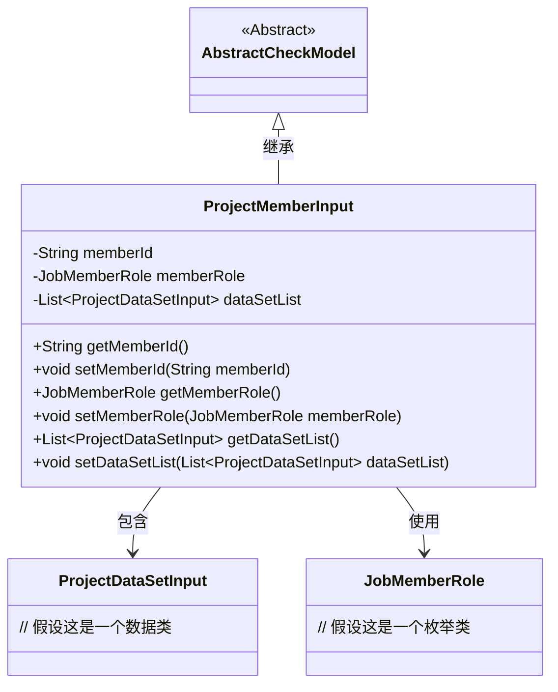
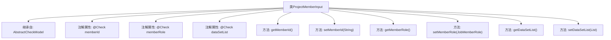

# 基础信息

|      |      |
|------|------|
| 名称 | ProjectMemberInput |
| 编码语言 | .java |
| 代码路径 | WeFe/board/board-service/src/main/java/com/welab/wefe/board/service/dto/entity/ProjectMemberInput.java |
| 包名 | com.welab.wefe.board.service.dto.entity |
| 依赖项 | ['com.welab.wefe.common.fieldvalidate.AbstractCheckModel', 'com.welab.wefe.common.fieldvalidate.annotation.Check', 'com.welab.wefe.common.wefe.enums.JobMemberRole', 'java.util.List'] |
| 概述说明 | ProjectMemberInput类包含成员ID、角色和数据集列表字段，提供getter/setter方法，成员ID为必填项。 |

# 说明

ProjectMemberInput类继承自AbstractCheckModel，包含三个主要字段：memberId（必填，校验提示为空时显示"请选择项目合作方"）、memberRole（不显示在界面上）和dataSetList（数据集列表）。每个字段都有对应的getter和setter方法，用于获取和设置属性值。该类用于处理项目成员输入数据，包含成员ID、角色和关联的数据集信息。

# 类列表 Class Summary

| 名称   | 类型  | 说明 |
|-------|------|-------------|
| ProjectMemberInput | class | ProjectMemberInput类包含成员ID（必填）、成员角色和数据集列表字段，提供getter/setter方法。 |

## 类 ProjectMemberInput

|      |      |
|------|------|
| 访问范围 | public |
| 类型 | class |
| 名称 | ProjectMemberInput |
| 说明 | ProjectMemberInput类包含成员ID（必填）、成员角色和数据集列表字段，提供getter/setter方法。 |

### UML类图

这段类图展示了ProjectMemberInput类继承自AbstractCheckModel基类，包含三个主要私有字段：memberId(String类型)、memberRole(JobMemberRole类型)和dataSetList(ProjectDataSetInput列表类型)。该类通过getter/setter方法暴露这些字段的访问权限，其中memberId字段通过@Check注解标记为必填项。ProjectMemberInput与ProjectDataSetInput和JobMemberRole存在关联关系，分别表示项目数据集列表和成员角色枚举。整体结构体现了表单数据验证和项目成员信息管理的领域模型。

### 内部方法调用关系图

该流程图展示了ProjectMemberInput类的结构，它继承自AbstractCheckModel类，包含三个带有@Check注解的属性和对应的getter/setter方法。memberId属性有非空校验要求，memberRole属性设置为不显示，dataSetList属性用于存储数据集列表。所有方法均按标准JavaBean规范实现，用于访问和修改这些属性值。

### 字段列表 Field List

| 名称  | 类型  | 说明 |
|-------|-------|------|
| dataSetList | List<ProjectDataSetInput> | 数据集列表字段，类型为ProjectDataSetInput的私有列表，使用@Check注解标记。 |
| memberRole | JobMemberRole | 成员角色检查注解，不显示，私有成员角色变量。 |
| memberId | String | Java字段注解：成员Id必填，为空提示"请选择项目合作方"。 |

### 方法列表

| 名称  | 类型  | 说明 |
|-------|-------|------|
| setMemberId | void | 设置成员ID的方法，将输入字符串赋值给类的成员变量memberId。 |
| getMemberId | String | 获取成员ID的方法，返回字符串类型的memberId。 |
| setDataSetList | void | 这是一个Java方法，用于设置数据集列表属性，接收一个ProjectDataSetInput类型的List参数。 |
| getDataSetList | List<ProjectDataSetInput> | 方法返回数据集列表dataSetList。 |
| getMemberRole | JobMemberRole | 方法getMemberRole返回成员角色memberRole。 |
| setMemberRole | void | 设置成员角色方法，将传入的成员角色赋值给当前对象的成员角色属性。 |

