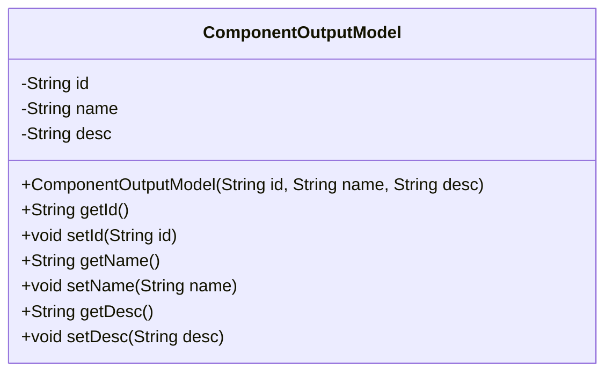
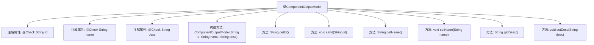

# 基础信息

|      |      |
|------|------|
| 名称 | ComponentOutputModel |
| 编码语言 | .java |
| 代码路径 | WeFe/board/board-service/src/main/java/com/welab/wefe/board/service/dto/entity/component/ComponentOutputModel.java |
| 包名 | com.welab.wefe.board.service.dto.entity.component |
| 依赖项 | ['com.welab.wefe.common.fieldvalidate.annotation.Check'] |
| 概述说明 | ComponentOutputModel类包含id、name、desc三个属性，分别表示组件唯一标识、中文名称和描述，提供构造方法和getter/setter。 |

# 说明

ComponentOutputModel是一个Java类，用于表示组件输出模型。该类包含三个私有字段：id（组件唯一标识）、name（组件中文名称）和desc（描述），每个字段都带有@Check注解标注其用途。类提供了包含这三个参数的构造函数，以及每个字段的getter和setter方法，用于访问和修改字段值。

# 类列表 Class Summary

| 名称   | 类型  | 说明 |
|-------|------|-------------|
| ComponentOutputModel | class | ComponentOutputModel类包含id、name、desc三个属性，分别表示组件唯一标识、中文名称和描述，提供构造方法和getter/setter。 |

## 类 ComponentOutputModel

|      |      |
|------|------|
| 访问范围 | public |
| 类型 | class |
| 名称 | ComponentOutputModel |
| 说明 | ComponentOutputModel类包含id、name、desc三个属性，分别表示组件唯一标识、中文名称和描述，提供构造方法和getter/setter。 |

### UML类图

这段代码定义了一个名为ComponentOutputModel的类，用于表示组件输出模型的数据结构。该类包含三个私有字段：id（组件唯一标识）、name（组件中文名称）和desc（描述），每个字段都带有@Check注解用于验证。类中提供了完整的构造方法和getter/setter方法，允许外部代码访问和修改这些字段的值。这个类主要用于封装组件相关的输出数据，便于在系统中传递和处理组件信息。

### 内部方法调用关系图

这段代码定义了一个名为ComponentOutputModel的类，包含三个带有@Check注解的私有属性(id、name、desc)以及对应的构造方法和getter/setter方法。流程图展示了类的整体结构，包括注解属性、构造方法和6个访问器方法，清晰地呈现了类的成员组成和方法调用关系。该类主要用于封装组件输出模型的数据结构，通过注解对字段进行校验标记，并通过标准访问方法提供对这些字段的操作接口。

### 字段列表 Field List

| 名称  | 类型  | 说明 |
|-------|-------|------|
| id | String | 代码定义了一个私有字符串变量id，并用@Check注解标记其需满足"组件唯一标识"的校验条件。 |
| name | String | 代码定义了一个私有字符串变量name，使用@Check注解标注组件中文名称。 |
| desc | String | 私有字符串类型变量desc，使用@Check注解标记名称为"描述"。 |

### 方法列表

| 名称  | 类型  | 说明 |
|-------|-------|------|
| setDesc | void | Java方法：设置desc属性值。参数为String类型desc，将其赋值给当前对象的desc属性。 |
| setName | void | 设置对象名称的方法，将参数name赋值给对象的name属性。 |
| getName | String | 方法返回字符串类型的name变量值。 |
| setId | void | 设置对象ID的方法，将参数id赋值给当前对象的id属性。 |
| getId | String | 该方法返回字符串类型的id值。 |
| getDesc | String | 获取描述信息的方法，返回字符串desc。 |

