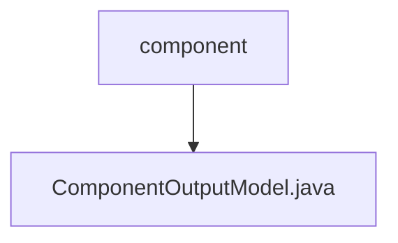

# 基础信息

|      |      |
|------|------|
| 名称 | component |
| 编码语言 | .java |
| 代码路径 | WeFe/board/board-service/src/main/java/com/welab/wefe/board/service/dto/entity/component |
| 包名 | docs.board.board-service.src.main.java.com.welab.wefe.board.service.dto.entity.component |
| 概述说明 | ComponentOutputModel类包含id、name、desc三个属性，分别表示组件唯一标识、中文名称和描述，提供构造方法和getter/setter。 |

# 说明

ComponentOutputModel是一个Java类，用于表示组件输出模型。该类包含三个私有字段：id（组件唯一标识）、name（组件中文名称）和desc（描述），每个字段都带有@Check注解标注其用途。类提供了包含这三个参数的构造函数，以及每个字段的getter和setter方法，用于访问和修改字段值。

### 包内部结构视图

该流程图展示了组件目录与输出模型文件之间的层级关系。component作为父级目录节点，ComponentOutputModel.java作为其子节点，表示该Java类文件位于component目录下。这种结构常见于项目中的DTO层，用于定义组件相关的输出数据模型。

# 文件列表

| 名称   | 类型  | 说明 |
|-------|------|-------------|
| [ComponentOutputModel.java](ComponentOutputModel.md) | file | ComponentOutputModel类包含id、name、desc三个属性，分别表示组件唯一标识、中文名称和描述，提供构造方法和getter/setter。 |

