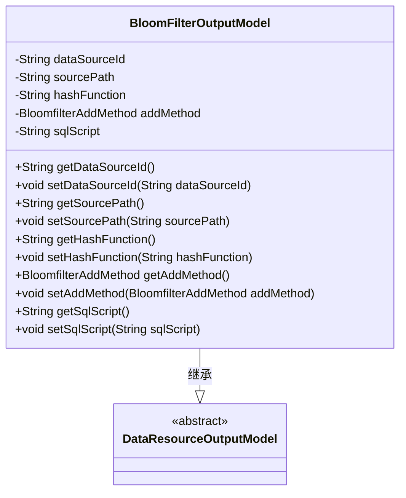

# 基础信息

|      |      |
|------|------|
| 名称 | BloomFilterOutputModel |
| 编码语言 | .java |
| 代码路径 | WeFe/board/board-service/src/main/java/com/welab/wefe/board/service/dto/entity/data_resource/output/BloomFilterOutputModel.java |
| 包名 | com.welab.wefe.board.service.dto.entity.data_resource.output |
| 依赖项 | ['com.welab.wefe.board.service.constant.BloomfilterAddMethod', 'com.welab.wefe.common.fieldvalidate.annotation.Check'] |
| 概述说明 | BloomFilterOutputModel类继承DataResourceOutputModel，包含数据源ID、地址、主键hash方法、布隆过滤器添加方式和SQL语句等字段及其getter/setter方法。 |

# 说明

BloomFilterOutputModel类继承自DataResourceOutputModel，包含五个关键字段：数据源id、数据源地址、主键hash生成方法、布隆过滤器添加方式和sql语句。每个字段都通过@Check注解进行校验，并提供了对应的getter和setter方法。该类主要用于处理与布隆过滤器相关的数据输出模型。

# 类列表 Class Summary

| 名称   | 类型  | 说明 |
|-------|------|-------------|
| BloomFilterOutputModel | class | BloomFilterOutputModel类继承DataResourceOutputModel，包含数据源ID、地址、主键hash方法、布隆过滤器添加方式和SQL语句字段及对应getter/setter方法。 |

## 类 BloomFilterOutputModel

|      |      |
|------|------|
| 访问范围 | public |
| 类型 | class |
| 名称 | BloomFilterOutputModel |
| 说明 | BloomFilterOutputModel类继承DataResourceOutputModel，包含数据源ID、地址、主键hash方法、布隆过滤器添加方式和SQL语句字段及对应getter/setter方法。 |

### UML类图

这段代码展示了一个布隆过滤器输出模型类BloomFilterOutputModel，它继承自抽象基类DataResourceOutputModel。该类包含五个核心私有字段：数据源ID、源路径、哈希函数、布隆过滤器添加方法和SQL脚本，每个字段都有对应的getter和setter方法。通过@Check注解对字段进行校验，主要用于处理与布隆过滤器相关的数据输出场景，体现了数据验证和封装的设计思想。

### 内部方法调用关系图

```mermaid
graph TD
    A["类BloomFilterOutputModel"]
    B["继承自: DataResourceOutputModel"]
    C["属性: String dataSourceId"]
    D["属性: String sourcePath"]
    E["属性: String hashFunction"]
    F["属性: BloomfilterAddMethod addMethod"]
    G["属性: String sqlScript"]
    H["方法: getDataSourceId()"]
    I["方法: setDataSourceId(String)"]
    J["方法: getSourcePath()"]
    K["方法: setSourcePath(String)"]
    L["方法: getHashFunction()"]
    M["方法: setHashFunction(String)"]
    N["方法: getAddMethod()"]
    O["方法: setAddMethod(BloomfilterAddMethod)"]
    P["方法: getSqlScript()"]
    Q["方法: setSqlScript(String)"]

    A --> B
    A --> C
    A --> D
    A --> E
    A --> F
    A --> G
    A --> H
    A --> I
    A --> J
    A --> K
    A --> L
    A --> M
    A --> N
    A --> O
    A --> P
    A --> Q
```

这段代码定义了一个名为BloomFilterOutputModel的类，继承自DataResourceOutputModel。该类包含五个私有属性：dataSourceId、sourcePath、hashFunction、addMethod和sqlScript，每个属性都有对应的getter和setter方法。这些属性都带有@Check注解，用于验证字段的有效性。该类主要用于存储布隆过滤器相关的输出数据模型，包括数据源信息、哈希函数、添加方式以及SQL脚本等内容。

### 字段列表 Field List

| 名称  | 类型  | 说明 |
|-------|-------|------|
| dataSourceId | String | 字段dataSourceId带有数据源ID校验注解。 |
| hashFunction | String | 主键hash生成方法对应的变量hashFunction。 |
| sourcePath | String | 代码定义了一个私有字符串变量sourcePath，并用@Check注解标记其名称为"数据源地址"。 |
| sqlScript | String | 类成员变量sqlScript，使用@Check注解标记为需校验的SQL语句。 |
| addMethod | BloomfilterAddMethod | 布隆过滤器添加方式配置项，定义添加方法。 |

### 方法列表

| 名称  | 类型  | 说明 |
|-------|-------|------|
| setSqlScript | void | 这是一个Java方法，用于设置类的sqlScript属性值。方法接受一个字符串参数sqlScript，并将其赋值给类的同名成员变量。 |
| getSqlScript | String | 方法返回字符串类型的sqlScript属性值。 |
| setSourcePath | void | 设置源路径的方法，将输入参数赋值给类的sourcePath成员变量。 |
| setDataSourceId | void | 设置数据源ID的方法，将输入参数赋值给类的成员变量dataSourceId。 |
| getDataSourceId | String | 这是一个Java方法，返回私有成员变量dataSourceId的值。 |
| setHashFunction | void | 这是一个Java方法，用于设置对象的hashFunction属性值。方法接受一个字符串参数hashFunction，并将其赋值给当前对象的同名属性。 |
| setAddMethod | void | 设置布隆过滤器添加方法。 |
| getSourcePath | String | 方法返回字符串类型的sourcePath值。 |
| getAddMethod | BloomfilterAddMethod | 获取Bloomfilter的添加方法。 |
| getHashFunction | String | 获取哈希函数名称的方法。 |

