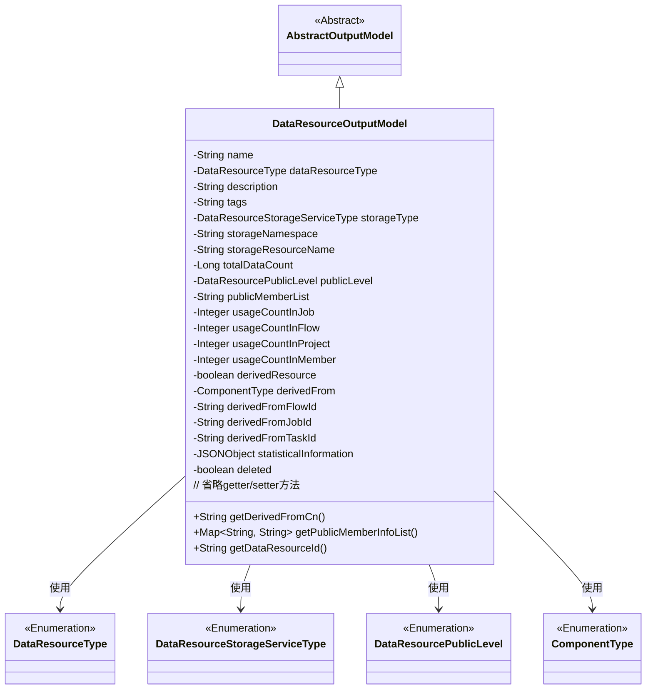

# 基础信息

|      |      |
|------|------|
| 名称 | DataResourceOutputModel |
| 编码语言 | .java |
| 代码路径 | WeFe/board/board-service/src/main/java/com/welab/wefe/board/service/dto/entity/data_resource/output/DataResourceOutputModel.java |
| 包名 | com.welab.wefe.board.service.dto.entity.data_resource.output |
| 依赖项 | ['com.alibaba.fastjson.JSONObject', 'com.welab.wefe.board.service.dto.entity.AbstractOutputModel', 'com.welab.wefe.board.service.service.CacheObjects', 'com.welab.wefe.common.fieldvalidate.annotation.Check', 'com.welab.wefe.common.util.StringUtil', 'com.welab.wefe.common.wefe.enums.ComponentType', 'com.welab.wefe.common.wefe.enums.DataResourcePublicLevel', 'com.welab.wefe.common.wefe.enums.DataResourceStorageServiceType', 'com.welab.wefe.common.wefe.enums.DataResourceType', 'java.util.Map', 'java.util.TreeMap'] |
| 概述说明 | DataResourceOutputModel类定义了数据资源的输出模型，包含名称、类型、描述、标签、存储信息、使用统计、可见性及衍生来源等属性。 |

# 说明

DataResourceOutputModel类继承自AbstractOutputModel，用于描述数据资源的输出模型。包含资源名称、类型、描述、标签、存储类型、存储命名空间和资源名称等基本信息。记录资源的总数据量、可见性级别、可见成员列表，以及在不同场景（job、flow、project、成员）中的使用次数。标识是否为衍生资源，记录衍生来源类型、流程ID、任务ID和子任务ID。包含资源统计信息和删除状态标记。提供获取衍生来源中文描述和公开成员信息列表的方法，以及各属性的getter和setter方法。

# 类列表 Class Summary

| 名称   | 类型  | 说明 |
|-------|------|-------------|
| DataResourceOutputModel | class | DataResourceOutputModel类定义了数据资源的输出模型，包含名称、类型、描述、存储信息、使用统计、可见性及衍生来源等属性。 |

## 类 DataResourceOutputModel

|      |      |
|------|------|
| 访问范围 | public |
| 类型 | class |
| 名称 | DataResourceOutputModel |
| 说明 | DataResourceOutputModel类定义了数据资源的输出模型，包含名称、类型、描述、存储信息、使用统计、可见性及衍生来源等属性。 |

### UML类图

这段代码定义了一个数据资源输出模型类`DataResourceOutputModel`，继承自抽象类`AbstractOutputModel`。该类包含大量私有字段（用`@Check`注解标记）用于描述数据资源的各种属性，如名称、类型、存储信息、使用统计等，同时提供了相应的getter/setter方法。特别值得注意的是，该类还包含两个业务方法：`getDerivedFromCn()`用于获取衍生来源的中文标签，`getPublicMemberInfoList()`用于处理可见成员列表信息。该类与多个枚举类型（`DataResourceType`、`DataResourceStorageServiceType`等）存在依赖关系。

### 内部方法调用关系图

```mermaid
graph TD
    A["类DataResourceOutputModel"]
    B["继承: AbstractOutputModel"]
    C["属性: String name"]
    D["属性: DataResourceType dataResourceType"]
    E["属性: String description"]
    F["属性: String tags"]
    G["属性: DataResourceStorageServiceType storageType"]
    H["属性: String storageNamespace"]
    I["属性: String storageResourceName"]
    J["属性: Long totalDataCount"]
    K["属性: DataResourcePublicLevel publicLevel"]
    L["属性: String publicMemberList"]
    M["属性: Integer usageCountInJob"]
    N["属性: Integer usageCountInFlow"]
    O["属性: Integer usageCountInProject"]
    P["属性: Integer usageCountInMember"]
    Q["属性: boolean derivedResource"]
    R["属性: ComponentType derivedFrom"]
    S["属性: String derivedFromFlowId"]
    T["属性: String derivedFromJobId"]
    U["属性: String derivedFromTaskId"]
    V["属性: JSONObject statisticalInformation"]
    W["属性: boolean deleted"]
    X["方法: String getDerivedFromCn()"]
    Y["方法: Map<String,String> getPublicMemberInfoList()"]
    Z["方法: String getDataResourceId()"]
    AA["方法: 标准getter/setter"]

    A --> B
    A --> C
    A --> D
    A --> E
    A --> F
    A --> G
    A --> H
    A --> I
    A --> J
    A --> K
    A --> L
    A --> M
    A --> N
    A --> O
    A --> P
    A --> Q
    A --> R
    A --> S
    A --> T
    A --> U
    A --> V
    A --> W
    A --> X
    A --> Y
    A --> Z
    A --> AA
```

这段代码定义了一个名为DataResourceOutputModel的类，继承自AbstractOutputModel，主要用于描述数据资源的输出模型。该类包含20多个属性，涵盖了资源名称、类型、描述、存储信息、使用统计等多个维度，每个属性都带有@Check注解用于校验。类中提供了三个自定义方法：getDerivedFromCn()用于获取衍生来源的中文标签，getPublicMemberInfoList()用于处理可见成员列表，getDataResourceId()继承父类方法获取资源ID。其余均为标准的getter/setter方法，用于属性访问和修改。整个类结构清晰，属性分类明确，适合作为数据资源管理的核心模型。

### 字段列表 Field List

| 名称  | 类型  | 说明 |
|-------|-------|------|
| description | String | 字段描述注解，私有字符串类型变量。 |
| dataResourceType | DataResourceType | 代码定义了一个私有字段dataResourceType，使用@Check注解标记并指定名称为"资源类型"，类型为DataResourceType。 |
| storageResourceName | String | 定义私有字符串变量storageResourceName，用于存储资源名称（如表名、文件名），并通过@Check注解进行校验。 |
| derivedFromTaskId | String | 检查衍生来源子任务ID的字符串字段。 |
| derivedResource | boolean | 私有布尔变量derivedResource，使用@Check注解标记为检查是否是衍生资源。 |
| usageCountInMember | Integer | 成员资源使用计数，记录被其他成员使用的次数。 |
| storageNamespace | String | 代码定义了一个私有字符串变量storageNamespace，用于检查资源在存储中的命名空间、库名和目录路径。 |
| publicMemberList | String | 私有字符串publicMemberList用于控制可见成员列表，仅列表中的联邦成员可查看资源基本信息。 |
| storageType | DataResourceStorageServiceType | 定义私有变量storageType，使用@Check注解校验"存储类型"，类型为DataResourceStorageServiceType。 |
| publicLevel | DataResourcePublicLevel | 资源的可见性检查字段，类型为DataResourcePublicLevel。 |
| usageCountInJob | Integer | 字段usageCountInJob记录资源在job中的使用次数，通过@Check注解标记检查项。 |
| derivedFromJobId | String | 衍生来源任务ID字段，用于标识任务的来源。 |
| usageCountInProject | Integer | 资源在项目中的使用次数统计。 |
| name | String | 定义私有字符串变量name，使用@Check注解标记资源名称。 |
| tags | String | 代码定义了一个私有字符串变量tags，并用@Check注解标记其名称为"标签"。 |
| totalDataCount | Long | 定义了一个私有长整型变量totalDataCount，用于存储总数据量，并标注了检查名称。 |
| derivedFromFlowId | String | 衍生来源流程ID字段，用于标识流程的衍生来源。 |
| derivedFrom | ComponentType | 定义组件类型来源枚举，包括原始、对齐、分箱三种类型。 |
| usageCountInFlow | Integer | 检查资源在流程中的使用次数。 |
| deleted | boolean | 检查数据集是否被删除的布尔变量。 |
| statisticalInformation | JSONObject | 定义了一个私有JSONObject变量statisticalInformation，用于存储数据资源的统计信息，并通过@Check注解进行校验。 |

### 方法列表

| 名称  | 类型  | 说明 |
|-------|-------|------|
| getDerivedFromCn | String | 获取派生来源的中文标签，若存在则返回，否则返回空字符串。 |
| setStorageNamespace | void | 设置存储命名空间的方法，将输入参数赋值给类的成员变量storageNamespace。 |
| setUsageCountInProject | void | 设置项目内使用次数的方法，参数为整型数值。 |
| setStorageType | void | 方法设置存储类型，参数为DataResourceStorageServiceType类型，赋值给成员变量storageType。 |
| setDerivedResource | void | 设置派生资源标志的方法，参数为布尔值derivedResource。 |
| setPublicMemberList | void | 设置公共成员列表的方法，将输入字符串赋值给类的成员变量publicMemberList。 |
| isDeleted | boolean | 该方法返回布尔值，表示对象是否被标记为删除。 |
| setDerivedFromFlowId | void | 设置派生流程ID的方法，将参数值赋给类的成员变量。 |
| getDataResourceId | String | 该方法返回父类的ID作为数据资源ID。 |
| setDerivedFromJobId | void | 方法设置派生任务ID，将参数值赋给类的成员变量derivedFromJobId。 |
| getUsageCountInJob | Integer | 获取任务中的使用次数。 |
| setStatisticalInformation | void | 这是一个Java方法，用于设置类的统计信息属性，接收JSONObject类型参数并赋值给成员变量。 |
| getTotalDataCount | Long | 方法getTotalDataCount返回totalDataCount的长整型值。 |
| getDerivedFromFlowId | String | 获取派生流程ID的方法，返回字符串类型变量derivedFromFlowId。 |
| getStorageType | DataResourceStorageServiceType | 获取当前存储服务类型的方法，返回DataResourceStorageServiceType类型值。 |
| getUsageCountInProject | Integer | 获取项目内使用次数的整数值。 |
| getPublicMemberList | String | 获取公共成员列表的方法，返回字符串类型变量publicMemberList。 |
| setDerivedFrom | void | 方法setDerivedFrom用于设置当前组件的派生来源，参数derivedFrom表示来源组件类型。 |
| isDerivedResource | boolean | 方法检查是否为派生资源，返回布尔值derivedResource。 |
| getPublicMemberInfoList | Map<String, String> | 该方法返回公共成员信息列表的映射。若列表为空则返回空映射，否则将成员ID与名称对应存入TreeMap并返回。 |
| setDataResourceType | void | 这是一个Java方法，用于设置数据资源类型。方法名为setDataResourceType，接收一个DataResourceType类型的参数，并将其赋值给当前对象的dataResourceType属性。 |
| getDerivedFromJobId | String | 该方法返回派生自作业ID的字符串值。 |
| getDataResourceType | DataResourceType | 获取数据资源类型的方法，返回dataResourceType字段值。 |
| setUsageCountInFlow | void | 设置流程内使用次数的公共方法。 |
| getStatisticalInformation | JSONObject | 获取统计信息的JSON对象方法。 |
| setPublicLevel | void | 设置数据资源的公开级别方法，参数为publicLevel，赋值给当前对象的publicLevel属性。 |
| setTags | void | 这是一个Java方法，用于设置对象的tags属性。方法接受一个字符串参数tags，并将其赋值给当前对象的tags字段。 |
| setUsageCountInMember | void | 设置成员内使用次数的公共方法，参数为整型usageCountInMember，赋值给类变量。 |
| getDerivedFromTaskId | String | 获取派生任务ID的方法，返回字符串类型的派生任务ID。 |
| setName | void | 设置对象名称的方法，将参数name赋值给对象的name属性。 |
| setDescription | void | 设置描述信息的方法，将输入参数赋值给对象的description属性。 |
| setUsageCountInJob | void | 这是一个Java方法，用于设置作业中的使用次数变量。方法接受一个整数参数，并将其赋值给类的成员变量usageCountInJob。 |
| setDerivedFromTaskId | void | 设置派生任务ID的方法，将参数值赋给类的成员变量。 |
| getPublicLevel | DataResourcePublicLevel | 获取数据资源的公开级别。 |
| getUsageCountInMember | Integer | 获取成员使用次数的整数值。 |
| getUsageCountInFlow | Integer | 获取流程中的使用次数。 |
| getStorageNamespace | String | 获取存储命名空间的方法，返回字符串类型值storageNamespace。 |
| getDerivedFrom | ComponentType | 获取派生来源的组件类型。 |
| getDescription | String | 这是一个Java方法，返回字符串类型的description属性值。 |
| getName | String | 方法getName返回字符串name的值。 |
| setTotalDataCount | void | 设置总数据量的方法，将输入值赋给类变量totalDataCount。 |
| setDeleted | void | 这是一个Java方法，用于设置对象的删除状态。方法接受一个布尔参数deleted，并将其赋值给对象的deleted属性。 |
| getTags | String | 方法getTags返回字符串类型的成员变量tags的值。 |
| getStorageResourceName | String | 获取存储资源名称的方法，返回字符串类型变量storageResourceName。 |
| setStorageResourceName | void | 设置存储资源名称的方法，将输入参数赋值给类成员变量storageResourceName。 |

