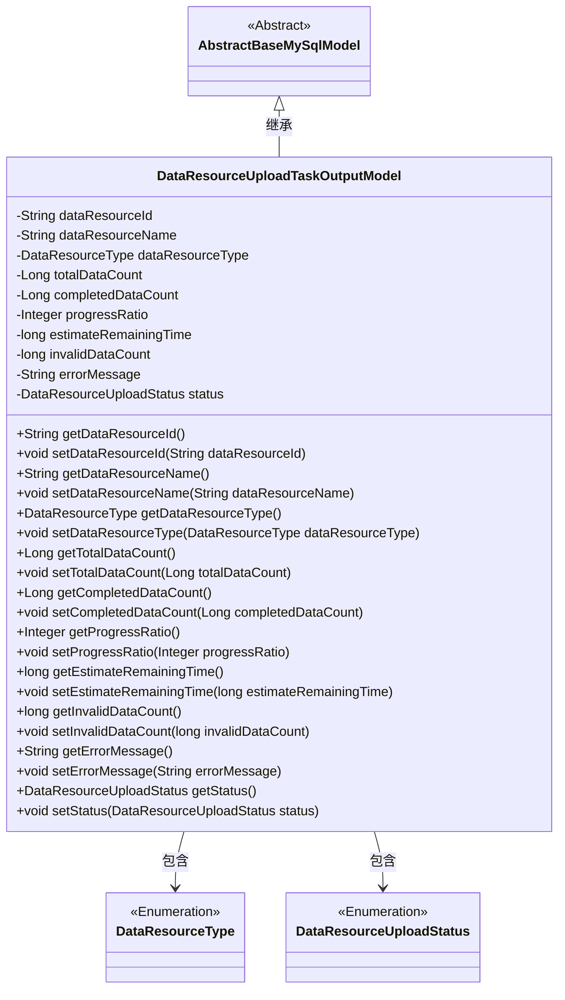

# 基础信息

|      |      |
|------|------|
| 名称 | DataResourceUploadTaskOutputModel |
| 编码语言 | .java |
| 代码路径 | WeFe/board/board-service/src/main/java/com/welab/wefe/board/service/dto/entity/data_resource/output/DataResourceUploadTaskOutputModel.java |
| 包名 | com.welab.wefe.board.service.dto.entity.data_resource.output |
| 依赖项 | ['com.welab.wefe.board.service.database.entity.base.AbstractBaseMySqlModel', 'com.welab.wefe.common.fieldvalidate.annotation.Check', 'com.welab.wefe.common.wefe.enums.DataResourceType', 'com.welab.wefe.common.wefe.enums.DataResourceUploadStatus'] |
| 概述说明 | 数据资源上传任务输出模型，包含资源ID、名称、类型、数据量、进度、剩余时间、无效数据量、错误信息和状态等字段。 |

# 说明

DataResourceUploadTaskOutputModel是一个继承自AbstractBaseMySqlModel的类，用于描述数据资源上传任务的输出信息。包含数据资源ID、名称、类型、总数据行数、已完成数据行数、进度百分比、预计剩余耗时、无效数据量、错误消息和状态等字段。每个字段都有对应的getter和setter方法，用于获取和设置属性值。状态字段使用DataResourceUploadStatus枚举表示任务状态，如上传中、已完成或已失败。

# 类列表 Class Summary

| 名称   | 类型  | 说明 |
|-------|------|-------------|
| DataResourceUploadTaskOutputModel | class | 数据资源上传任务输出模型，包含资源ID、名称、类型、数据量、进度、剩余时间、无效数据、错误消息和状态等信息。 |

## 类 DataResourceUploadTaskOutputModel

|      |      |
|------|------|
| 访问范围 | public |
| 类型 | class |
| 名称 | DataResourceUploadTaskOutputModel |
| 说明 | 数据资源上传任务输出模型，包含资源ID、名称、类型、数据量、进度、剩余时间、无效数据、错误消息和状态等信息。 |

### UML类图

这段代码定义了一个数据资源上传任务输出模型类，继承自抽象基类AbstractBaseMySqlModel。该类包含多个私有字段，如数据资源ID、名称、类型、总数据量、已完成数据量、进度比例等，以及对应的getter和setter方法。其中DataResourceType和DataResourceUploadStatus是枚举类型，用于表示数据资源类型和上传状态。该类主要用于封装数据资源上传过程中的各种状态信息和统计数据。

### 内部方法调用关系图

这段代码定义了一个名为DataResourceUploadTaskOutputModel的类，继承自AbstractBaseMySqlModel，用于表示数据资源上传任务的输出模型。该类包含多个属性，如数据资源ID、名称、类型、总数据行数、已完成数据行数、进度百分比、预计剩余时间、无效数据量、错误消息和状态等，并为每个属性提供了对应的getter和setter方法。这些属性都带有@Check注解，用于进行校验。该模型主要用于跟踪和记录数据资源上传过程中的各种状态和统计信息。

### 字段列表 Field List

| 名称  | 类型  | 说明 |
|-------|-------|------|
| invalidDataCount | long | 字段invalidDataCount用于记录无效数据量和主键重复条数。 |
| progressRatio | Integer | 任务进度百分比字段，类型为整数。 |
| dataResourceName | String | 定义私有字符串变量dataResourceName，使用@Check注解校验数据资源名称。 |
| errorMessage | String | 代码定义了一个私有字符串变量errorMessage，并标注了检查注解，名称为"错误消息"。 |
| status | DataResourceUploadStatus | 字段status表示数据资源上传状态，可选值为上传中、已完成、已失败。 |
| dataResourceType | DataResourceType | 定义私有变量dataResourceType，类型为DataResourceType，使用@Check注解校验资源类型。 |
| totalDataCount | Long | 定义了一个私有长整型变量totalDataCount，用于存储总数据行数，并通过@Check注解进行校验。 |
| estimateRemainingTime | long | 类成员变量estimateRemainingTime，用于存储预计剩余耗时，使用@Check注解标记。 |
| dataResourceId | String | 数据资源ID校验字段 |
| completedDataCount | Long | 已写入数据行数的检查字段，类型为长整型。 |

### 方法列表

| 名称  | 类型  | 说明 |
|-------|-------|------|
| getDataResourceName | String | 获取数据资源名称的方法，返回字符串类型值dataResourceName。 |
| getEstimateRemainingTime | long | 获取剩余时间估计值的方法，返回长整型变量estimateRemainingTime。 |
| setInvalidDataCount | void | 设置无效数据计数的方法，将参数值赋给类成员变量invalidDataCount。 |
| getErrorMessage | String | 获取错误信息的方法，返回字符串类型的错误消息。 |
| getCompletedDataCount | Long | 获取已完成数据计数的方法，返回长整型数值。 |
| getTotalDataCount | Long | 方法getTotalDataCount返回totalDataCount的长整型值。 |
| getDataResourceType | DataResourceType | 获取数据资源类型的方法，返回dataResourceType。 |
| setDataResourceName | void | 设置数据资源名称的方法，将输入参数赋值给类的成员变量。 |
| getDataResourceId | String | 获取数据资源ID的方法，返回字符串类型的dataResourceId。 |
| setProgressRatio | void | 设置进度比例的方法，参数为整型progressRatio，赋值给类成员变量progressRatio。 |
| setEstimateRemainingTime | void | 设置剩余时间估计值的方法，参数为长整型。 |
| setDataResourceId | void | 设置数据资源ID的方法，将输入参数赋值给类的成员变量dataResourceId。 |
| setDataResourceType | void | 设置数据资源类型的方法，将输入参数赋值给类的成员变量。 |
| getInvalidDataCount | long | 获取无效数据计数的方法，返回无效数据的数量。 |
| getProgressRatio | Integer | 获取进度比例值的方法，返回整数类型progressRatio。 |
| setCompletedDataCount | void | 这是一个Java方法，用于设置completedDataCount属性的值。方法接收一个Long类型参数，并将其赋值给类的成员变量completedDataCount。 |
| setTotalDataCount | void | 设置总数据量的方法，参数为长整型totalDataCount。 |
| setErrorMessage | void | 这是一个Java方法，用于设置错误信息。方法名为setErrorMessage，接受一个字符串参数errorMessage，并将其赋值给类的成员变量errorMessage。 |
| getStatus | DataResourceUploadStatus | 获取当前数据资源上传状态的方法，返回DataResourceUploadStatus对象。 |
| setStatus | void | 该方法用于设置数据资源上传状态，将传入的status参数赋值给当前对象的status属性。 |

