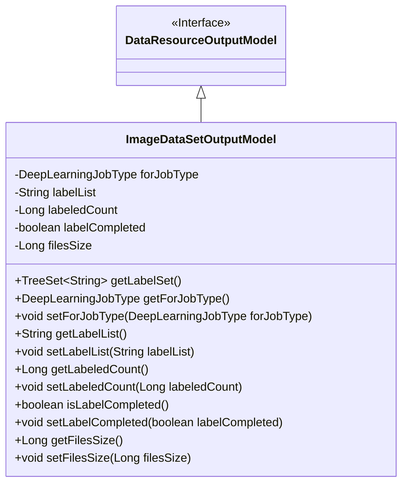
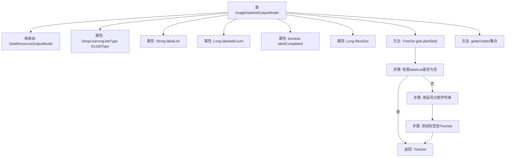

# 基础信息

|      |      |
|------|------|
| 名称 | ImageDataSetOutputModel |
| 编码语言 | .java |
| 代码路径 | WeFe/board/board-service/src/main/java/com/welab/wefe/board/service/dto/entity/data_resource/output/ImageDataSetOutputModel.java |
| 包名 | com.welab.wefe.board.service.dto.entity.data_resource.output |
| 依赖项 | ['com.alibaba.fastjson.annotation.JSONField', 'com.welab.wefe.common.fieldvalidate.annotation.Check', 'com.welab.wefe.common.util.StringUtil', 'com.welab.wefe.common.wefe.enums.DeepLearningJobType', 'java.util.List', 'java.util.TreeSet'] |
| 概述说明 | ImageDataSetOutputModel类继承DataResourceOutputModel，包含任务类型、标签列表、已标注数量、标注完成状态和数据集大小等属性，提供标签集合转换方法及getter/setter。 |

# 说明

ImageDataSetOutputModel继承自DataResourceOutputModel，包含五个核心字段：forJobType表示任务类型（如物体检测），labelList存储标签列表字符串，labeledCount记录已标注数量，labelCompleted标识是否标注完成，filesSize记录数据集大小。提供getLabelSet方法将逗号分隔的labelList转换为有序标签集合，并包含各字段的标准getter/setter方法。JSONField注解确保getLabelSet方法不被序列化。

# 类列表 Class Summary

| 名称   | 类型  | 说明 |
|-------|------|-------------|
| ImageDataSetOutputModel | class | 图像数据集输出模型类，包含任务类型、标签列表、标注数量、标注完成状态和数据集大小等属性，提供标签集转换方法及标准getter/setter。 |

## 类 ImageDataSetOutputModel

|      |      |
|------|------|
| 访问范围 | public |
| 类型 | class |
| 名称 | ImageDataSetOutputModel |
| 说明 | 图像数据集输出模型类，包含任务类型、标签列表、标注数量、标注完成状态和数据集大小等属性，提供标签集转换方法及标准getter/setter。 |

### UML类图

这段代码定义了一个名为ImageDataSetOutputModel的类，它继承自DataResourceOutputModel接口。该类主要用于处理图像数据集的输出模型，包含任务类型、标签列表、已标注数量、标注完成状态和数据集大小等属性。其中getLabelSet()方法将逗号分隔的标签字符串转换为有序的TreeSet集合。所有字段都带有@Check注解用于验证，部分字段还有@JSONField注解控制序列化行为。

### 内部方法调用关系图

这段代码展示了一个图像数据集输出模型类，继承自基础数据资源模型。核心功能包括维护深度学习任务类型、标签列表、标注状态等属性，特别提供了将逗号分隔的标签字符串转换为有序集合的方法。流程图清晰呈现了类结构继承关系和getLabelSet()方法的处理逻辑：先检查空值，然后分割字符串，最后构建有序集合返回。所有属性都配有标准的getter/setter方法，符合JavaBean规范。

### 字段列表 Field List

| 名称  | 类型  | 说明 |
|-------|-------|------|
| labelList | String | Java注解@Check标记私有字符串变量labelList，参数name值为"label;列表"。 |
| labelCompleted | boolean | 类成员变量labelCompleted，布尔类型，标注检查注解@Check(name="是否已标注完毕")。 |
| labeledCount | Long | 类成员变量labeledCount，使用@Check注解标记为"已标注数量"，类型为Long。 |
| forJobType | DeepLearningJobType | 代码定义了一个私有变量forJobType，类型为DeepLearningJobType，通过@Check注解指定任务类型为"物体检测"。 |
| filesSize | Long | 检查数据集大小的私有长整型变量filesSize。 |

### 方法列表

| 名称  | 类型  | 说明 |
|-------|-------|------|
| getLabelList | String | 获取标签列表的方法，返回字符串类型的labelList变量。 |
| getFilesSize | Long | 方法返回文件大小数值。 |
| setFilesSize | void | 设置文件大小的方法，参数为长整型filesSize，赋值给类变量this.filesSize。 |
| setLabelCompleted | void | 这是一个Java方法，用于设置布尔类型的labelCompleted属性值。方法接受一个参数并赋值给类成员变量。 |
| isLabelCompleted | boolean | 该方法返回布尔值，表示标签是否已完成。 |
| getForJobType | DeepLearningJobType | 获取当前任务的深度学习作业类型。 |
| getLabelSet | TreeSet<String> | 该方法返回去重且排序的标签集合，若输入为空则返回空集合。使用JSONField忽略序列化。 |
| setLabeledCount | void | 设置已标记数量的方法，参数为长整型。 |
| setForJobType | void | 设置深度学习任务类型的方法。 |
| setLabelList | void | 这是一个Java方法，用于设置类的labelList属性值。方法接收一个字符串参数labelList，并将其赋值给类的同名成员变量。 |
| getLabeledCount | Long | 方法getLabeledCount返回长整型值labeledCount。 |

