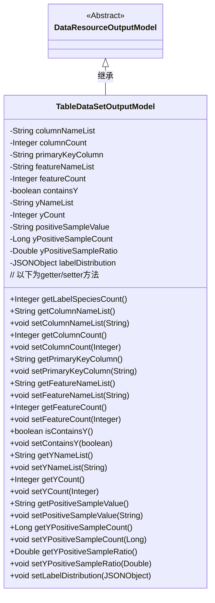

# 基础信息

|      |      |
|------|------|
| 名称 | TableDataSetOutputModel |
| 编码语言 | .java |
| 代码路径 | WeFe/board/board-service/src/main/java/com/welab/wefe/board/service/dto/entity/data_resource/output/TableDataSetOutputModel.java |
| 包名 | com.welab.wefe.board.service.dto.entity.data_resource.output |
| 依赖项 | ['com.alibaba.fastjson.JSONObject', 'com.alibaba.fastjson.annotation.JSONField', 'com.welab.wefe.board.service.dto.vo.data_set.table_data_set.LabelDistribution', 'com.welab.wefe.common.fieldvalidate.annotation.Check'] |
| 概述说明 | 数据集输出模型，包含字段列表、列数、主键、特征列表、Y值相关属性及正样本信息。 |

# 说明

该代码定义了一个名为TableDataSetOutputModel的类，继承自DataResourceOutputModel。类中包含多个字段，用于描述数据集的各种属性，如列名列表、列数、主键字段、特征列表、特征数量、是否包含Y值、Y列名称列表、Y列数量、正样本值、正例数量及比例等。其中labelDistribution字段存储标签分布情况，但被标记为不直接输出。类中还提供了所有字段的getter和setter方法，以及一个获取标签分类数量的方法getLabelSpeciesCount。

# 类列表 Class Summary

| 名称   | 类型  | 说明 |
|-------|------|-------------|
| TableDataSetOutputModel | class | TableDataSetOutputModel类继承DataResourceOutputModel，包含数据集字段、主键、特征、Y值相关属性和统计信息，如列数、特征数量、正样本比例等，并限制labelDistribution字段的序列化输出。 |


## 类 TableDataSetOutputModel

|      |      |
|------|------|
| 访问范围 | public |
| 类型 | class |
| 名称 | TableDataSetOutputModel |
| 说明 | TableDataSetOutputModel类继承DataResourceOutputModel，包含数据集字段、主键、特征、Y值相关属性和统计信息，如列数、特征数量、正样本比例等，并限制labelDistribution字段的序列化输出。 |


### UML类图



这段类图展示了TableDataSetOutputModel继承自抽象类DataResourceOutputModel的结构。TableDataSetOutputModel包含多个私有字段，用于存储数据集的各种属性，如列名列表、列数、主键字段、特征列表等，并提供了相应的getter和setter方法。特别值得注意的是getLabelSpeciesCount()方法，它根据containsY和labelDistribution字段的状态返回标签分类数量。类图中清晰地体现了继承关系和类的成员结构，适合用于理解该数据输出模型的设计。


### 内部方法调用关系图

```mermaid
graph TD
    A["类TableDataSetOutputModel"]
    B["继承自: DataResourceOutputModel"]
    C["属性: String columnNameList"]
    D["属性: Integer columnCount"]
    E["属性: String primaryKeyColumn"]
    F["属性: String featureNameList"]
    G["属性: Integer featureCount"]
    H["属性: boolean containsY"]
    I["属性: String yNameList"]
    J["属性: Integer yCount"]
    K["属性: String positiveSampleValue"]
    L["属性: Long yPositiveSampleCount"]
    M["属性: Double yPositiveSampleRatio"]
    N["属性: JSONObject labelDistribution"]
    O["方法: Integer getLabelSpeciesCount()"]
    P["方法: 所有getter/setter方法"]

    A --> B
    A --> C
    A --> D
    A --> E
    A --> F
    A --> G
    A --> H
    A --> I
    A --> J
    A --> K
    A --> L
    A --> M
    A --> N
    A --> O
    A --> P

    O -->|条件判断| H["containsY"]
    O -->|条件判断| N["labelDistribution"]
    O -->|转换| "labelDistribution.toJavaObject()"
```

这段代码展示了一个TableDataSetOutputModel类，继承自DataResourceOutputModel，主要用于管理表格数据集的输出模型。类包含12个带@Check注解的属性和1个不序列化的JSONObject属性，其中getLabelSpeciesCount()是核心业务方法，通过containsY和labelDistribution进行条件判断后返回标签分类数量。所有属性都配有标准的getter/setter方法，整体结构清晰体现了数据封装和校验逻辑。

### 字段列表 Field List

| 名称  | 类型  | 说明 |
|-------|-------|------|
| yNameList | String | 代码定义了一个私有字符串变量yNameList，使用@Check注解标记，参数name值为"y列名称列表"。 |
| yCount | Integer | 定义私有整型变量yCount，用于检查y列的数量。 |
| containsY | boolean | 私有布尔变量containsY，用于检查是否包含Y值。 |
| primaryKeyColumn | String | 代码定义了一个私有字符串变量primaryKeyColumn，并用@Check注解标记为"主键字段"。 |
| positiveSampleValue | String | 代码定义了一个私有字符串变量positiveSampleValue，并添加了名为"正样本的值"的检查注解。 |
| featureNameList | String | 代码定义了一个私有字符串变量featureNameList，用于存储特征列表，并通过@Check注解进行校验。 |
| columnCount | Integer | 定义私有整型变量columnCount，用于检查数据集列数，标注为@Check。 |
| featureCount | Integer | 类成员变量featureCount，使用@Check注解标记名称为"特征数量"，类型为Integer。 |
| labelDistribution | JSONObject | 代码定义了一个私有JSONObject变量labelDistribution，用于存储标签分布数据，通过注解禁止JSON序列化并标记检查用途。 |
| yPositiveSampleCount | Long | 类成员变量yPositiveSampleCount，用于记录正例数量，带@Check注解。 |
| columnNameList | String | 数据集字段列表的列名变量，使用@Check注解标记。 |
| yPositiveSampleRatio | Double | 正例比例检查字段，类型为Double，变量名为yPositiveSampleRatio。 |

### 方法列表

| 名称  | 类型  | 说明 |
|-------|-------|------|
| setContainsY | void | 设置是否包含Y的布尔值方法。 |
| getyPositiveSampleRatio | Double | 获取y正样本比例的方法，返回Double类型值yPositiveSampleRatio。 |
| setyCount | void | 设置yCount属性的方法，参数为Integer类型。 |
| setyPositiveSampleCount | void | 设置y正样本数量方法，参数为长整型yPositiveSampleCount，赋值给类成员变量。 |
| setPrimaryKeyColumn | void | 设置主键列的方法，将输入参数赋值给类的成员变量primaryKeyColumn。 |
| getPrimaryKeyColumn | String | 获取主键列名的方法，返回字符串类型的primaryKeyColumn。 |
| setColumnNameList | void | 设置列名列表的方法，将输入参数赋值给类的成员变量columnNameList。 |
| isContainsY | boolean | 方法isContainsY返回布尔值containsY的状态。 |
| getyCount | Integer | 获取yCount值的公共方法，返回整数类型。 |
| getFeatureNameList | String | 该方法返回featureNameList字符串。 |
| getLabelSpeciesCount | Integer | 方法getLabelSpeciesCount返回标签种类数。若无y数据或labelDistribution为空则返回null，否则返回labelDistribution中的labelSpeciesCount值。 |
| setFeatureNameList | void | 设置特征名称列表的方法，将输入字符串赋值给类成员变量featureNameList。 |
| setyNameList | void | 这是一个Java方法，用于设置yNameList属性的值。方法接收一个字符串参数并赋值给类的成员变量。 |
| getFeatureCount | Integer | 获取特征数量的方法，返回整数值featureCount。 |
| setyPositiveSampleRatio | void | 设置正样本比例的方法，接受Double类型参数并赋值给类成员变量yPositiveSampleRatio。 |
| getyPositiveSampleCount | Long | 获取yPositiveSampleCount值的方法，返回类型为Long。 |
| setFeatureCount | void | 设置特征数量方法，将输入参数赋给类成员变量featureCount。 |
| setColumnCount | void | 设置列数方法，将输入的整数值赋给类的列数属性。 |
| setPositiveSampleValue | void | 设置正样本值的公共方法，参数为字符串类型。 |
| getPositiveSampleValue | String | 获取正样本值的公共方法，返回字符串类型变量positiveSampleValue。 |
| getColumnNameList | String | 获取列名列表的方法。 |
| getyNameList | String | 获取yNameList字符串的方法。 |
| getColumnCount | Integer | 获取列数的方法，返回整型变量columnCount的值。 |
| setLabelDistribution | void | 设置标签分布数据，参数为JSON对象。 |


