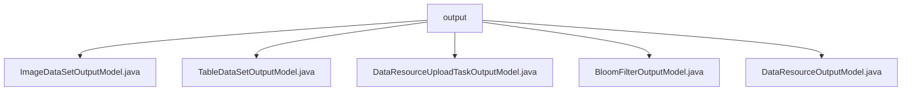

# 基础信息

|      |      |
|------|------|
| 名称 | output |
| 编码语言 | .java |
| 代码路径 | WeFe/board/board-service/src/main/java/com/welab/wefe/board/service/dto/entity/data_resource/output |
| 包名 | docs.board.board-service.src.main.java.com.welab.wefe.board.service.dto.entity.data_resource.output |
| 概述说明 | ImageDataSetOutputModel继承DataResourceOutputModel，含任务类型、标签列表、标注状态等字段。TableDataSetOutputModel描述数据集属性，如列名、特征、标签分布等。DataResourceUploadTaskOutputModel记录上传任务信息，包括进度、状态等。BloomFilterOutputModel处理布隆过滤器相关数据。DataResourceOutputModel为基类，包含资源基本信息、使用统计等。 |

# 说明

## 概述  
该模块核心职责是提供数据资源管理的统一输出模型体系，支持图像数据集、表格数据集、布隆过滤器等异构数据的标准化描述与状态跟踪。接口规范遵循Java Bean模式，通过继承层次实现字段复用（如DataResourceOutputModel为基类），各子类扩展特定属性并包含字段校验注解（例如@Check）和序列化控制（如JSONField）。关键数据结构包括标签列表（labelList）、特征分布（labelDistribution）、任务进度（progressPercentage）等，采用枚举类型（如DataResourceUploadStatus）约束状态字段。外部依赖主要为Spring框架的序列化注解和校验工具。例如ImageDataSetOutputModel通过getLabelSet实现标签格式转换，TableDataSetOutputModel提供getLabelSpeciesCount统计分类数量。

## 主要业务场景  
模块支撑数据资源全生命周期管理，覆盖上传（如DataResourceUploadTaskOutputModel跟踪进度）、标注（labeledCount标记完成度）、特征分析（正样本比例计算）等流程。交互模式类似事件总线模式，通过标准化输出模型传递数据状态变更，例如布隆过滤器参数（BloomFilterOutputModel）包含SQL语句和主键Hash方法。典型应用包括联合学习任务调度（forJobType指定任务类型）、数据质量监控（invalidDataCount记录异常）。API类型涵盖资源元数据查询（如getStorageNamespace）、统计聚合（如getUsageCountInProject），集成案例可见于数据看板展示和任务流水线状态同步场景。

### 包内部结构视图

该流程图展示了`output`目录下的5个Java文件之间的层级关系。所有文件都直接隶属于`output`目录，没有更深层的嵌套结构。这些文件包括ImageDataSetOutputModel、TableDataSetOutputModel等数据资源相关的输出模型类，共同构成了数据资源输出模块的核心组成部分。

# 文件列表

| 名称   | 类型  | 说明 |
|-------|------|-------------|
| [ImageDataSetOutputModel.java](ImageDataSetOutputModel.md) | file | ImageDataSetOutputModel类继承DataResourceOutputModel，包含任务类型、标签列表、已标注数量、标注完成状态和数据集大小等属性，提供标签集合转换方法及getter/setter。 |
| [TableDataSetOutputModel.java](TableDataSetOutputModel.md) | file | 数据集输出模型，包含字段列表、列数、主键、特征列表、Y值相关属性及正样本信息。 |
| [DataResourceUploadTaskOutputModel.java](DataResourceUploadTaskOutputModel.md) | file | 数据资源上传任务输出模型，包含资源ID、名称、类型、数据量、进度、剩余时间、无效数据量、错误信息和状态等字段。 |
| [BloomFilterOutputModel.java](BloomFilterOutputModel.md) | file | BloomFilterOutputModel类继承DataResourceOutputModel，包含数据源ID、地址、主键hash方法、布隆过滤器添加方式和SQL语句等字段及其getter/setter方法。 |
| [DataResourceOutputModel.java](DataResourceOutputModel.md) | file | DataResourceOutputModel类定义了数据资源的输出模型，包含名称、类型、描述、标签、存储信息、使用统计、可见性及衍生来源等属性。 |

